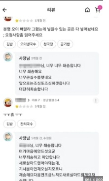
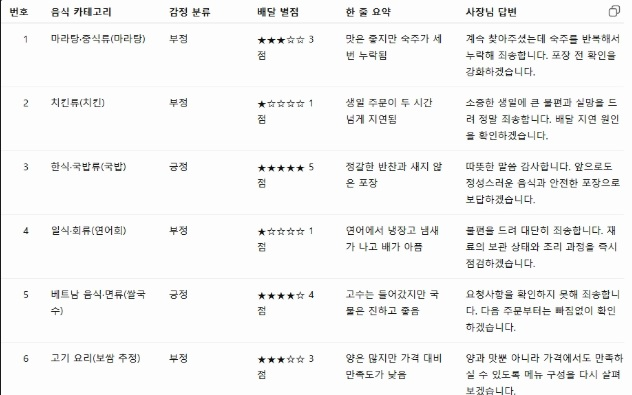
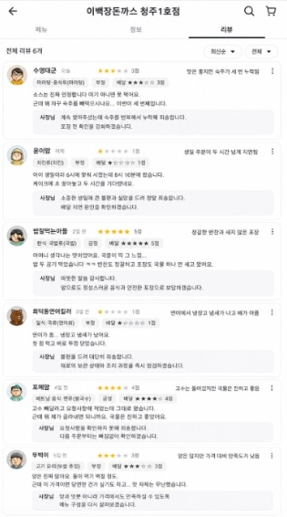
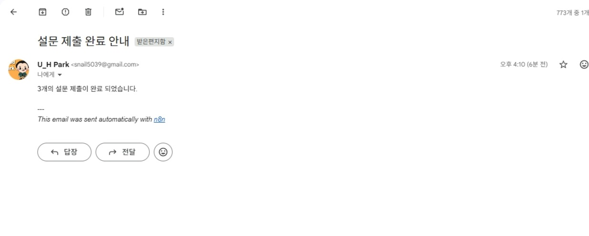
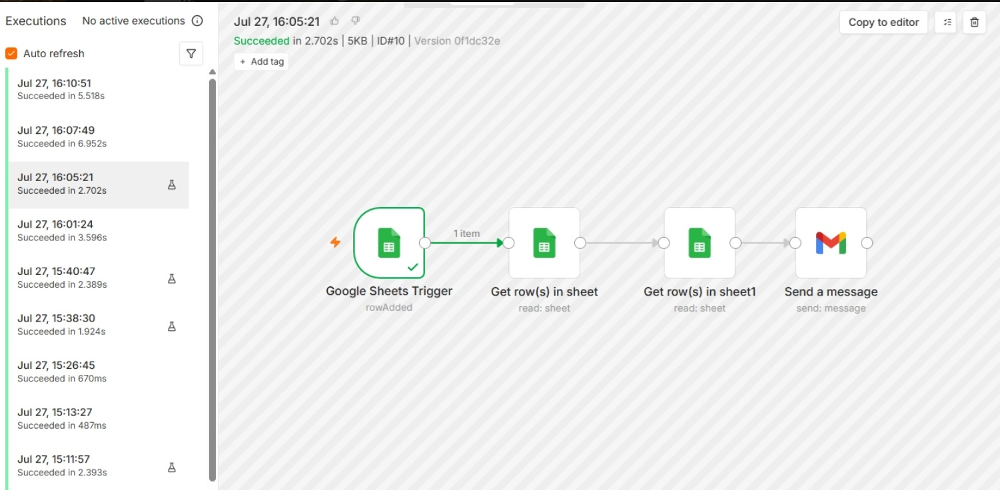
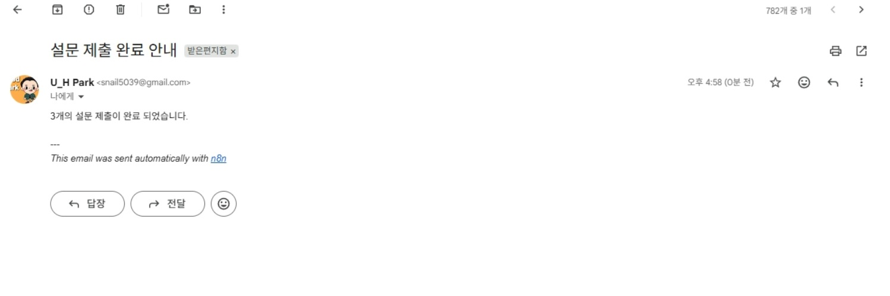
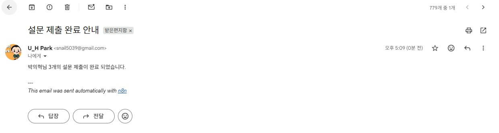
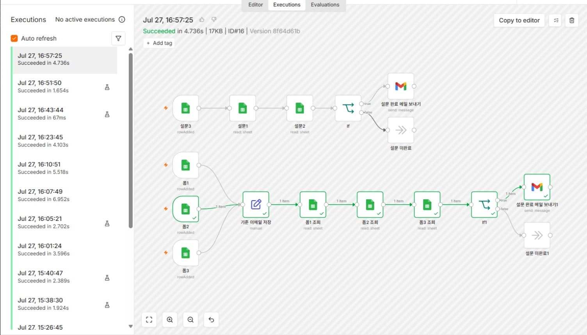
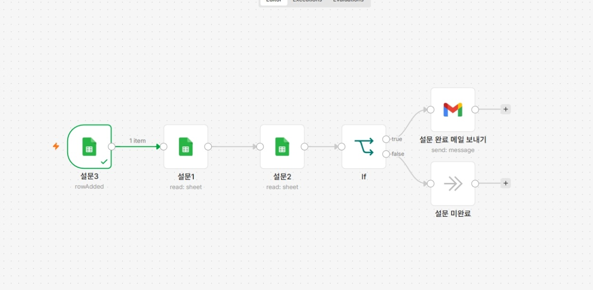

```markdown
## 복습
LLM : 다음 자리에 올 텍스트를 확률적으로 예측하는 것

프롬프트 엔지니어링
하네스 엔지니어링 : 가이드를 주는 것
컨텍스트 엔지니어링 

세션 : 채팅창, 대화 단위
컨텍스트 메모리 : 하나의 세션안에서 기억하는 것(단기 기억)
```

```markdown
## 프롬프트 엔지니어링

Context : TMI를 넣자
마크다운으로 구조를 잡아서 넣자

### 입력의 구조를 만드는 것이 전부다
좋은 프롬프트 4요소 : 역할 - 맥락 - 작업 - 형식(모양)

[
### ex)
너는 자산운용사의 리서치 어시스턴트야
아래 기사를 펀드매니저의 아침 브리핑용으로 요약해줘

# 형식
- 핵심 3줄 (각 줄 25자 이내) 
- 시장 영향 : 긍정 / 부정 / 중립 중 하나 + 근거 1줄
- 관련 섹터 태크 (# 은행 / 테크)
]

1. 구분자를 써라
2. 단계를 나눠라
3. 출력 예시를 보여줘라

### Zero-shot : 예시 없이 시키기
### Few-show : 예시로 기준을 보여주기

### Chain-of-Thought / Self-Consistency
* 생각의 사슬 : 답 전에 과정을 말하게 하라
** 풀이과정을 쓰면서 답을 내놓게 한다

- Self-Consistency : 여러 번 풀게 하고 투표시키기

## ReAct : 모델이 혼자 다 아는 척하지 않고, 모르는 것은 도구로 확인하게 만드는 구조

### Tree-of_Thought : 갈래를 펼쳐서 탐색하기
* 정답이 없는 문제에서 품질 끌어올리는 용도 (ex/ 3가지 제안 및 장단점 평가, 최선안 선택)

## 시스템 프롬프트 / 사용자 프롬프트

* 시스템 : 변하지 않는 규칙 : 정체성, 기준, 형식, 금지사항 등 (직원의 업무 메뉴얼)
```

실습

### 시스템 프롬프트 작성하기 (~11:35)

> 수업에서 함께 만든 "금융 VOC 분류기"의 구조를 가져와서
배달 잇츠 리뷰를 정해진 형식으로 출력하는 시스템 프롬프트를 완성해 보세요.
핵심은 단순히 내용을 분류하는게 아니라, 우리가 원하는 출력 형식을 항상 유지하는 겁니다 !
> 

### 결과

- 음식 카테고리
- 긍정/부정
- 배달 별점 (5점 만점)
- 한 줄 요약 (30자 이내)

- 리뷰 데이터
    
    ```python
    소스는 진짜 인정합니다 여기 아니면 못 먹어요. 근데 왜 자꾸 숙주를 빼먹으시나요...
    이번이 세 번째입니다. 담아주시는 분이 바뀌셨나요? 맛은 늘 그대로라 계속 시키긴 할 건데
    체크 좀 부탁드릴게요
    ```
    
    ```python
    아이 생일이라 6시에 맞춰 시켰는데 8시 10분에 왔습니다.
    케이크에 초 꽂아놓고 두 시간을 기다렸네요. 애가 울다 지쳐서 잠들었어요.
    치킨은 뭐 늘 먹던 맛이니까 별 할 말 없고요. 다음부터는 그냥 근처 가게 시킬게요
    ```
    
    ```python
    어머니 생각나는 맛이었어요. 국물이 딱 그 느낌... 밥 두 공기 먹었습니다 ㅋㅋ
    반찬도 정갈하고 포장도 국물 하나 안 새고 왔어요.
    사장님 오래오래 장사하세요 진짜로
    ```
    
    ```python
    연어가 좀... 뭐랄까 냉장고 냄새가 났어요. 무슨 말인지 아시죠?
    첫 점 먹고 바로 뚜껑 닫았습니다. 남편은 괜찮다는데 저는 도저히 못 먹겠더라고요.
    밤에 배가 계속 아파서 결국 약 먹고 잤습니다. 환불까지는 바라지도 않으니까
    재료 관리만 좀 신경 써주세요
    ```
    
    ```python
    고수 빼달라고 요청사항에 적었는데 그대로 왔습니다.
    근데 뭐 제가 골라내면 되니까요. 국물은 진하고 좋았어요.
    다음엔 확인 한 번만 부탁드립니다 :)
    ```
    
    ```python
    양은 진짜 많아요. 둘이 먹기 벅찰 정도. 근데 이 가격이면 당연한 건가 싶기도 하고...
    3만 8천원이면 좀 있다가 고기집 가는 게 낫지 않나 하는 생각이 들긴 했어요.
    맛 자체는 무난했습니다. 잡내도 없고요
    ```
    

### 예시

```python
너는 후기를 분류하는 우리팀 CX 10년차 직원이야.
아래 후기를 분석해서 ~~~한 구조로 답변해줘.

~~~~
# 규칙
1. ~~~~

# 출력형식
~~~~~

~~~
```

나의 출력 프롬프트

```markdown
# 너는 배달의민족 같은 리뷰 분류 시스템이야, 즉 사람들이 배달을 시켜먹고 난 후에 후기를 보고 아래와 같이 분류해주면돼 

* 분류 기준으로는 

1. 음식 카테고리 

2. 긍정/부정

3. 배달 별점(5점 만점)

4. 한 줄 요약(30자 이내)

# 규칙

- 보내주는 리뷰데이터를 참고해서 음식을 유추해서 카테고리를 정한다

- 긍정 / 부정은 리뷰 데이터에 있는 말을 참고해서 긍정 혹은 부정으로 분류해

- 요약을 할 때는 없는 말은 지어내지 말고 있는 말로 하면 돼

- 추가적으로 사장님 입장에서 한줄로 답변 남기는 것도 넣어

- 음식이 무엇인지 모를 경우에는 추측해서 음식 카테고리에 넣어 음식 까지 넣으면 돼

# 출력 예시

- 사진 참고

- 음식 카테고리 분류(음식명) / 긍정 or 부정 / 배달 별점 / 한줄 요약을 사진을 참고해서 출력해줘

# 리뷰 데이터 

1.소스는 진짜 인정합니다 여기 아니면 못 먹어요. 근데 왜 자꾸 숙주를 빼먹으시나요... 

이번이 세 번째입니다. 담아주시는 분이 바뀌셨나요? 맛은 늘 그대로라 계속 시키긴 할 건데

체크 좀 부탁드릴게요

2.아이 생일이라 6시에 맞춰 시켰는데 8시 10분에 왔습니다.

케이크에 초 꽂아놓고 두 시간을 기다렸네요. 애가 울다 지쳐서 잠들었어요.

치킨은 뭐 늘 먹던 맛이니까 별 할 말 없고요. 다음부터는 그냥 근처 가게 시킬게요

3.어머니 생각나는 맛이었어요. 국물이 딱 그 느낌... 밥 두 공기 먹었습니다 ㅋㅋ

반찬도 정갈하고 포장도 국물 하나 안 새고 왔어요.

사장님 오래오래 장사하세요 진짜로

4.연어가 좀... 뭐랄까 냉장고 냄새가 났어요. 무슨 말인지 아시죠?

첫 점 먹고 바로 뚜껑 닫았습니다. 남편은 괜찮다는데 저는 도저히 못 먹겠더라고요.

밤에 배가 계속 아파서 결국 약 먹고 잤습니다. 환불까지는 바라지도 않으니까

재료 관리만 좀 신경 써주세요

5.고수 빼달라고 요청사항에 적었는데 그대로 왔습니다.

근데 뭐 제가 골라내면 되니까요. 국물은 진하고 좋았어요.

다음엔 확인 한 번만 부탁드립니다 :)

6.양은 진짜 많아요. 둘이 먹기 벅찰 정도. 근데 이 가격이면 당연한 건가 싶기도 하고...

3만 8천원이면 좀 있다가 고기집 가는 게 낫지 않나 하는 생각이 들긴 했어요.

맛 자체는 무난했습니다. 잡내도 없고요
```

참고할 사진




## 실행 결과





## 3. 배운 점 / 어려웠던 점

- 구체적인 내용(규칙, 출력 예시 등등)을 넣으니 위 실행 결과 처럼 보기 좋게 원하는대로 출력이 되는 것 같다.
- 평소에 일반적인 문장으로 질문을 하게 되면 길게 출력만 되서 보기도 불편하고 내용이 시시때때로 바뀌는 데 이번에는 바뀌지 않아 좋다
- 다만 이런식으로 자세하게 프롬프트를 준 적이 많이 있지 않아 규칙은 어떻게 할지, 출력 예시는 어떻게 할지 정하는 것이 조금 헷갈린다.

```markdown
## n8n
* 코드 없이 노코드 자동화 
* 개발자가 아닌 직군들이 만들기 위해 만들어진 도구
- 목적에 따른 도구가 다르다

### 셀프 호스팅

14시 n8n 설명 및 실습
```

과제

### **여러개의 구글폼 입력받아서 메일을 보내는 workflow를 만들어주세요.**

1. 첫번째 구글폼에서는 - 이름과 지역을 입력받으세요.
2. 두번째 구글폼에서는 - 취미와 제일 좋아하는 음식을 입력 받으세요.
3. 세번째 구글폼에서는 - 최애 영화를 입력 받으세요.

---

각각의 구글폼을 제출하면 → 메일을 보내는 n8n 자동화를 만들어 주세요.

제출 : 자신의 n8n 워크플로우 화면을 캡쳐해서 이미지로 제출해 주세요.

단 ! 🙋

- 첫번째만 입력했을때 메일이 가게 할 수도 있고
- 첫번째, 두번째, 세번째 모두 입력되었을때만 메일이 가게 할 수도 있어요.

---

일단 처음에는 위에꺼 신경쓰지 마시고 일단 !

세개의 폼과 하나의 메일 발송 로직을 완성하시고 그 이후에 조건들을 고민해보세요.

(제출은 최소 하나의 폼을 입력받고 메일이 발송된다는 로직까지는 필요)

**HINT**

- 각 폼 마다 각 사람을 구분하는 구분자(이메일, 이름)등을 받을수도 있겠죠?
- `IF` 노드를 검색해서 사용해 보세요.
- 하나의 노드에서 다른 여러 노드들의 값을 가져올 수 있습니다.

#### **첨부 자료**

등록된 첨부 자료가 없습니다

#### **문항 정보**

### **문항 1여러개의 폼을 입력받는 n8n 워크플로우 설계하기**

### **여러개의 구글폼 입력받아서 메일을 보내는 workflow를 만들어주세요.**

1. 첫번째 구글폼에서는 - 이름과 지역을 입력받으세요.
2. 두번째 구글폼에서는 - 취미와 제일 좋아하는 음식을 입력 받으세요.
3. 세번째 구글폼에서는 - 최애 영화를 입력 받으세요.

---

각각의 구글폼을 제출하면 → 메일을 보내는 n8n 자동화를 만들어 보세요.

초기에는 첫 번째, 두 번째, 세 번째 폼을 순서대로 제출한다는 전제로 구현해보세요.

단 ! 🙋

- 첫번째만 입력했을때 메일이 가게 할 수도 있고
- 첫번째, 두번째, 세번째 모두 입력되었을때만 메일이 가게 할 수도 있어요.

---

일단 처음에는 위에꺼 신경쓰지 마시고 일단 !

세개의 폼과 하나의 메일발송 로직을 완성하시고 그 이후에 조건들을 고민해보세요.

(제출은 하나의 폼을 입력받고, 메일이 발송되는 것이 최소 조건입니다)

과제 결과

## 간단버전 제출 확인



## 간단버전 실행



## 전체 제출 테스트



## 제출 완료 시 이름 추가



## 폼 조회 조건 추가



## if문 추가



**#부트캠프 #멀티캠퍼스부트캠프 #AI캠퍼스 #AI에이전트엔지니어**