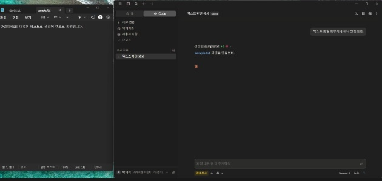
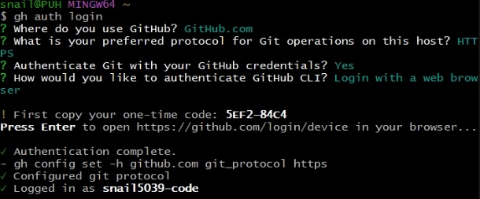
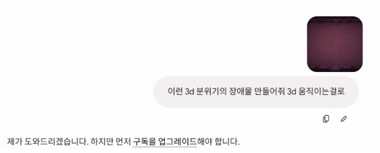
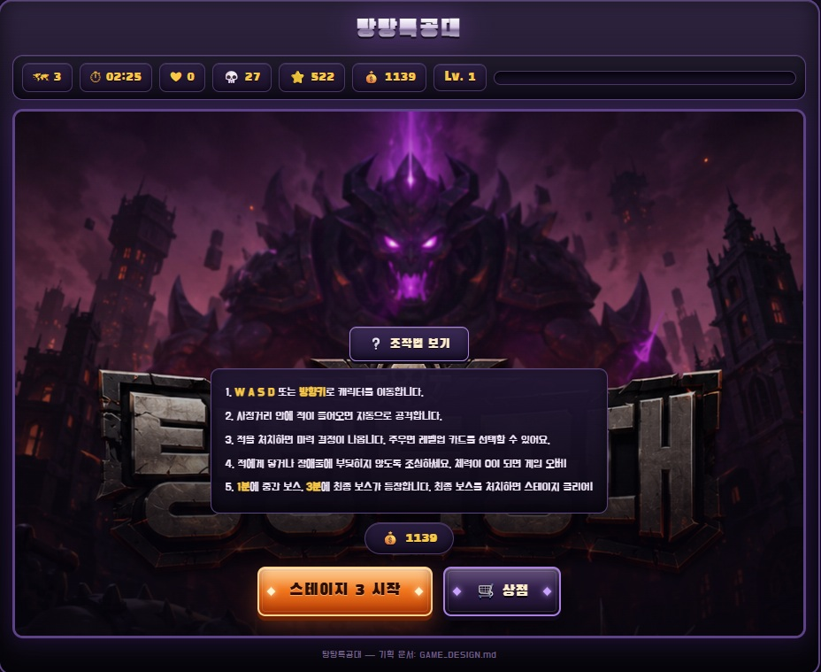

```markdown
## 강시님 정답 공개
* 저작권 상 사진 미첨부
```

```markdown
### AI 엔지니어 -> "기술" + 제너럴리스트 + 비즈니스 + 기능 + 마케팅이 필요하다

* Web -> 실사용자까지 할 수 있는지

## claude 설치 및 실습
* Git 설치
* node.js 설치
* claude 홈페이지에서 다운로드 
** 기본적인 사용 방법
```

** 기본적인 파일 생성 테스트



- 로컬에서는 파일 개수를 상관하지 않고 작업을 할 수 있다.

회색 : 진행중

노란색 : 질문

하늘색 : 완료

회색 안에 비어있는 : 작업 끝, 확인 완료/ 과거의 세션

## 활용해서 Resume 수정해보자

- 현재 html로 깔끔하게 만들고 있는 중

```markdown
## 바이브 코딩
1. 한번에 하나씩
* 단계를 나눠서 한다
2. 에러
* 캡처 후 질문
3. 완벽 보다는 완성
```

```markdown
## GitHub와 연결
```



```markdown
### 공개 레포지토리 -> 누구든지 클론 받을 수 있다

### 비공개 레포지토리 -> 접근이 불가능하다(협업자만 가능하다)

* 커밋 메시지 잘 넣기
ex)
- 제목 (feat. 제목)
- 줄바꿈
- 내용
**권장함

기능 : feature
버그 : bugfiy
문서 : docs
주석 comm
```

### claude.md

- 클로드가 동작하기 전에 읽어서 내용대로 동작
- 나만의 메모리(지침)

구조를 잘 잡으면 알아서 정해진 규칙에 따라 행동한다

- 참조하는 형식으로 구성

프로젝트 대한 설명 + 참조 + 폴더 구조

1. 전역 메모리
- 공통적인 것들은 클로드한테 전역메모리로 올려 달라고 하면 된다.
1. 로컬 메모리

과제

## **팡팡 아케이드**

나만의 하네스를 세팅하고, AI와 함께 **하나의 완성된 인터랙티브 웹 앱**을 처음부터 끝까지 만들어 봅니다.

결과물은 아케이드 형태지만, 진짜 목표는 따로 있어요. **기획 → 구현 → 디버깅 사이클을 내 손으로 한 바퀴 돌려보는 것**입니다.

### **진행순서**

**1. 먼저 AI와 함께 기획해 보세요.**

바로 코드부터 짜지 마세요. 무엇을 만들지 대화로 정리하는 게 먼저입니다.

- tip) 기획을 같이 하고 나서 → `지금 논의한 거 전부 md 파일로 문서화해줘`
- 이 문서가 앞으로 AI에게 건네줄 **컨텍스트**가 됩니다. 하네스의 시작이죠.

**2. 기획 문서를 기반으로 구현을 시작하세요.**

- tip) 한 번에 모든 구현을 하려고 하면 100% 꼬입니다.
- tip) 하나의 기능부터 차근차근 구현하고 **직접 확인**하세요.
- 캐릭터가 움직인다 → 확인. 점수가 올라간다 → 확인. 이 리듬을 지키세요.

**3. 이상하거나, 에러가 나거나, 버그가 생기면**

- 그 부분을 캡쳐하거나 복사해서 다시 AI와 수정하세요.
- tip) 스크린샷 캡쳐가 아주 잘 동작합니다. 꼭 해보시길 (Mac `Cmd+Shift+4` / Win `Win+Shift+S`)

### **제출 전 확인**

아래 5가지가 모두 동작해야 합니다.

- 시작하면 간단한 조작법이 나온다
- 판당 점수를 계산한다
- 종료 조건이 있다
- 한 판이 끝나고 다시 시작이 된다
- **다시 시작 버튼을 빠르게 두 번 눌러도 정상이다**

> HINT 🙋 마지막 항목이 제일 잘 터집니다. 빠르게 두 번 누르면 게임이 두 개 겹쳐 돌거나, 점수가 이상해지거나, 캐릭터가 두 배로 빨라지곤 해요.
> 
> 
> 이게 바로 **상태 관리**의 함정입니다. 이전 판이 완전히 정리됐는지, 타이머나 루프가 중복으로 돌고 있진 않은지 AI와 함께 점검해 보세요.
> 
> 잘 안 되면 증상을 그대로 설명해 주세요. `다시 시작을 빠르게 두 번 누르면 캐릭터가 두 배로 빨라져` 처럼요.
> 

### **제출 방법**

**zip 파일 하나**로 제출합니다. 아래 3가지를 폴더에 담아 압축해 주세요.

```python
내게임이름/
├── index.html        ← 필수
├── screenshot.png    ← 실행 화면 캡쳐
└── 기획문서.md         ← 1번에서 만든 문서
```

⚠️ 이미지는 따로 올라가지 않으니 **반드시 zip 안에 함께 넣어주세요.**

⚠️ 압축을 풀었을 때 `index.html`이 바로 보여야 합니다.

**zip 만드는 법**

- macOS: 폴더 우클릭 → "압축하기"
- Windows: 폴더 우클릭 → "보내기" → "압축(ZIP) 폴더"

배포는 이후에 다시 말씀드릴게요 🙂

claude 사용 게임 만들기

실제 플레이 캡처본 1개, index.html 파일 1개 압축해서 올리기



- 뜻밖의 상황이다….

현재 진행 상황

게임 화면 캡처




- 기획문서

GAME_DESIGN.md

- 현재까지 진행 html

현재 크레딧 한도 초과로 미완성 게임 진행 불가