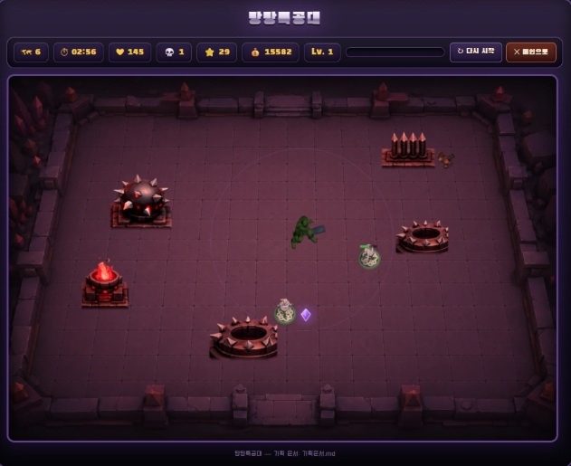
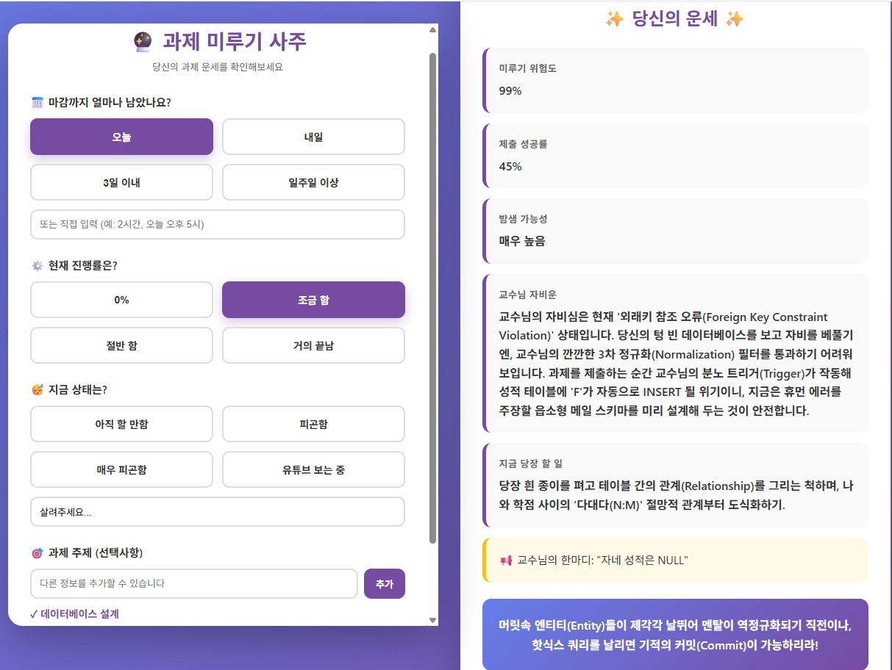

```markdown
## 게임 결과
```
## 기타 파일들은 노션 참고(Readme 읽기)

index.html

PROGRESS.md

기획문서.md

** 아마도 폴더 형식 및 이미지가 없어 로드가 안된다. 

** 실제로 해보면 잘되는걸 확인 할 수 있다.




** 실행예시

```markdown
`
컨텍스트 윈도우가 점점 차게 되면 토큰 소비가 커진다.
새 세션에서 시작하면 훨씬 좋지만 전에 작업하던 것을 알게 하려면 md 문서로 정리해서 넘겨줘야한다.
`
or
새로운 지시를 내린다
```

```markdown
QA - test
* 추가 기능, 버그 등등 발견하기
```

### CS

```markdown
* 컴퓨터공학
- index.html -> 정적 웹사이트
 * 바뀌지 않는 것
 
## 요즘 웹사이트는 동적 웹사이트이다.

* 서버 - 클라이언트 구조
- 클라이언트 : 내가 사용하는 모든 기기, 웹 브라우저, 사용하는 사람
- 서버 : 저장, 계산, 판단

현재 만든 것은 서버가 없는 구조
```

```markdown
Python -> Django, Fast API
JS -> node

#### 서버를 개발 할때는 저장하는 공간이 필요해서 데이터베이스를 붙인다
-> mysql, oracle, postgre, mogDB

개발자
1. FE : 클라이언트 (React, 뷰, 스벨트)
2. BE : 서버
3. App : Android, ios, 한번에 개발 가능한 프로그램(크로스 플랫폼 : Flutter)
4. 응용프로그램 : C, C++ 등등
```

```markdown
### AI 엔지니어
* AI (LLM) Agent
* server (Fast API)
* DB
- 적어도 3가지는 알아야한다.

Cloud - AWS, GCP 등등
```

```markdown
#### 데이터를 주고 받는 대표적인 형식 : JSON
* JSON 
 : key 와 value -> {key : value}
 

* 다른 회사가 만든 것을 다른 쪽에서 쓸 수 있게 만들어 놓은 규칙을 API라고 한다
```

#### 제미나이 API 사용 실습

https://ai.google.dev/gemini-api/docs/get-started?hl=ko#python

```markdown
https://ai.google.dev/gemini-api/docs/get-started?hl=ko#rest

나 텍스트 넣고 텍스트를 받는  API가 궁금해 설명해줘.

탐색함 웹, 사용함 도구 1개
Gemini API 문서(REST 탭) 기준으로 텍스트 입력 → 텍스트 생성하는 방법은 다음과 같습니다.

1. 엔드포인트
POST https://generativelanguage.googleapis.com/v1beta/interactions
2. 인증
API 키를 헤더에 넣습니다 (쿼리 파라미터 대신 헤더 방식 사용).

-H "x-goog-api-key: $GEMINI_API_KEY"
3. 기본 요청 (텍스트 → 텍스트)
curl -X POST "https://generativelanguage.googleapis.com/v1beta/interactions" \
  -H "x-goog-api-key: $GEMINI_API_KEY" \
  -H 'Content-Type: application/json' \
  -d '{
    "model": "gemini-3.5-flash",
    "input": "Explain how AI works in a few words"
  }'
model: 사용할 모델명 (예: gemini-3.5-flash)
input: 문자열 하나만 넣으면 단일 사용자 메시지로 처리됨
4. 응답 형식
{
  "id": "v1_...",
  "status": "completed",
  "steps": [
    {
      "type": "model_output",
      "content": [
        { "type": "text", "text": "생성된 답변 텍스트" }
      ]
    }
  ],
  "usage": { "total_tokens": 197, "total_input_tokens": 8, "total_output_tokens": 12 }
}
→ 실제 생성된 텍스트는 steps[].content[].text (type이 model_output인 항목)에서 꺼내면 됩니다.

5. 스트리밍
?alt=sse 쿼리 + "stream": true를 추가하면 SSE로 토큰 단위 응답을 받을 수 있습니다.

6. 멀티턴(대화 이어가기)
"store": false로 서버에 히스토리를 저장하지 않는 stateless 모드를 쓸 수도 있고, input을 배열로 넣어 여러 턴의 메시지를 한 번에 전달할 수도 있습니다:

"input": [
  { "type": "user_input", "content": "I have 2 dogs in my house." }
]
참고로 이 interactions 엔드포인트 구조는 비교적 최근에 정리된 API 형태로 보입니다(과거에는 models/{model}:generateContent + contents 필드를 쓰는 방식이었어요). API 키 발급이나 세부 파라미터(temperature, 최대 토큰 등)까지 필요하시면 말씀해주세요.
```

.gitignore

- 올리지 않은 파일
- API 키 같은 것을 올리는 곳

### 실제 테스트

```python
import os
import requests
from dotenv import load_dotenv

load_dotenv()

API_KEY = os.environ.get("GEMINI_API_KEY", "여기에_API_KEY_입력")
MODEL = "gemini-3.5-flash"
URL = f"https://generativelanguage.googleapis.com/v1beta/interactions"

def ask_gemini(prompt: str) -> str:
    response = requests.post(
        URL,
        headers={
            "x-goog-api-key": API_KEY,
            "Content-Type": "application/json",
        },
        json={
            "model": MODEL,
            "input": prompt,
        },
    )
    response.raise_for_status()
    data = response.json()

    for step in data.get("steps", []):
        if step.get("type") == "model_output":
            for content in step.get("content", []):
                if content.get("type") == "text":
                    return content["text"]
    return "(응답에서 텍스트를 찾지 못했습니다)"

if __name__ == "__main__":
    text = ask_gemini("Explain how AI works in a few words")
    print(text)
```

### 응답결과

```markdown
PS C:\Users\snail\OneDrive\바탕 화면\portfolio> & C:\Users\snail\AppData\Local\Programs\Python\Python313\python.exe "c:/Users/snail/OneDrive/바탕 화면/portfolio/gemini_test.py"
AI learns from vast data to find patterns and make predictions.
```

과제

## **AI 기능을 붙인 나만의 미니 앱 서비스**

오늘 배운 **서버-클라이언트 구조**와 **API 호출**을 직접 써서, AI가 들어간 작은 웹서비스를 하나 완성해 봅니다.

거창할 필요 없어요. **기능 하나가 제대로 도는 게 열 개가 반쯤 되는 것보다 낫습니다.** 파일 한 장으로 끝나도 좋습니다.

### **무엇을 만들까요**

Gemini API를 불러서 결과를 화면에 보여주는 서비스면 무엇이든 좋습니다. 아이디어가 안 떠오르면 아래에서 골라 시작해 보세요.

- 오늘 기분을 적으면 그에 맞는 노래를 추천해 주는 서비스
- 영어 문장을 넣으면 한국어로 바꾸고 문법 설명까지 해 주는 번역기
- 냉장고에 있는 재료를 적으면 만들 수 있는 요리를 알려 주는 서비스
- 긴 글을 붙여넣으면 세 줄로 요약해 주는 서비스
- 내가 쓴 자기소개를 넣으면 면접 예상 질문을 뽑아 주는 서비스

### **진행순서**

**1. 무엇을 만들지 AI와 먼저 정하세요.**

- tip) 어제처럼 기획을 먼저 하고 `지금 논의한 거 md로 정리해줘`라고 하면 문서가 남습니다.
- 화면에 뭘 입력받고, AI에게 뭘 물어보고, 결과를 어떻게 보여줄지. 이 세 가지만 정하면 시작할 수 있습니다.

**2. 한 덩어리씩 만들고 그때마다 확인하세요.**

- 서버가 뜨는지 → 확인
- 요청을 보내면 서버까지 값이 들어오는지 → 확인
- 그 값으로 Gemini를 불러 답이 오는지 → 확인
- 받은 답이 화면에 보이는지 → 확인
- tip) 한 번에 다 만들려고 하면 어디서 틀어졌는지 못 찾습니다. 오늘 실습에서 하신 그대로 하나씩 확인하며 가세요.

**3. 막히면 증상을 그대로 AI에게 주세요.**

- 에러 메시지를 복사하거나 화면을 캡쳐해서 붙이면 됩니다.
- tip) "안 돼요"보다 `요청을 보내면 터미널에 401 에러가 떠`가 훨씬 빨리 해결됩니다.

### **제출 전 확인**

- 입력한 값을 서버로 보내면 AI 응답이 화면에 나온다
- 응답을 기다리는 동안 사용자가 알 수 있다 (로딩 표시, 버튼 비활성화 등)
- 빈 값으로 보내도 서버가 죽지 않는다
- 같은 요청을 빠르게 두 번 보내도 정상이다
- **zip 안에** `.env` **파일이 없다**

### **제출 방법**

**프로젝트 폴더를 통째로 압축해서 zip 하나로 제출합니다.** 파일 구조는 자유입니다. 본인이 만든 그대로 내시면 됩니다.

다만 아래 두 가지는 zip 안에 꼭 함께 넣어주세요.

- **실행 화면 캡쳐** (스크린샷 이미지)
- **기획 문서** (1번에서 만든 md 파일)

⚠️ `.env`**는 빼고 압축하세요.** 압축 후 한 번 풀어서 확인해 보시면 확실합니다.

⚠️ 이미지는 따로 올라가지 않으니 반드시 zip 안에 함께 넣어주세요.

⚠️ `venv`, `__pycache__` 같은 폴더는 용량만 키우니 빼셔도 됩니다.

**zip 만드는 법**

- macOS: 폴더 우클릭 → "압축하기"
- Windows: 폴더 우클릭 → "보내기" → "압축(ZIP) 폴더"

배포는 이후에 다시 말씀드릴게요 🙂

결과(매우 간단하게 만듬)

07.29과제.zip


