```markdown
### Discord
* 알림 : PC, Mobile, iPad
* 연동을 하기 편하게 API를 많이 열려있다.

### 두 개의 채널
* 텍스트 : #으로 시작되는 것들
* 음성 : 스피커 모양 

### 화면 공유
* 어플리케이션, 전체화면, 기기 등으로 사용 가능
```

```jsx
* Gemini -> env -> 내 프로그램 <- AI
                     (Html)
* server -> AWS, GCP

* Client -> 주소 -> 컴퓨터
            (IP), 도메인
* 도메인 -> 가비아에서 구매 가능

* naver.com -> 홈페이지 주세요(요청) -> naver 서버 -> 홈페이지의 코드 -> 웹 브라우저
** URL은 도메인에 다른 정보들을 붙여 놓은것
```

```markdown
### 인터넷은 하나의 유선으로 연결된 것
* World Wide Web : www

## 해저케이블 보는 주소
https://www.submarinecablemap.com/ 
```

### n8n 실습

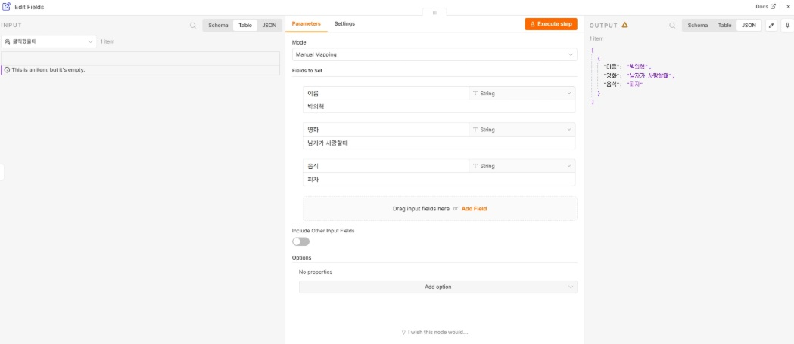

- edit fields에서 JSON 값 만들어서 넘기기

메일을 보낼 때

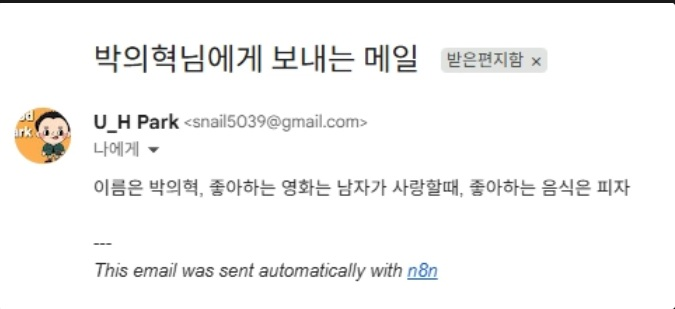

밑 쪽에 n8n이라고 뜬다

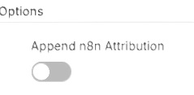

제거하려면 옵션에서 끄면 된다

- n8n으로 Discord 채널에 메세지 보내기

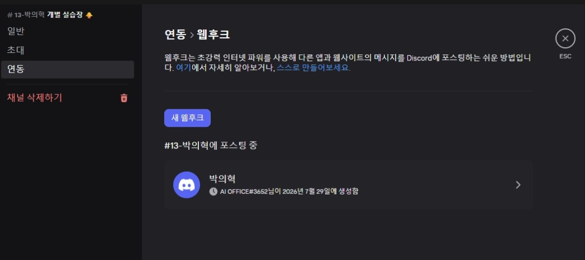

새 웹후크를 클릭 후 주소를 복사한 후 n8n 노드에 주소를 넣으면 된다.

- 영어 이름 추천 자동화 만들기

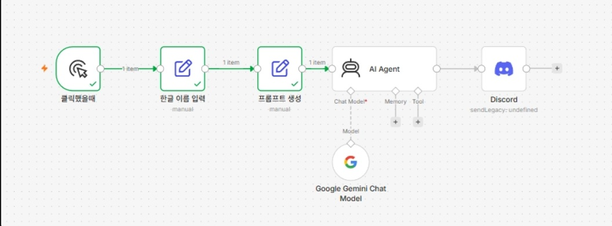

```markdown
## 프롬프트

당신은 한국어와 영어권 이름에 모두 익숙한 전문 네이밍 컨설턴트입니다.
입력된 한글 이름과 어울리는 영어 이름을 정확히 3개 추천해 주세요.

한글 이름: {{ $json.name_kr }}
성별 : {{ $json.gender }}

추천 기준:
1. 한글 이름의 첫 음절, 자음과 모음, 전체적인 발음이나 리듬이 비슷한 이름을 우선합니다.
2. 현재 영어권에서 실제로 자연스럽게 사용하는 이름을 추천합니다.
3. 지나치게 오래되거나 올드한 느낌의 이름은 제외합니다.
4. 억지로 발음을 맞춘 이름이나 실제로 거의 사용하지 않는 이름은 제외합니다.
5. 세 이름은 서로 다른 분위기를 가지도록 추천합니다.
6. 성별 정보가 없다면 성별 중립적이거나 폭넓게 사용할 수 있는 이름을 우선합니다.
7. 이름의 뜻이 불확실하면 과장하지 말고, 일반적으로 알려진 의미나 이미지를 설명합니다.

각 추천에는 반드시 다음 정보를 포함하세요.
* 영어 이름
* 한글 발음
* 이름의 뜻 또는 일반적으로 연상되는 이미지
* 한글 이름과 잘 어울리는 이유

JSON 형식으로 답변하세요.

예시
{
"recommendations": [
{
"name": "영어 이름",
"pronunciation": "한글 발음",
"meaning": "이름의 뜻 또는 이미지",
"reason": "한글 이름과 잘 어울리는 이유"
}
]
}
```

- 제이슨 형태로 넘어온다

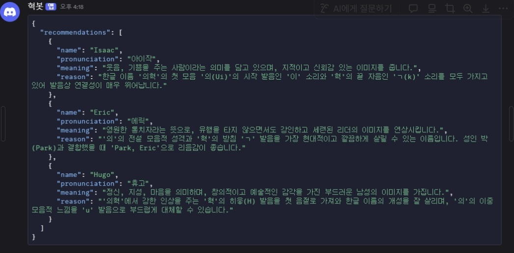

- OutputParser  구조화 시켜서 넘기기
- 옵션을 켜주면 OutputParser를 달수 있게 바뀐다.

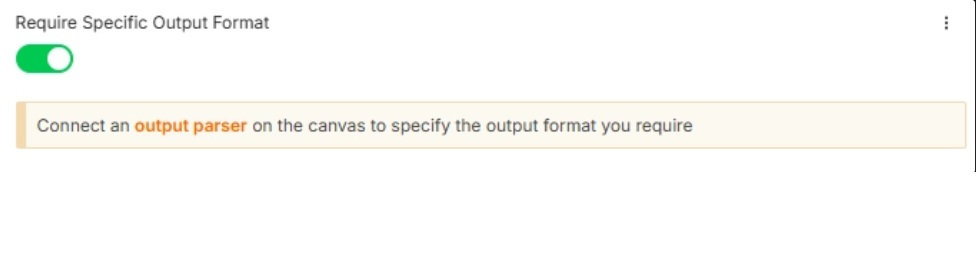

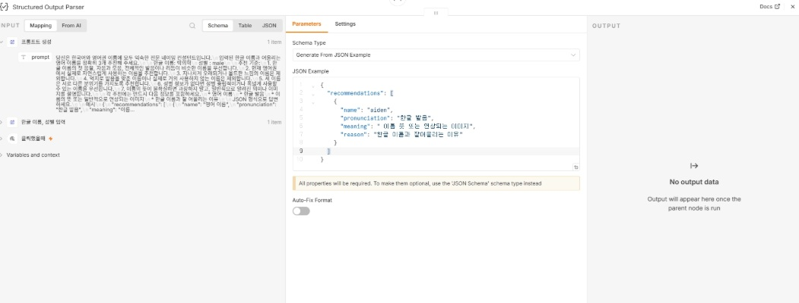

- 최종 구조

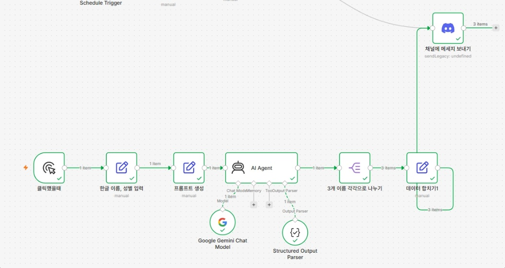

- 결과

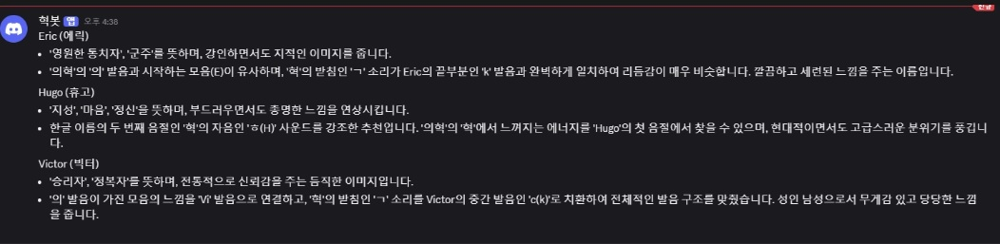

##### Split Out : 배열로 뭉쳐 있던 JSON 데이터를 항목 하나하나로 쪼개서 처리하는 것

## 과제

## **오늘의 날씨와 운세 자동화 봇 만들기**

오늘 배운 URL·API 요청과 n8n의 AI Agent를 엮어서, **매일 아침 9시 20분에 알아서 돌아가는 자동화를 만들어주세요.**

내가 실행 버튼을 누르지 않아도 정해진 시간에 스스로 동작해야합니다.

### **무엇을 만드나요**

디스코드의 **내 개인 채널**로 매일 아침 9시 20분에 아래 두 가지가 담긴 메시지가 도착하게 만듭니다.

- **오늘 내 지역의 날씨** - 내가 사는 곳 근처
- **나에 대한 오늘의 운세** - 운세 대신 명언도 좋습니다

tip) 매번 내용은 달라져도 **형식은 일정하게** 유지되도록 만들어 보세요.

### **사용하는 도구**

- **open-meteo.com** - 날씨 정보 API
- **n8n** - AI Agent 노드 & HTTP Request 노드
- **Discord** - 받을 채널

### **제출 방법**

아래 두 장을 스크린샷으로 찍어 **zip 하나로 압축**해서 제출해 주세요.

- **(1)** 내 n8n 흐름 스크린샷 - 노드 연결이 다 보이게
- **(2)** 테스트해서 실제로 받은 디스코드 내역 스크린샷

⚠️ 이미지는 따로 올라가지 않으니 반드시 zip 안에 함께 넣어주세요.

⚠️ API 키나 웹훅 주소가 화면에 그대로 찍혔다면 가리고 캡쳐해 주세요.

**실제 전송 여부는 내일 오전에 자동으로 발송되는지 확인할 예정입니다.**

### 과제 결과

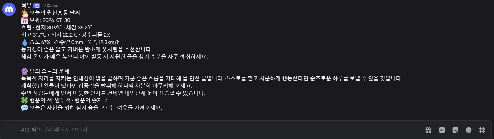

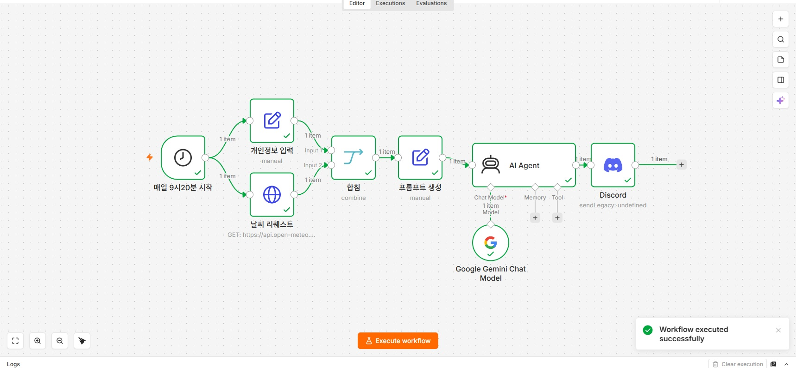