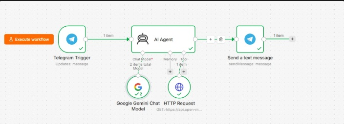
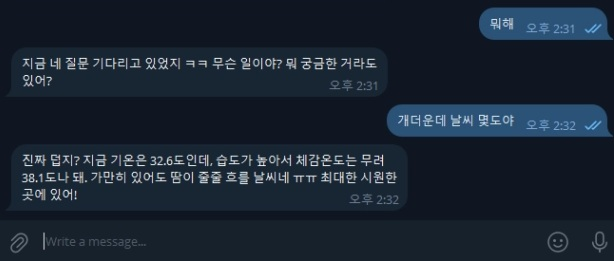
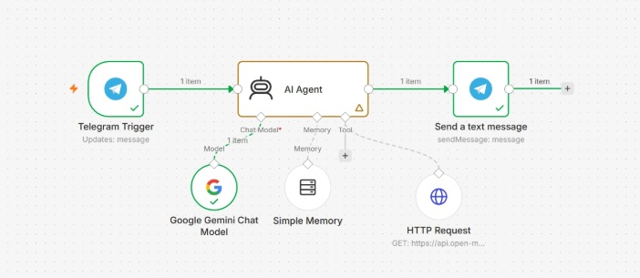
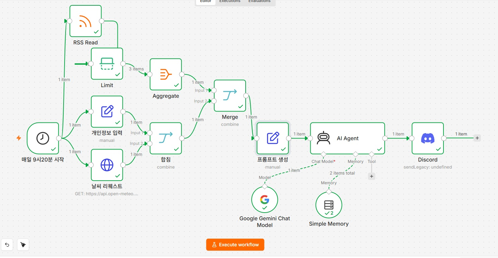
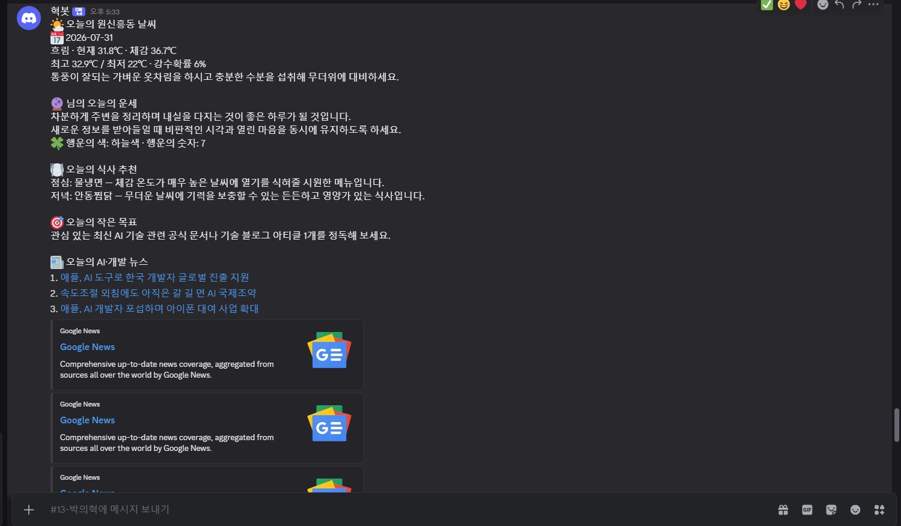
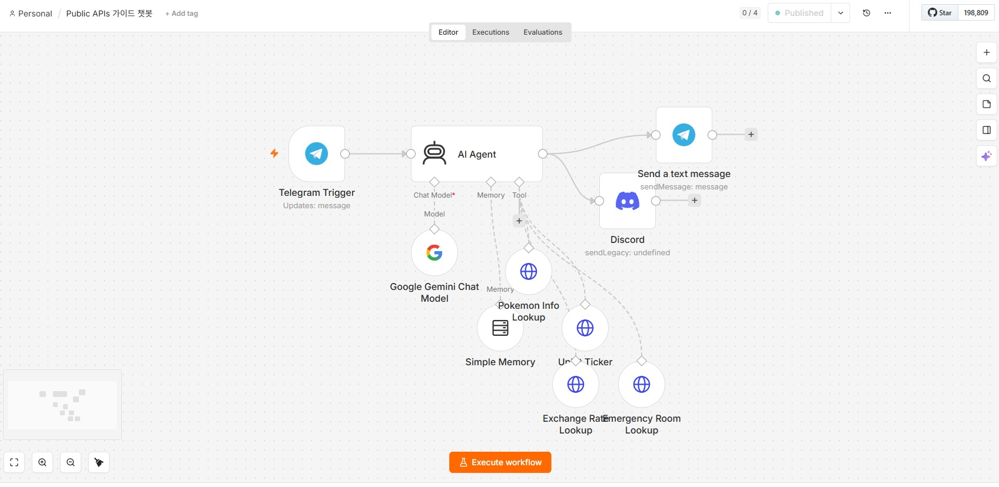
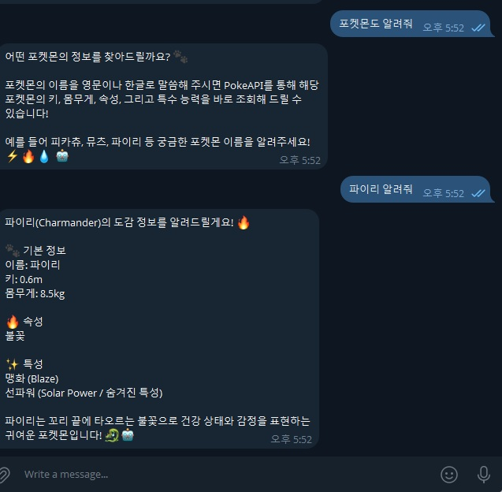
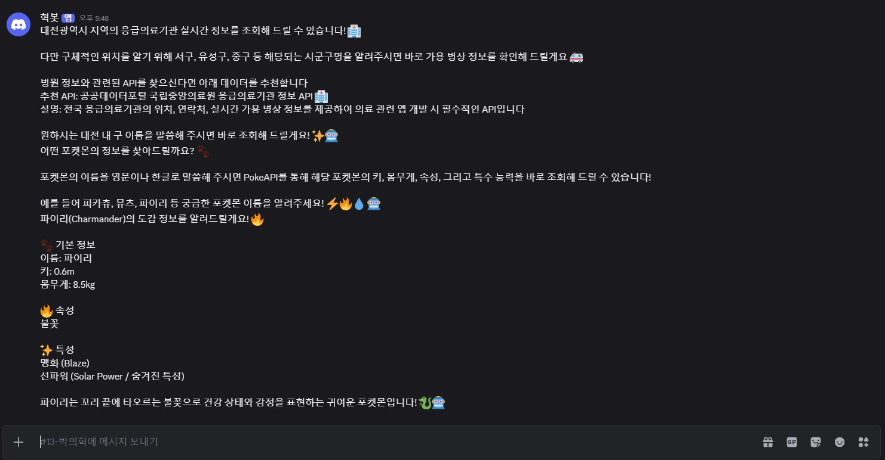

```markdown
## HTTP
-> hyper text transfor protocal (초 글자 [엄청난 글자] 전송 규약)

* 요청 : request
 1. 데이터 조작 x : GET 요청
 2. 데이터 조작 o : POST 요청
  * 이러한 요청의 방식을 Method라고 한다
* 응답 : response
- 기본적으로 인터넷 검색, 사이트 접속등과 같은 것은 GET 요청
- POST 요청의 경우 로그인 처리, 회원가입 등등

### 특징
1. 요청을 보내면 응답을 반드시 보낸다
2. 요청과 응답을 여러번 주고 받는다 해서 맥락을 알지 못한다. 
 * 상태 유지 X

* 상태를 기억할 수 있게 작은 상태 조각을 달고 다님/ 다음 요청 시 하나를 달고 보냄
(쿠키 / 세션)

## 인터넷은 최초 군사 목적으로 개발되었다.

Q. https://google.com 을 웹 브라우저에서 입력하고 엔터를 치면 어떤일이 일어나는지 서술하시오.
- 서버에 요청을 보내면 google.com의 코드를 넘겨준다. 웹 브라우저는 그 코드를 읽고 화면을 띄운다.

- 웹 브라우저는 클라이언트로서 서버로 요청을 보내는 역할을 합니다.
  https 프로토콜을 이용한 요청을 보내는데, google.com 이라는 도메인에 해당하는 ip를 갖고 있는 
  전세계 어딘가에 있는 서버 컴퓨터로 요청을 보냅니다.
  
  이때 이 요청이 웹 페이지를 보여달라는 요청이라면 응답으로 코드가 가득한 응답을 줍니다.
  그러면 내 웹 브라우저는 해당 코드를 랜더링(이쁘게 보여줌)을 거쳐서 내게 보여주게 됩니다.
```

```markdown
### URL -> 요청
* 구조 : https://www.google.com/search?q=kakako+api+docs&sca_esv=d0b210a9e94f1392
        (프로토콜) (도메인)     (Path경로)?(Query)
        
									       com 뒤에(포트port 번호(80) 숨겨져 있음) 
										     컴퓨터의 안쪽으로 들어가는 문을 포트번호라고 생각하면 된다. 

https://news.naver.com/ -> 마지막 /만 path(경로)

* Query는 key : value 
 * 데이터 전달
 
### Status code(상태코드)
- 1xx : 정보  
- ☆2xx : Successful responses -> 성공(문제 없음) 
 * 200 ok / 201 created
- 3xx : 리다이렉션, 방향을 바꿔서 요청 처리  
- ☆4xx : Client Error Responses
 * 400 (Bed Request) / 404 (Not Found) 
- ☆5xx : Server Error Responses 서버가 잘못했을때

https://httpstatusdogs.com/
https://http.cat/
* 비유해서 보여준다
```

```markdown
### 양방향 통신 

* 텔레그램 연동

BotFather 검색
- 내 bot 등록

* n8n으로 텔레그램 연결
```

실습

1)날씨를 물어보거나 혹은 오늘 추워? 오늘 더워?
같이 물어보면 날씨 API를 호출해서 답을 하도록 해주세요

2)그 외 답변은 마치 내 친한 친구처럼 내 정보를 알고 있는
상태에서 답을 하도록 해주세요.





- 메모리를 넣지 않으면 기억을 하지를 못한다.



- 메모리 넣기

과제

오늘 배운 **AI Agent 노드**와 **텔레그램 연동**을 활용해, 내가 진짜로 매일 받아보고 싶은 봇을 만들어 봅니다.

과제는 두 개입니다. **둘 다 제출**해 주세요.

### **과제 1 · 아침 자동화 봇 커스터마이징**

지금 매일 아침 9시 20분에 디스코드로 오는 자동화는 날씨와 운세만 들어 있습니다. 이것을 **나만의 자동화**로 바꿔 주세요.

- 단순히 기능 하나만 넣지 말고, **여러 정보가 어우러진 형태**로 만들어 보세요
- **필수** :: AI Agent의 **메모리(Memory) 기능**을 반드시 활용할 것
- 예시 :: 매일 점심 메뉴 추천 (단, 이전에 추천한 메뉴는 제외) - 메모리를 쓰는 이유를 잘 생각해 보세요.

### **과제 2 · 텔레그램 X 디스코드 AI 봇**

공개 API를 **1개 이상** 활용해서 나만의 봇을 만들어 주세요.

- **필수** :: AI Agent를 활용해 자연스럽게 대화하는 봇으로 만들 것
- **필수** :: **텔레그램과 디스코드 양쪽 모두**에 답변이 도착하도록 구현할 것 (말을 거는 건 텔레그램에서만 해도 됩니다)

### **제출물**

아래 4가지를 **zip으로 압축**해서 제출해 주세요.

1. n8n 노드 캡처 이미지
2. 텔레그램 결과 이미지
3. 디스코드 결과 이미지
4. 최종 미니프로젝트 아이디어 초안 (.md 문서, 아주 간단해도 좋습니다)

⚠️ 이미지는 따로 올라가지 않으니 **반드시 zip 안에 함께** 넣어 주세요.

⚠️ 모두가 볼 수 있는 공간이니 **개인정보가 노출되지 않도록** 주의해 주세요.

과제 결과










기획문서_API가이드봇.md

최종프로젝트_아이디어초안.md

#### md 파일은 노션 참고    