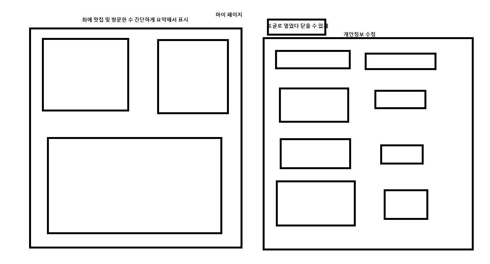
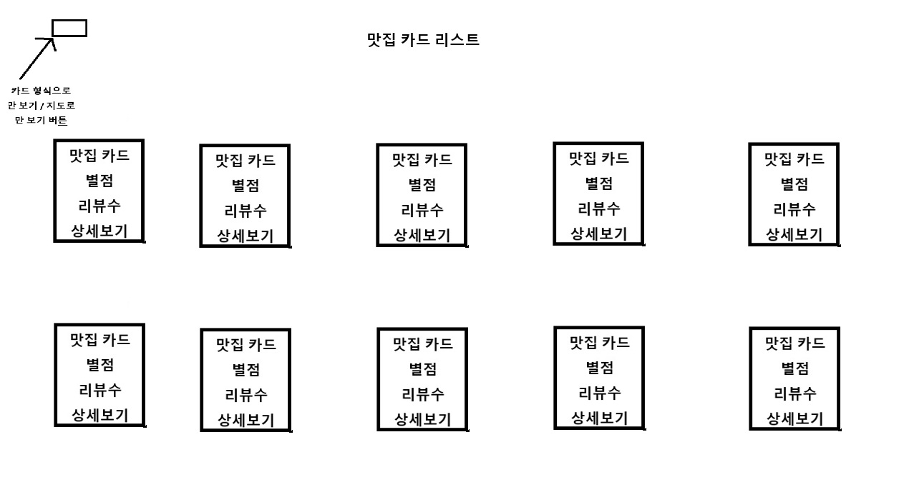
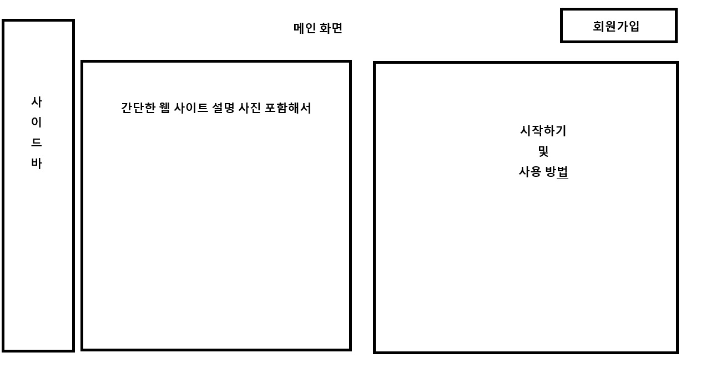
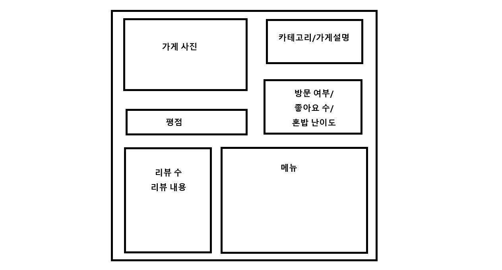
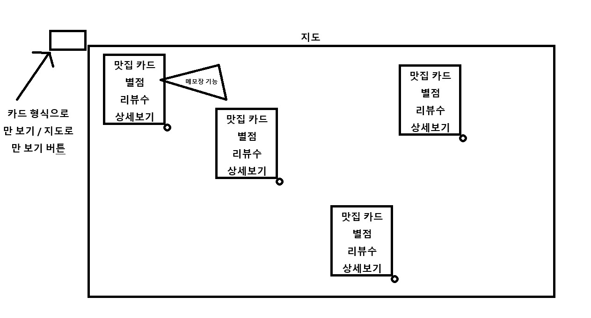
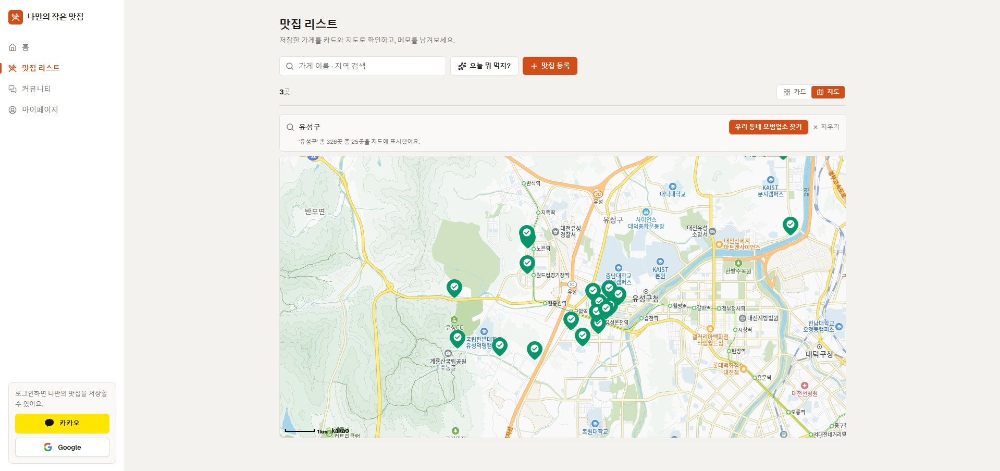
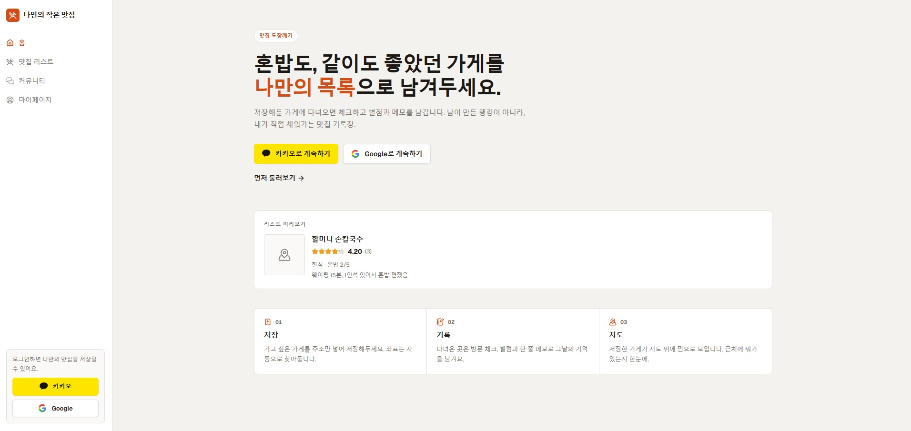

```markdown
### n8n
1. cloud
 * 편하다, 컴퓨팅자원에 대해 신경쓰지 않아도 된다.
 * 돈이 든다.
 
2. selfhosted
 * 무료로 사용하려면 내 컴퓨터에 설치/설정 등을 해야한다
 
n8n 스킬 : https://github.com/czlonkowski/n8n-skills
* 노드 자동화
* 돈을 안내면 사용할 수는 없다
https://docs.n8n.io/connect/n8n-api/authentication

### 국회의원 맛집 지도
https://restaurant.coroke.net/
```

```markdown
* 생산 -> AI "가능함"
         -> 막힘 -> CS지식 부족

* software 종류 
: 웹(Web), 운영체제(모바일, 데스크톱(응))

* 컴퓨터 구조
컴퓨터 - CPU(중앙처리장치) - MB - RAM(주 메모리/ 주저장장치) / SSD,HD (보조저장장치)
																	CPU랑 속도가 맞다          프로그램
멀티 스레딩(나누어서 작업)																	

* 필수지식
- 알고리즘
- 자료구조 -> Data

Python -> 구현 -> 컴퓨터 언어 (변수)
                             어떤 구조로 올리는 걸 변수라고 함
Program -> RAM 

함수 : InPut -> 처리 -> OutPut 같다
클래스(객체) : 현실 -> 컴퓨터
* 반복되는 자료구조(형태), 정의 하는 것

소프트웨어 공학 
- 패턴들을 모아놓은 것
* 워터풀, 애자일 등등

* 개발언어(프레임워크) -> 도구 모음
- API - 어디로 호출(주소), 데이터
 ** 처리를 해주는 함수, 기능을 잘 모아놓은 것을 프레임워크라고 한다

FE : JS 언어기반 프레임워크 (React, view, sbelt)
BE : Python,   JS, C, C++, Go
     FastAPI  node
     

네트워크
- Client : 핸드폰, 웹브라우저, 어플 등등 
- Server 
* 요청과 응답을 주고 받음
 - GET, POST (HTTP method)
 
Status code
- 1xx
- 2xx : success
- 3xx
- 4xx : 클라이언트 에러
- 5xx : 서버 에러

Client -> Server(FE(동적, 웹페이지 구성) -> BE(데이터, API))
```

```markdown
- SSR(Server Side Rendering) 
* 서버쪽에서 렌더링 준비를 끝마친 상태로 클라이언트에 전달하는 방식

- CSR(Client Side Rendering)
* 말 그대로 SSR과 달리 렌더링이 클라이언트 쪽에서 일어난다. 
즉, 서버는 요청을 받으면 클라이언트에 HTML과 JS를 보내준다.

SEO 관점에서는 SSR이 유리하다.
(검색이 잘되는지)
robots.txt 를 주소 뒤에 입력하면 크롤링, claud가 가져갈 수 있는지 알 수 있다.

* 현재는 상황에 따라 다르게 줄 수 있는 도구들이 있다.

SSR : 서버에서 화면을 미리 만든다
CSR : 브라우저가 화면을 그린다
```

```markdown
레거시 : 과거의 산물 

### 배포
Vercel : 원클릭 FE 배포 가능

백엔드 : 클라우드 환경으로 배포해야한다
* AWS : AI와 연결해서 가능
```

```markdown
FE : Next.js 

BE : Node, FastAPI 중 하나로

- DB에서 Data를 꺼내서 이쁘게 구조를 잡아 전달하는 프로그램

C : create 생성
R : read 읽기
U : update 수정
D : delete 삭제

DB : Supabase
* SQL : RDB 엑셀 같은 테이블 형식
-> Mysql, Oracle, postgleSQL 등등
* noSQL : JSON 같은 형식
```

MCP - AI 에이전트에게 가능하게 연결 해주는 것?

NEXT / supabase 연결

공식 문서 참고해서 claud랑 연결하면 된다

### 중요 중요! 적고 가는 것이 좋음

로컬 하네스 엔지니어링 : 프로젝트 기획 문서에 대한 것

글로벌 하네스 엔지니어링 : 개인적인 것

### 과제

## **무엇을 만드나요**

가고 싶은 맛집을 저장하고, 다녀온 곳에 별점을 남기는 **나만의 맛집 관리 서비스**를 만듭니다.

수업에서 진행한 기획을 바탕으로 금일 배운 FE + BE + DB + Deploy 구조를 살펴봅니다.

## **제출 기준**

**하나의 기능에 대해 CRUD를 완성했다면 과제 완료입니다.**

등록·조회·수정·삭제가 되고, 그게 배포된 주소에서 동작하면 충분합니다.

## **제출물 (zip 1개)**

아래 3개를 압축해서 **zip 파일 하나**로 제출합니다.

1. **회고.md** - 배포 링크와 함께 이번 실습에서 새롭게 알게된 부분, 느낀점, 막혔던 부분 등을 작성합니다.
2. **screenshot** 배포 화면을 캡쳐해서 넣어주세요.

**이미지는 zip 안에 함께 넣어주세요.** 따로 올리면 첨부되지 않습니다.

## **유의사항**

- **API 키를 제출물에 넣지 마세요**
- 배포 주소는 **실제로 접속되는지** 한 번 눌러보고 제출하세요

### 과정

my-little-restaurant.md











### 결과





회고.md

#### md 파일 노션 참고