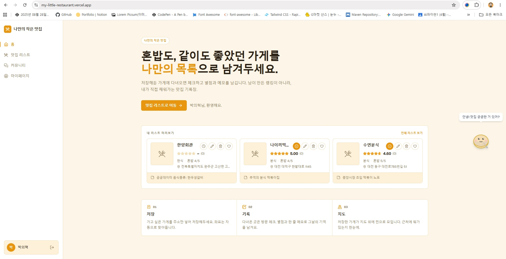
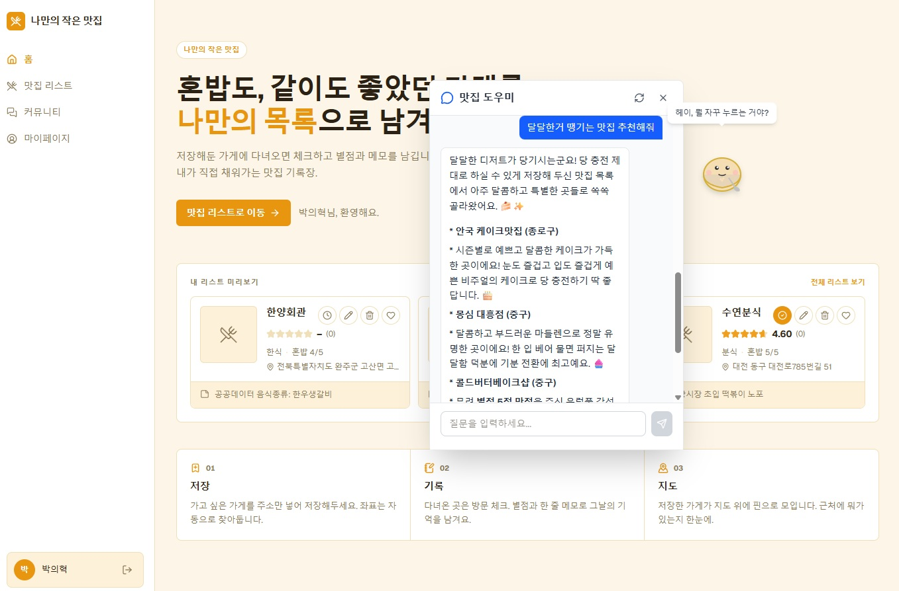
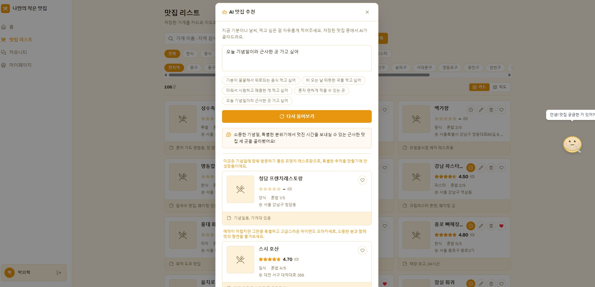

```markdown
* AI -> 기획이 중요하다

* 방지 장치 
1. 기획 : 기획.md
2. 개발 : 아직 코드를 만져보지 않았다.
 * 기능 테스트
```

```markdown
** 취업 관련
FE, BE, PM, PO, IOS, AND : 직군 붕계 (개발자)
CS적인 지식을 가지고 풀스택 개발자가 되야 취업할 수 있다.(포지셔닝 중요)
```

```markdown
#### 환경변수
key - gemini key 
			open AI
이런 키들을 Local에만 있으면 배포가 안된다

- supabase - key -> Vercel

* 하나의 환경안에 들어가있는 키
key name : key value

.env 파일 안에 넣는다고 해서 보안이 좋다거나 하는 건 아니다
-> 단, .파일은 OS에서 숨김 처리를 한다

#### 프로젝트 환경
- Local : 내 컴퓨터
- Development : 같은 조직 (테스트 환경)
- Production : 실제 사용 <- env
* 3단계 환경을 두고 만든다

* 값은 노출하지 않고 코드에서 이름(Key)으로 호출한다.
```

```markdown
웹도 모바일 뷰로 디자인 할 수 있다.
* 클로드, 지피티 한테 용어를 물어보고 실행하면 된다.

AI 시킬 때 -> 사람이 어떻게 하는지 생각하고 시킨다
```

https://kr.pinterest.com/

관심 있는 이미지나 아이디어를 가상의 게시판에 핀으로 꽂아 수집하고 공유하는 이미지 기반 소셜 미디어 

플랫폼

디자이너 → 감각을 키울 수 있다.(다양한 레퍼런스 및 디자인을 핀터레스에서 모으면 된다)

- 개발 간에도 도움이 되니 참고
- 디자인시스템 키워드로 잡기
- 무드보드 : 이미지, 텍스트, 컬러칩 등을 모아 프로젝트의 분위기와 방향성을 시각적으로 표현하는          디자인 도구

디자인.md 파일을 만든다음 그걸 기준으로 디자인시스템을 만들자고 한다.

다음 프로토타입을 70% 정도가 됬을 때 다른 페이지도 이걸 기준으로 만들자고 한다.

```markdown
* AI Agent - skill(md파일로 적용)
* 스킬 만들기
- 마크다운 파일에 본인이 정한 스킬을 만들어서 편하게 쓰자
- 생성형 AI 에이전트가 특정 업무를 수행할 때 참고하는 지침, 명령어, 
  스크립트 등을 모듈 형태로 패키징한 재사용 가능한 리소스
  
* 설치는 주소 복사에서 설치 해달라고 하면 된다

https://github.com/epoko77-ai/im-not-ai  AI 티 안나게 하는 스킬

Tools 
- skill
- MCP
- hook
등이 있다
AI가 알아서 쓰기 때문에 잘 관리를 해줘야한다
```

### 토근 줄이기

https://github.com/DietrichGebert/ponytail

스킬 참고!

### 과제

## **무엇을 만드나요**

어제 진행한 맛집 프로젝트의 대장정을 마무리합니다.

데이터베이스를 활용해 나만의 AI 기능을 넣어서 프로덕트를 개선해주세요.

가고 싶은 맛집을 저장하고, 다녀온 곳에 별점을 남기는 **나만의 맛집 관리 서비스**를 만들어봅니다.

Gemini API를 활용해주세요.

## **제출 기준**

하나의 기능에 대해 CRUD가 들어가 있고, AI Agent를 활용한 기능이 최소 한 개이상 있어야합니다.

## **제출물 (zip 1개)**

아래 3개를 압축해서 **zip 파일 하나**로 제출합니다.

1. **요약.md**배포 링크와 함께, 이번 서비스에서 개선한 부분과 막혔던점, 새롭게 배운점을 정리합니다.
2. **스크린샷** 배포 화면을 캡쳐해서 넣어주세요.
3. **Code** - 작성한 코드가 들어있는 프로젝트를 전체 zip으로 압축해서 제출합니다.

**이미지는 zip 안에 함께 넣어주세요.** 따로 올리면 첨부되지 않습니다.

## **유의사항**

- 배포 주소는 **실제로 접속되는지** 한 번 눌러보고 제출하세요

### 결과







요약.md

https://my-little-restaurant.vercel.app/