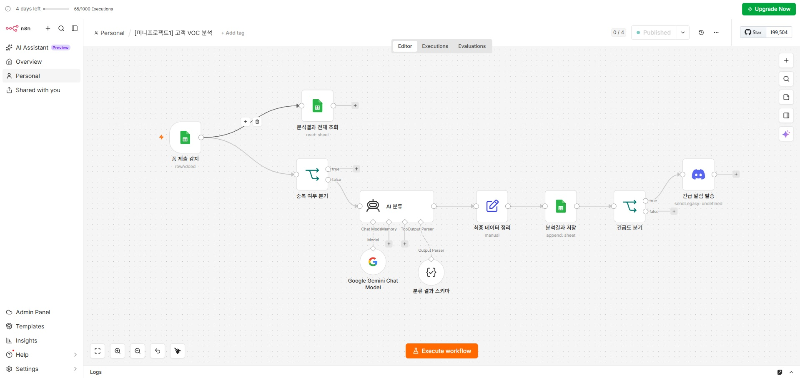
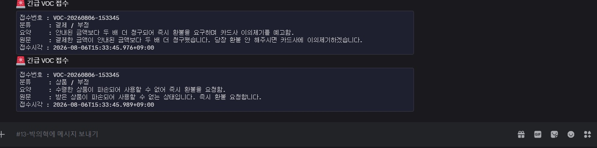
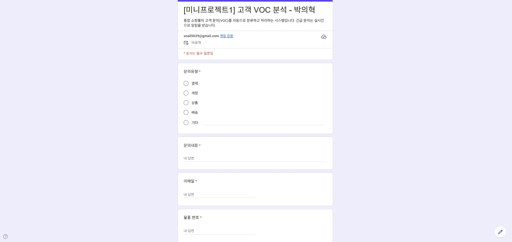
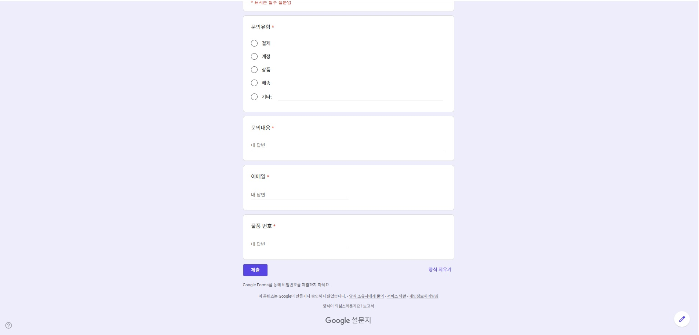
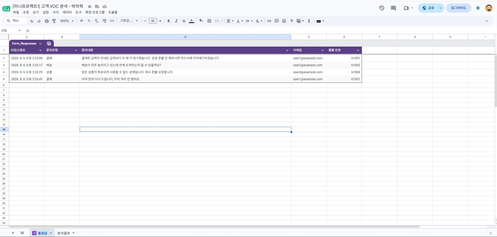
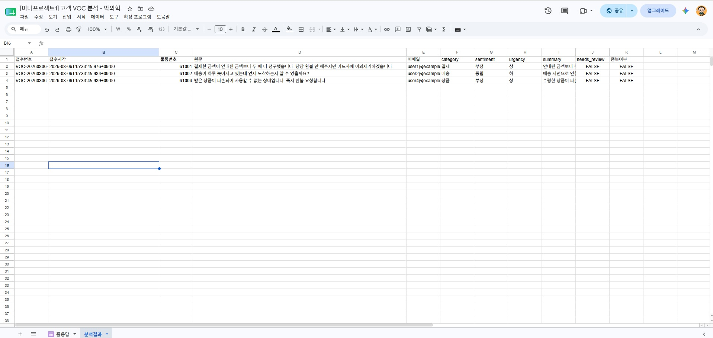
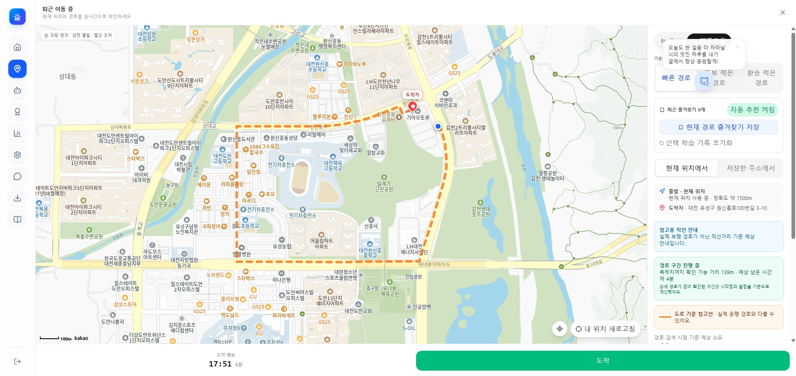
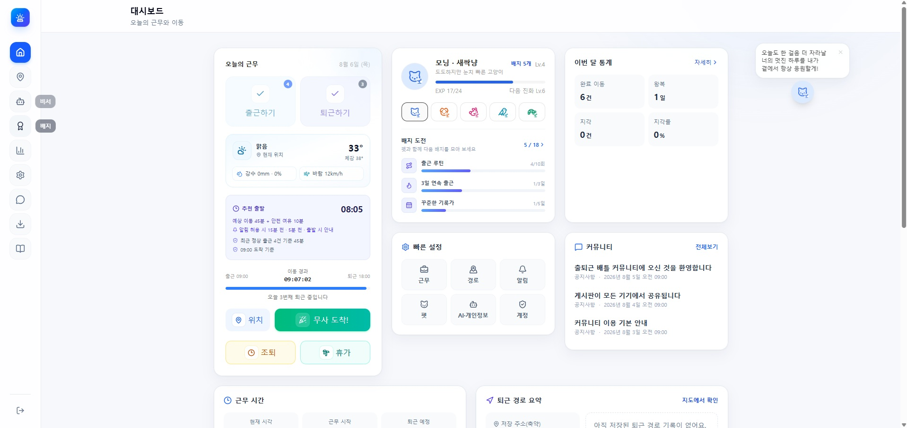
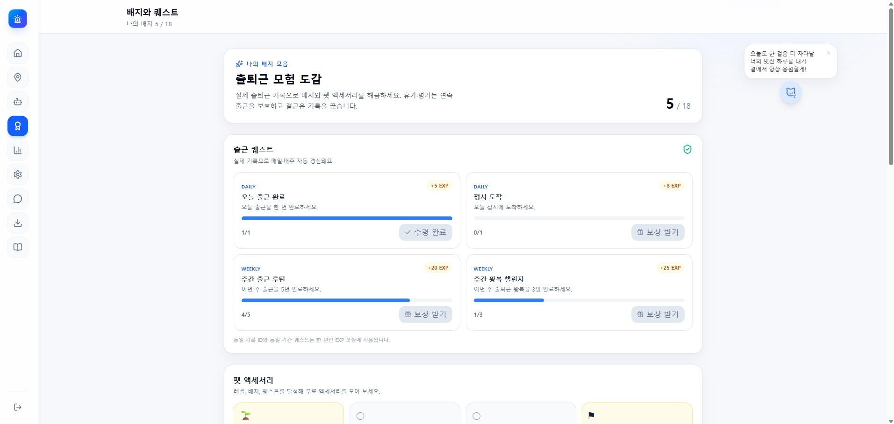

준비~~!!

### 미니_프로젝트_1 요구사항 및 결과

```markdown
## **고객 VOC 분석 Agent**

종합 쇼핑몰에서 개발 요청서가 들어왔습니다. 고객 문의가 하루 수십 건씩 들어오지만, 사람이 하나씩 읽고 분류하는 방식은 두 가지 문제가 있습니다. 담당자가 자리를 비운 사이 긴급 문의가 몇 시간씩 방치되고, 분류 기준이 사람마다 달라 통계를 낼 수 없습니다.

**접수부터 분류, 기록, 긴급 알림까지 사람 손을 거치지 않는 파이프라인**을 만듭니다.

### **요구사항**

- **REQ-01 수집** :: 구글 폼으로 VOC를 접수하고 시트에 자동 누적. 폼 항목은 `문의유형`(결제/계정/상품/배송/기타) `문의내용`(장문형) `이메일` `물품 번호`(5자리 숫자). 항목명은 그대로 사용하세요. 채점 시 이 이름으로 확인합니다
- **REQ-02 트리거** :: 시트에 새 응답이 추가되면 워크플로우가 자동 실행. 수동 실행만 되는 상태는 미완성으로 봅니다
- **REQ-03 중복 방지** :: 같은 물품에 대한 동일 문의가 두 번 들어와도 결과가 늘어나면 안 됩니다. 분석 결과 시트의 항목을 조합해 차단하고, **반드시 LLM 호출 이전에** 거릅니다. 중복 건은 저장도 알림도 없이 정상 종료
- **REQ-04 LLM 분류** :: 구조화 출력(JSON)으로 `category` `sentiment` `urgency` `summary`(80자 이하) `needs_review` 5개 필드 반환
- **REQ-05 검증 안전판** :: 필수 필드 누락·허용값 위반·타입 불일치를 검사. 위반 시 urgency는 `중`, needs_review는 `true`로. 검증 실패건도 시트에는 저장
- **REQ-06 결과 저장** :: 분석 결과를 시트에 기록
- **REQ-07 긴급 알림** :: urgency가 `상`인 건만 디스코드 Webhook으로 발송. 메시지에 접수번호·분류·요약·원문(200자)·접수시각 포함

### **긴급도 판정 기준 (프롬프트에 명시)**

- **상** :: 서비스를 못 쓰는 상태, 금전적 피해, 법적 대응이나 언론 제보 언급, 명시적 환불 요구
- **중** :: 불편하지만 사용은 가능, 문의와 개선 요청
- **하** :: 단순 질문, 칭찬, 정보 확인
```












미니프로젝트1_박의혁.md

### 미니_프로젝트_2 미시작

```markdown
## **금융 뉴스 브리핑 Agent**

자산운용사 리서치팀에서 개발 요청서가 들어왔습니다. 팀원들은 매일 아침 여러 뉴스 사이트를 돌아다니며 기사를 찾아 읽습니다. 사람마다 보는 매체가 달라 아는 뉴스가 제각각이고, 기사 대부분은 연예나 스포츠라 골라내는 데만 시간이 들고, 어제 읽은 기사를 오늘 또 읽습니다.

**매일 아침 8시 30분, 여러 매체 중 금융 기사만 골라 요약한 브리핑을 자동 발송하는 시스템**을 만듭니다.

### **요구사항**

- **REQ-01 수집** :: 서로 다른 매체의 뉴스 RSS 피드를 **최소 2개** 연결. 2개 이상 쓰는 이유는 커버리지 때문만이 아니라, 한 피드가 비거나 장애가 났을 때 브리핑이 통째로 멈추지 않게 하는 안전장치이기도 합니다
- **REQ-02 트리거** :: **매일 아침 8시 30분** 자동 실행. 아무것도 누르지 않아도 아침에 브리핑이 도착해야 합니다
- **REQ-03 중복 발송 방지** :: 어제 보낸 기사가 오늘 다시 들어가면 안 됩니다. 구글 시트의 발송 이력과 대조해 거릅니다. **기사를 구분하는 고유값을 무엇으로 삼을지 정하고 그 근거를 제출 문서에 적으세요.** 반드시 LLM 호출 이전에 차단합니다
- **REQ-04 금융 키워드 필터** :: 금융과 무관한 기사(연예·스포츠·날씨)가 브리핑에 들어가면 안 됩니다. 어떤 키워드를 어떻게 적용할지는 여러분이 설계합니다. **필터를 LLM 앞에 둘지 뒤에 둘지 판단하고 이유를 제출 문서에 적으세요.** 이 선택이 비용과 정확도를 결정합니다
- **REQ-05 LLM 요약과 중요도** :: 구조화 출력(JSON)으로 `summary`(3문장 이하) `importance`(1~5 정수) `category` `needs_review` 반환
- **REQ-06 디스코드 브리핑** :: 중요도 **4 이상**만, **하나의 메시지로 묶어** 발송. 기사가 5건이면 메시지 5개가 아니라 1개입니다. 기사마다 제목·요약·원문 링크·카테고리 포함
- **REQ-07 발송 이력 기록** :: 발송한 기사를 구글 시트에 자동 누적. 어떤 항목을 남길지는 여러분이 설계합니다

### **중요도 판정 기준 (프롬프트에 명시)**

- **5** :: 시장 전체를 흔드는 사건. 금리 결정, 대형 정책 발표, 급락과 급등
- **4** :: 특정 업종이나 대형 기업에 직접 영향. 실적 발표, 대형 인수합병
- **3** :: 참고할 만한 동향. 지표 발표, 업계 전망
- **2** :: 일반적인 소식 / **1** :: 브리핑에 넣을 필요 없는 기사

tip) **중요 기사가 하나도 없는 날의 경로도 설계하세요.** 아무 일도 없는 것과 시스템이 고장 난 것을 받는 사람이 구분할 수 있어야 합니다.
```

### 나만의_AI프로젝트 진행 중

```markdown
## **나만의 AI Agent 웹 서비스**

마지막 개발요청서는 **여러분 자신이 보낸 것**입니다.

앞선 두 프로젝트는 무엇을 만들지가 정해져 있었지만, 이번에는 시작부터 여러분이 결정합니다.

이전 수업에서 작성한 기획서를 살펴보고 구체화해 구현합니다.

🎯 **먼저 작게 완성하는 것을 목표로 하세요.**

기능이 많은 서비스가 아니라 하나의 일을 확실히 해내는 서비스가 좋은 평가를 받습니다.

화면 3개짜리가 완성되는 것이 화면 10개짜리가 절반만 되는 것보다 훨씬 낫습니다.

### **기술 스택 (고정)**

- 프레임워크 :: **Next.js** / 배포 :: **Vercel**
- 데이터베이스 :: **Supabase** / AI :: **Gemini API** (LLM, 이미지 생성 등)
- 각자 **본인 계정**으로 Vercel과 Supabase 프로젝트를 만들어 사용합니다

### **요구사항**

- **REQ-01 주제 (자유)** :: 기존 기획서를 기반으로 정합니다. 이틀 안에 만들 수 있는 크기로 줄여도 됩니다. 줄였다면 **무엇을 뺐는지와 그 이유**를 문서에 적으세요. 범위를 줄이는 것은 감점이 아니라 설계 능력입니다. 프로젝트 1·2와 주제가 겹쳐도 되지만, n8n으로 만든 것을 웹으로 옮기는 것이라면 **웹이기 때문에 가능해진 것**이 있어야 합니다
- **REQ-02 AI 기능 (1개 이상 필수)** :: 사용자의 입력이나 데이터를 받아 AI가 처리하고 그 결과가 화면에 나타나야 합니다. **미리 만들어 둔 응답을 보여주는 것은 AI 기능이 아닙니다**
- **REQ-03 데이터 저장** :: 사용자가 만든 데이터나 AI 처리 결과가 Supabase에 저장되어야 합니다. 새로고침하면 사라지는 상태는 저장이 아닙니다. 최소 1개 이상의 테이블을 설계하세요. 로그인은 필수가 아닙니다
- **REQ-04 배포** :: **접속 가능한 주소**가 있어야 합니다. 링크를 받은 사람이 아무 설치 없이 바로 쓸 수 있어야 합니다. 제출 전에 **다른 기기나 시크릿 창으로 직접 열어보세요.** 본인 브라우저에서만 되는 경우가 자주 있습니다
- **REQ-05 최소한의 사용성** :: 처음 들어온 사람이 무엇을 하는 서비스인지, 무엇을 먼저 눌러야 하는지 알 수 있어야 합니다. AI 호출이 실패하거나 입력이 비었을 때 화면이 깨지지 않아야 합니다

### **AI 기능 예시**

사용자가 쓴 글을 분류하거나 요약하기, 입력을 바탕으로 추천하기, 자연어 질문을 검색 조건으로 바꾸기, 이미지나 문서에서 정보를 뽑아내기, 대화형으로 응답하기 등
```







미니 프로젝트 1을 제외한 나머지 프로젝트는 현재 진행 중!!