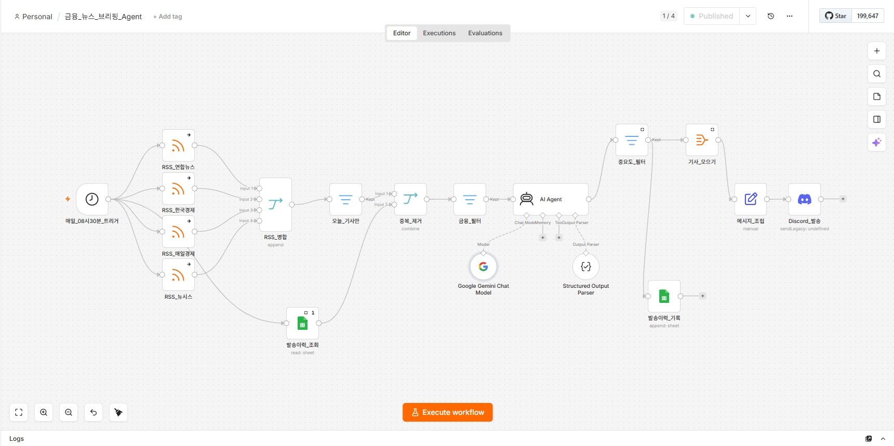
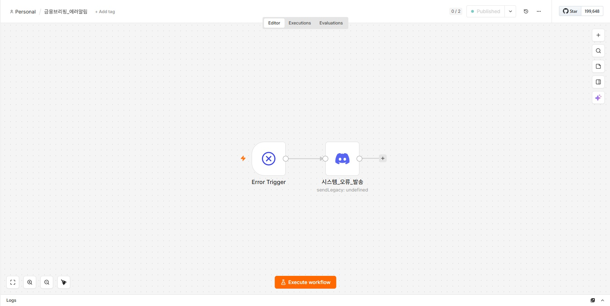
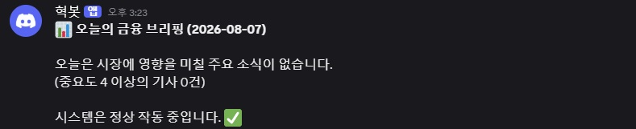
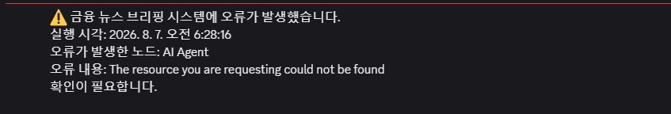
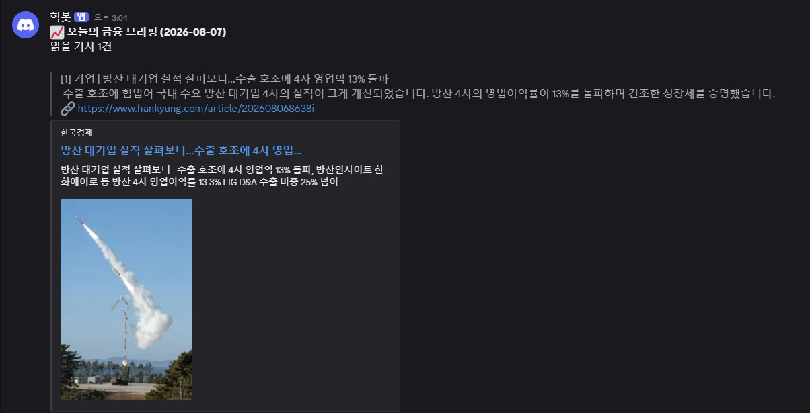
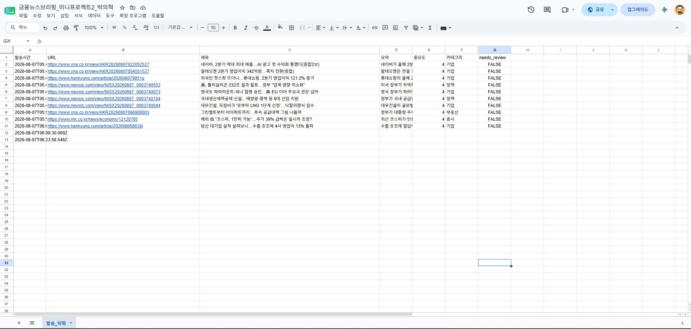

시험 문제 풀이 및 과제 진행!

과제 및 포토폴리오 관련

```markdown
* 정리
1. 이번 프로젝트까지는 AIStudio에만 올려도 됨
2. 이후 미니프로젝트는 깃헙에 올린다
3. 다만 깃헙에 올릴 때 퍼블릭/프라이빗은 선택
4. 프라이빗의 경우 맴버 초대를 해야됨
```

Github의 portfolio의 폴더 안에 폴더를 만들어서 과제 및 미니 프로젝트를 집어넣자

**[미니프로젝트2] 금융 뉴스 브리핑 Agent**













금융_뉴스_브리핑_Agent.json

금융브리핑_에러알림.json

미니프로젝트2_박의혁.md

완료!

미니프로젝트 3 진행 중!!

### md, josn 파일 노션 참고