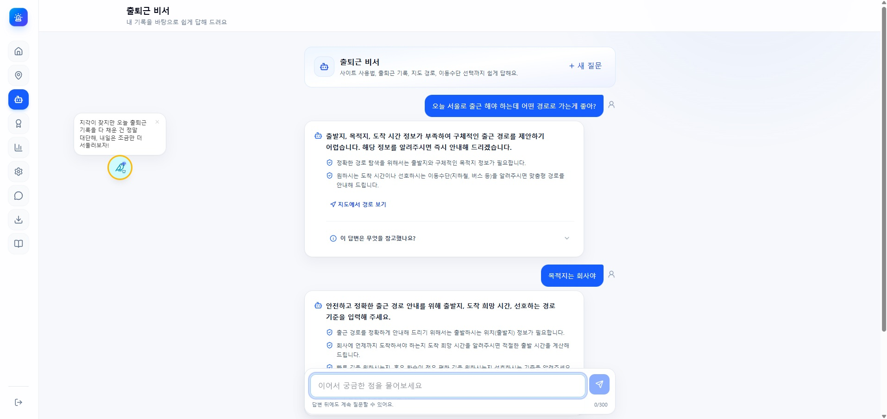
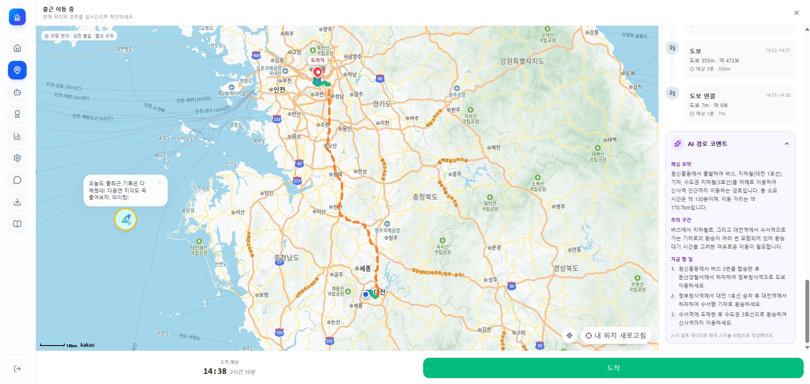
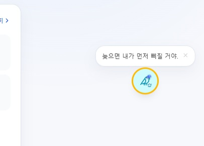
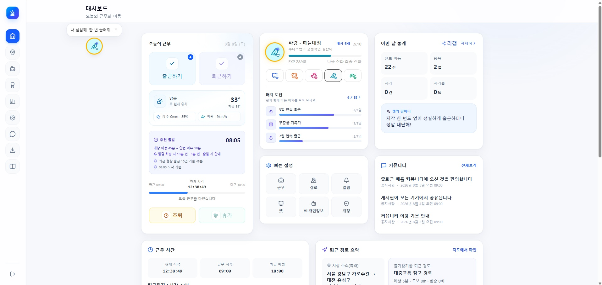
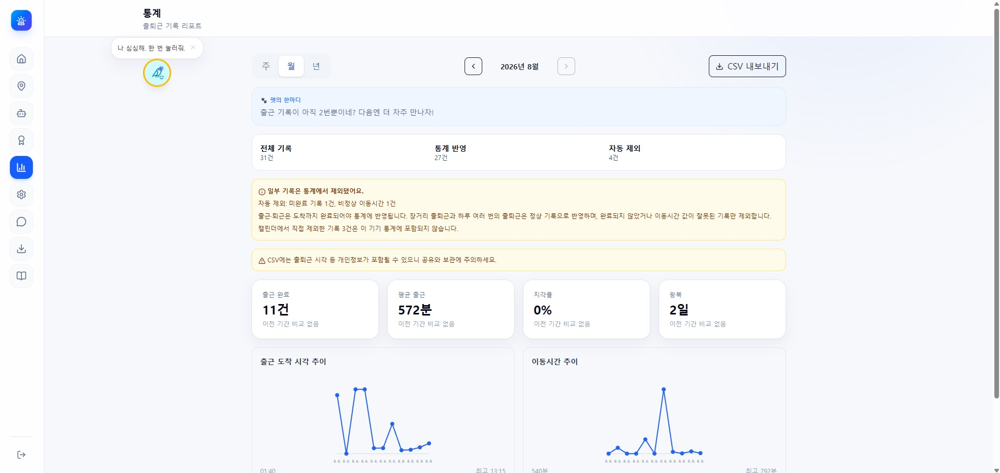
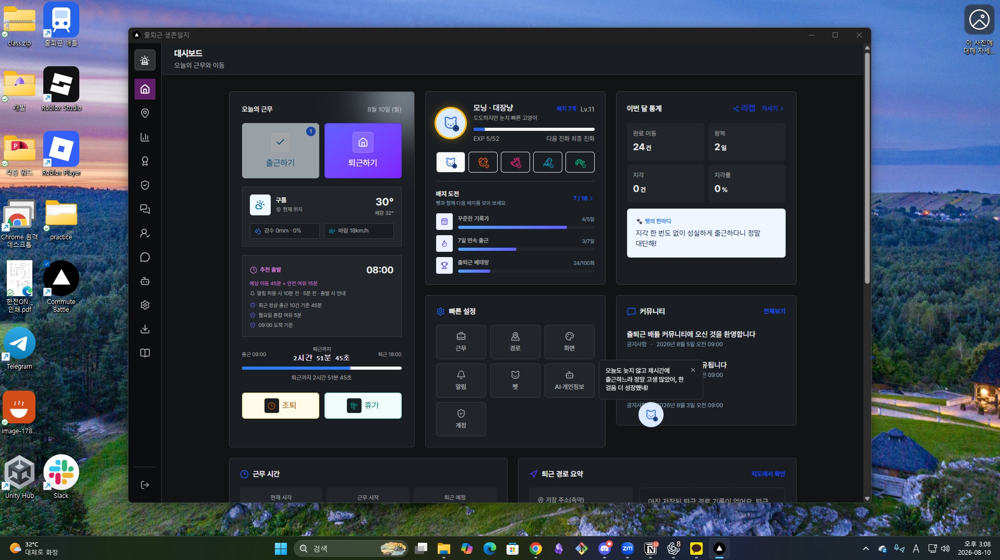
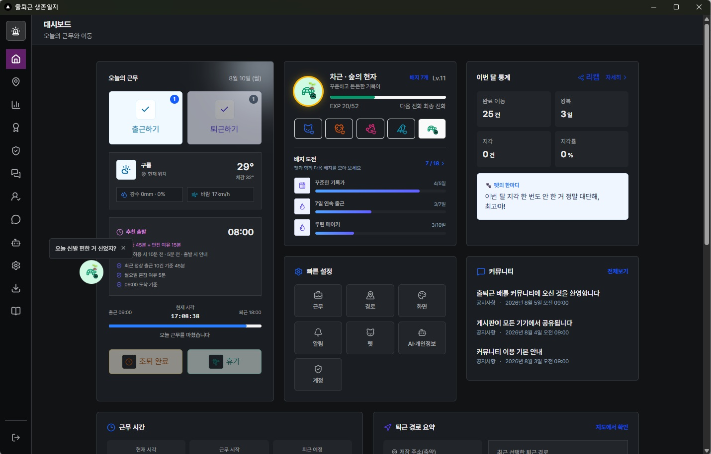
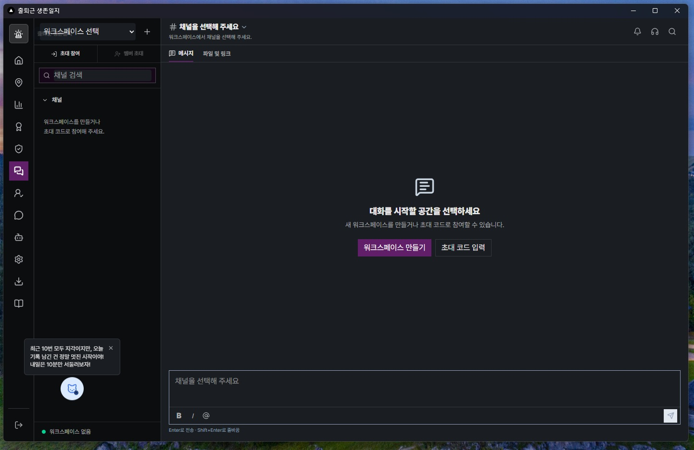
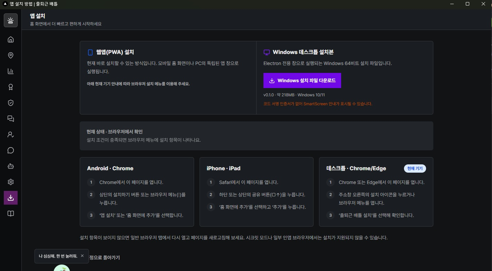

## 최종 프로젝트 마무리

### 결과

미니프로젝트3_출퇴근전쟁봇.md

#### 배포주소

https://commute-battle.vercel.app/

설명 

반복되는 출퇴근에 지루함을 느끼고 이거를 어떻게 하면 게임 처럼 만들 수 있을 까 고민을 했는 데 간단한 퀘스트와 아기자기한 펫으로 조금 더 힐링하면서 출근할 수 있었으면 좋겠어서 만들었다.

슬렉을 참고 했고 추후에는 부서별 채팅을 만들어서 업무용 메신저 및 근태 관리 프로그램이 되었으면 좋겠다.

- 채팅 기능 추가 및 근태 관리 기능 추가
- 실제 슬렉 같은 어플 형태로 개발 완료

각각의 사람들마다 추구하는 방향 디자인이 완전하게 달라 내 창의성? 지식을 늘릴 수 있어서 좋은 경험이었다. 토큰은 무지막지하게 다 써버렸지만!

#### 사진

확실히 테마랑 데스크톱 앱으로 만드니 훨씬 사용성과 가독성이 보기 좋아졌다.

누군가 업무용 앱으로 사용하면 좋겠다.