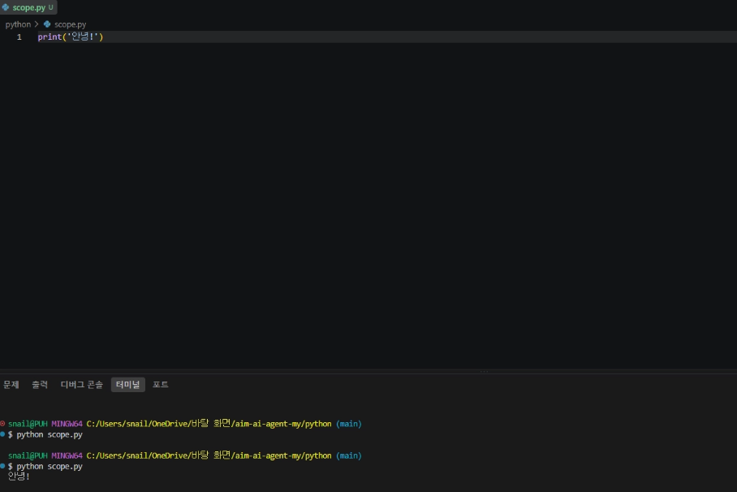

```markdown
# 회문
# 거꾸로 했을 때 나 자신과 같은 단어
# 수박이박수
# abcdcba
# 회문이라고 부릅니다.

# 단어를 입력받아서 회문인지 아닌지 찾아보는 함수를 만들어보세요.

def is_pallindrome(str) :
    return str == str[::-1]

    # 슬라이싱
    # [start : end : step]

# 반복을 통해 뒤집어보기
def is_pallindrome(str) :
    word = '다시합창합시다'

    reversd_word = ''
    # 맨 뒤부터 하나씩 꺼내와서 앞에 붙인다.
    for index in range(len(word)) :
        reversed_index = len(word) - index - 1
        print(index, reversed_index)    
        reversd_word = reversd_word + word[reversed_index]
    return word == reversd_word

def is_pallindrome(word) :

    reversd_word = ''
    # 맨 뒤부터 하나씩 꺼내와서 앞에 붙인다.
    for index in range(len(word) -1, -1, -1) :
        reversd_word = reversd_word + word[index]
    return word == reversd_word

def is_pallindrome(word) :

    reversd_word = ''
    for char in word :
        # print(char)
        reversd_word = char + reversd_word

    return word == reversd_word

# 뒤집지 않고 글자 하나하나를 확인한다
def is_pallindrome(word) :

    # for start in range(len(word)) :
    for start in range(len(word) // 2) : # 앞과 뒤를 비교하기때문에 절반만 봐도 괜찮다
        end= len(word) - start - 1
        # print(start, end)

        if word[start] != word[end] :
            return False
    return True

# 뒤집지 않고 글자 하나하나를 확인한다
def is_pallindrome(word) :

    # 왼쪽 / 오른쪽의 index
    # two pointer
    left = 0
    right = len(word) - 1

    while left < right :
        if word[left] != word[right] :
            return False    
        left += 1
        right -= 1
    return True

print(is_pallindrome('수박이박수') )# => True
print(is_pallindrome('abcde')) # => False

```

#### 파이썬 실행 방법



#### 알고리즘 실습

```markdown
lst = [2, 1, 6, 8, 3, 6]

# 1. 메서드
result = lst.sort()

print(result, lst)
```

```python
lst2 = [2, 1, 6, 8, 3, 6]

# 2. 함수
result2 = sorted(lst2)

print(result2, lst2)
```

트럼프 카드를 가지고 어떻게 정리를 할 수 있을까?

```python
# 트럼프 카드가 있을 때
# 걔들을 하나하나 확인을 하면서 1은 1끼리 모으고 2는 2끼리 모으고 3은 3끼리 모을꺼야.
# 마지막에 1 위에 2 위에 3 위에 얹으면서 정리를 할꺼야.

# 1 ~ 10까지의 숫자로 고정. + 트럼프니까 숫자 중복 허용
lst = [1, 3, 2, 5, 4, 6, 8, 7, 9, 10, 3, 5, 3, 5, 1]

dic = {}
# key : 카드의 종류 / value : 카드의 개수

for num in lst:
    if dic.get(num) is None:
        dic[num] = 0
    dic[num] += 1

print(dic)

sorted_lst = []
for i in range(1, 11): # 1 ~ 10까지의 카드가 있는걸 아니까 그것들을 돌면서
    # i : 카드의 종류
    # dic[i] : 카드의 개수
    # 카드의 개수만큼 카드의 종류를 sorted_lst에 넣고싶다.

    for _ in range(dic[i]): # 몇개인지 확인해서 - 
    # for _ in range(n) -> n번 반복할게. 변수는 중요하지 않아.

        sorted_lst.append(i) # 1 ~ 10까지의 카드를 정리한다.

print(sorted_lst)

# 카운팅 정렬 - 특정 범위의 데이터가 있을 때 적당히 유용합니다.
```

```python
# 위의 dictionary는 강사의 머릿속에 있는 바닥에 카드를 내려놓는다를 직관적으로 해석한것이고
# 우리에게 필요한것은 1 ~ 10까지의 공간일 뿐입니다.

counting_lst = [0]*11 # 0 ~ 10까지의 index를 가지는 리스트입니다. 여기다가 개수를 셀꺼에요.

lst = [1, 3, 2, 5, 4, 6, 8, 7, 9, 10, 3, 5, 3, 5, 1]

for num in lst:
    counting_lst[num] += 1

print(counting_lst)

sorted_lst = []
for i in range(1, 11): # 1 ~ 10까지의 카드가 있는걸 아니까 그것들을 돌면서
    for _ in range(counting_lst[i]): # 몇개인지 확인해서
        sorted_lst.append(i) # 1 ~ 10까지의 카드를 정리한다.

print(sorted_lst)

# # 카운팅 정렬 - 특정 범위의 데이터가 있을 때 적당히 유용합니다.
# 1 ~ 10까지의 범위인지를 알아야지만 이런 방법을 쓸 수 있음.
# 임의의 정수를 정렬해라 하면 사용이 불가능해요.
```

```python
# 정렬 -> 가장 앞에 것이 가장 작다. (오름차순 기준)
# 1. 전체를 봤을 때 맨 왼쪽이 가장 작습니다.
# 2. 그것을 제외하면, 2번째가 다음으로 작습니다.
# 3. 또 그것을 제외하면, 3번째가 다음으로 작습니다.
# 선택 정렬.

# 정렬 -> 가장 뒤의 것이 가장 큽니다.
# 1. 숫자 2개를 비교하면서 오른쪽을 크도록 순서를 바꿉니다.
# 2. 오른쪽으로 한칸 움직여서 1의 과정을 반복합니다.
# 3. 결과적으로 가장 마지막이 가장 큰 값이 됩니다.
# 4. 그것을 제외하고 다시 1 ~ 3을 반복합니다.
# 버블정렬.
```

```python
# 버블 정렬
lst = [1, 5, 3, 2, 6, 7, 4, 8, 0]

for j in range(1, len(lst)) :

    for i in range(len(lst)-j) :
        left = lst[i]
        right = lst[i+1]

        if left > right :
            lst[i], lst[i+1] = lst[i+1], lst[i]

    print(lst)
```

```python
# 정렬 -> 가장 앞에 것이 가장 작다. (오름차순 기준)
# 1. 전체를 봤을 때 맨 왼쪽이 가장 작습니다.
# 2. 그것을 제외하면, 2번째가 다음으로 작습니다.
# 3. 또 그것을 제외하면, 3번째가 다음으로 작습니다.
# 선택 정렬.

# 전체를 삥 돌면서 제일 작은 값의 index를 찾습니다.
# 그거를 제일 앞이랑 바꿉니다.
lst = [6, 5, 2, 3, 8, 7, 4, 1, 0]

# 가장 작은 값을 넣을 곳이 start_index, 즉 j
for j in range(len(lst) - 1) :
    start_index = j
    min_index = start_index

    # 남은 모든 숫자들에 대해서
    for i in range(start_index, len(lst)) :
        # 작은 값이 있으면 min_index를 갈아끼워줌.
        if lst[i] < lst[min_index] :
            min_index = i

    # 시작한 index, min_index의 위치를 바꿔줌
    lst[start_index], lst[min_index] = lst[min_index], lst[start_index]
print(lst)
```

#### merge sort도 참고

#### 2차원 배열

```python
mat = [
        [0, 1, 2, 3],
        [4, 5, 6, 7],
        [8, 9, 10, 11],
        [12, 13, 14, 15]
    ]
```

```python
# 6을 가져오고 싶어.
print(mat[1][2])
```

```python
# 모든 값을 순서대로 출력하고 싶어.
# 0 => 1 => 2 => 3 => 4 ...
print(mat[0][0])
print(mat[0][1])
print(mat[0][2])
print(mat[0][3])

print(mat[1][0])
print(mat[1][1])
print(mat[1][2])
print(mat[1][3])

print(mat[2][0])
print(mat[2][1])
print(mat[2][2])
print(mat[2][3])
```

```python
for i in range(len(mat)) :
    print(mat[i][0])
    print(mat[i][1])
    print(mat[i][2])
    print(mat[i][3])
```

```python
for i in range(len(mat)) :
    for j in range(len(mat)) :
        print(mat[i][j])
```

```markdown
### 세로 순서로 출력해보기
즉, 0, 4, 8, 12, 1, ...
```

```python
mat = [
        [0, 1, 2, 3],
        [4, 5, 6, 7],
        [8, 9, 10, 11],
        [12, 13, 14, 15]
    ]
for j in range(len(mat)) :
    print()
    for i in range(len(mat)) :
        print(mat[i][j], end=' ')
```

```markdown
### 세로로 더한 새로운 리스트 만들기
즉, [0 + 4 + 8 + 12, 1 + , ...]
```

```python
new_lst = []

for i in range(len(mat)) :
    num = 0
    for j in range(len(mat)) :
        num += mat[j][i]
    new_lst.append(num)
print(new_lst)

```

```markdown
### 0부터 시작하는 n * m 크기의 2차원 배열 만들기
즉, [  
        [0, 1, 2, 3, ..., n-1],  
        [n, ....]  
        [..., n*m-1]  
    ]
```

```python
n = 4
m = 5

num = 0
mat = []

for _ in range(n) :
    lst = []
    for _ in range(m) :
        lst.append(num)
        num += 1
    mat.append(lst)    
print(mat)

# lst = []
# for _ in range(n) :
#     lst.append(num)
#     num += 1
# print(lst)
```

```python
n = 4
m = 5

num = 0
mat = []

for i in range(n) :
    lst = []
    for j in range(m) :
        lst.append(4*i + j)
        num += 1
    mat.append(lst)    
print(mat)
```

```python
n = 4
m = 5

num = 0
mat = []

for i in range(n) :
    lst = [4*i + j for j in range(m)]
    mat.append(lst)    
print(mat)
```

```markdown
## 빈 grid 만들기
0으로 가득 찬 n*m 2차원 배열을 만들어서 사용하는 경우가 꽤나 있습니다.
```

```python
# 조심해야할 것.

mat = []

lst = [0]*m

for _ in range(n):
    mat.append(lst)

print(mat)

# 모든 가로(행)에 대해서 100이 들어가게 됩니다.
mat[0][0] = 100
print(mat)

lst[1] = 10000
print(mat)
# mat의 모든 원소들은 다 lst입니다. [0, 0, 0, 0, 0]이 아니라, lst입니다.

# 어떻게 방지해야하냐? -> 새로운 lst를 만들어서 넣어줘야합니다.

mat = []

for _ in range(n):
    # 위치만 넣어주면 되고 
    # 반복때마다 새로운 [0]*n이 탄생하기 때문에.
    lst = [0]*m 
    mat.append(lst)

mat[0][0] = 100
print(mat)
```

```python
value = [1, 2, 3, 4]
value2 = [1, 2, 3, 4]
value3 = value

print(value, value2, value3)
value[0] = 100
print(value, value2, value3)
```

#### delta

```python
mat = [
        [0, 1, 2, 3],
        [4, 5, 6, 7],
        [8, 9, 10, 11],
        [12, 13, 14, 15]
    ]

i = 2
j = 1
print(mat[i][j])
print(mat[i][j+1])
print(mat[i][j-1])
print(mat[i+1][j])
print(mat[i-1][j])
print()

di = [0, 0, 1, -1]
dj = [1, -1, 0, 0]
for d in range(4) :
    ni = i + di[d]
    nj = j + dj[d]
    print(mat[ni][nj])
# 쉽게 근처 이동 시킬 수 있는 곳 자동화 할때 쓰는 알고리즘
```

```markdown
### 문제
2와 근접해있는 1의 개수 구하기 => 2와 근접 : 상하좌우 중 하나가 맞닿아 있음
```

```python
# 5 5
# 1 0 1 0 2
# 0 0 1 2 1
# 0 1 0 1 2
# 1 1 0 2 1
# 2 0 1 0 2
n, m = 5, 5
lst = [
    [1, 0, 1, 0, 2], 
    [0, 0, 1, 2, 1], 
    [0, 1, 0, 1, 2], 
    [1, 1, 0, 2, 1], 
    [2, 0, 1, 0, 2]
    ]

di = [0, 0, 1, -1]
dj = [1, -1, 0, 0]

count = 0

for i in range(n) :
    for j in range(m) :
        if lst[i][j] == 2 :
            for k in range(4) :
                ni = i + di[k]
                nj = j + dj[k]

                if 0 <= ni < n and 0 <= nj < m :
                    if lst[ni][nj] == 1 :
                        count += 1
                        lst[ni][nj] = 0
print(count)

```

```python
n, m = 5, 5
lst = [
    [1, 0, 1, 0, 2], 
    [0, 0, 1, 2, 1], 
    [0, 1, 0, 1, 2], 
    [1, 1, 0, 2, 1], 
    [2, 0, 1, 0, 2]
    ]

# 1. 1의 개수부터 구해봅시다.
count = 0
di = [0, 0, 1, -1]
dj = [1, -1, 0, 0]

for i in range(n):
    for j in range(n):
        # print(lst[i][j], end=" ")

        # i, j가 고정되어있는 상태.

        if lst[i][j] == 1:
            # print(i, j)

            # 1와 근접한 모든 원소들을 확인합니다.
            for d in range(4):
                ni = i + di[d]
                nj = j + dj[d]
                # ni, nj가 그리드를 벗어났다. => 오류가 난다.

                # 그리드 안에 있을 때만 동작할꺼야.
                if 0 <= ni < n and 0 <= nj < m:

                    # ni, nj가 2인 경우에 개수를 세자.
                    if lst[ni][nj] == 2:
                        count += 1
                        # print(ni, nj, count)
                        # 하나를 발견했으면 더이상 볼 필요 없어.
                        break
            # print()
            
    # print()
print(count)
```

#### 풀어볼만 한 곳

프로그래머스

leetcode

dailyalgo

등등

#### 과제

너무 어렵다 ㅠㅠㅠㅠㅠㅠㅠㅠ

```python
# 다음 2차원 배열을 만들어보세요.

#  1  2  3  4  5
# 16 17 18 19  6
# 15 24 25 20  7        24는 2, 1   25 2, 2
# 14 23 22 21  8        23   3, 1   15 2 , 0    17  1, 1
# 13 12 11 10  9

n = 5

mat = []

for i in range(n) :
    li = []
    for j in range(n) :
        li.append(0)
    mat.append(li) 

# 우측 부터 아래 왼쪽 위 이런 순으로 진행한다
di = [0, 1, 0, -1]
dj = [1, 0, -1, 0]

i = 0
j = 0
dr = 0 # 시작 방향

for num in range(1, 26) :
    mat[i][j] = num

    ni = i + di[dr]
    nj = j + dj[dr]

    if ni < 0 or ni >= n or nj < 0 or nj >= n or mat[ni][nj] != 0 :
        dr = (dr + 1) % 4
        ni = i + di[dr]
        nj = j + dj[dr]

    i = ni
    j = nj

# 출력
for i in mat :
    print(i)

```