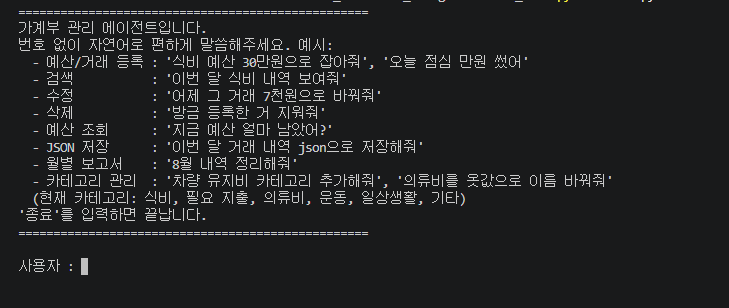
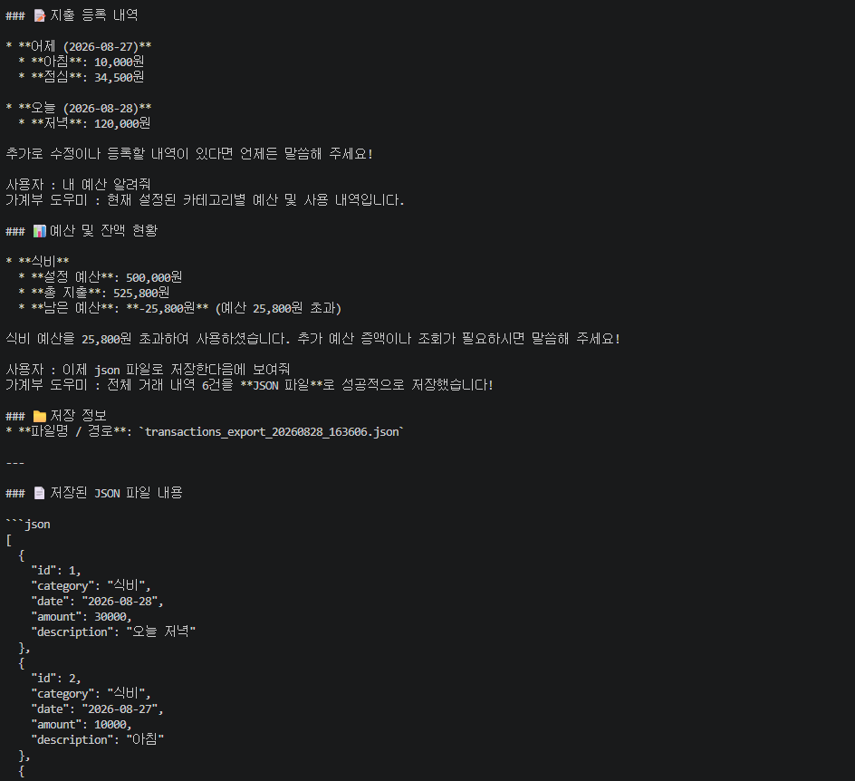
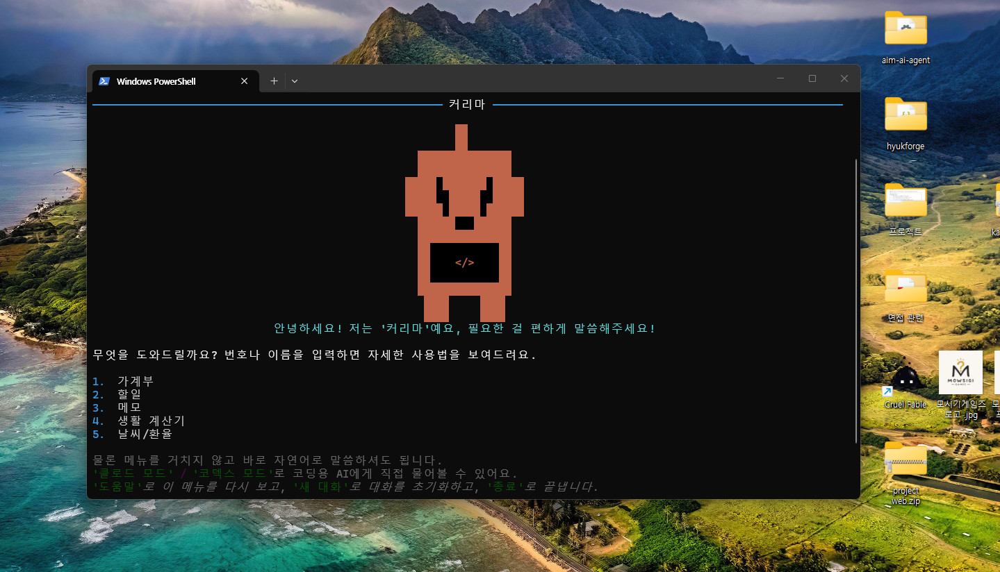
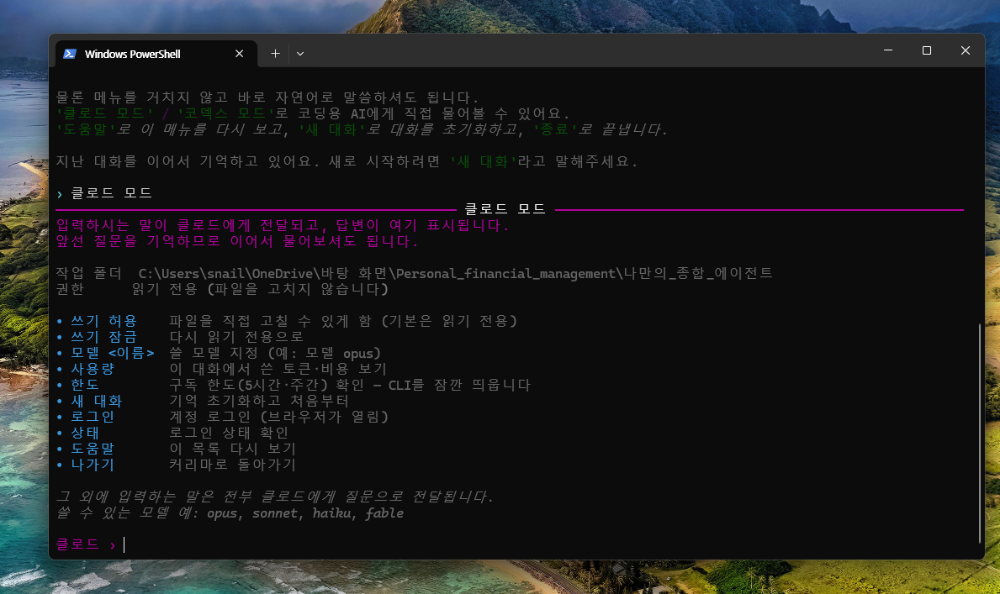
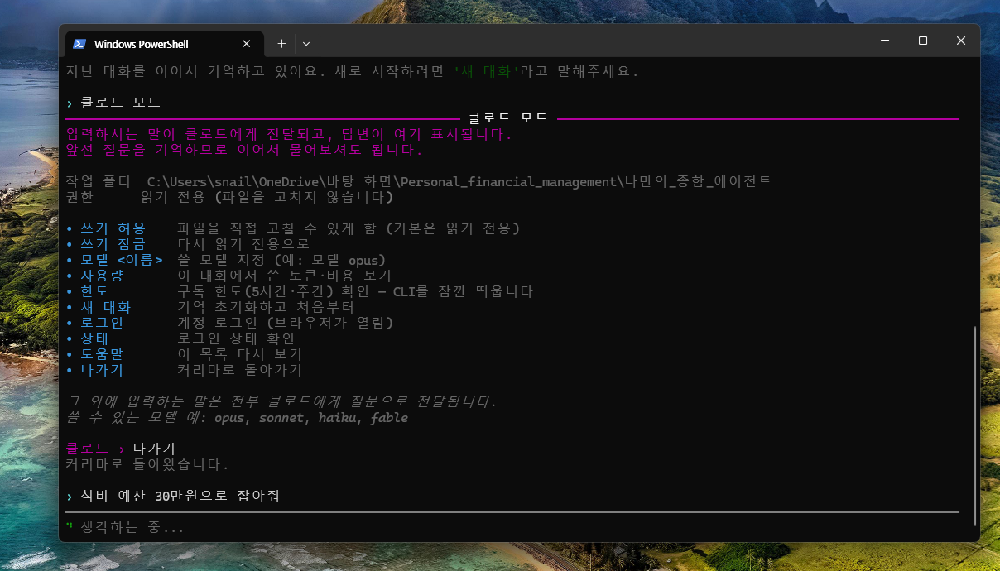
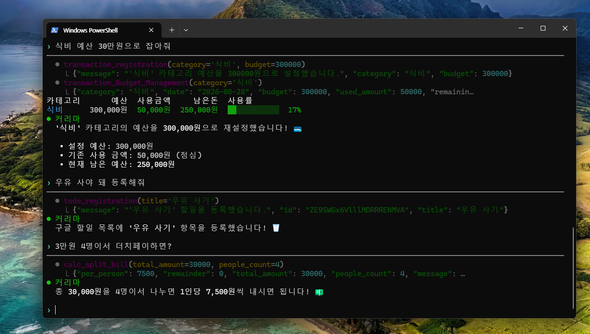
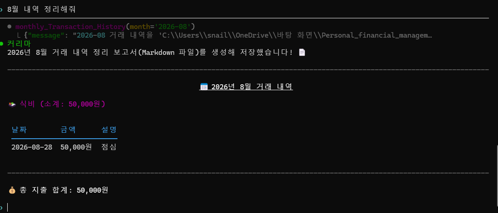

```markdown
개인 예산 관리 AI Agent
프로젝트
Gemini Function Calling을 이용해 자연어로 개인 거래 내역과 예산을 관리하는 Agent를 구현한다. 다음 사용 예시를 처리하는 데 필요한 도구와 데이터 구조는 자유롭게 설계한다.

진행 방법
먼저 거래 등록, 검색, 수정과 예산 관리 기능을 Python 함수로 구현하고 직접 호출하여 동작을 확인한다.

각 함수가 정상적으로 동작하면 Gemini Function Calling에 도구로 연결하여 자연어 요청으로 같은 기능을 실행한다.

사용 예시

복사
사용자: 오늘 점심으로 12,000원 썼어.
Agent: 지출 내역을 등록하고 결과를 알려준다.

사용자: 2026년 8월에 카페에서 쓴 내역을 찾아줘.
Agent: 조건에 맞는 거래 내역을 찾아 알려준다.

사용자: 2026년 8월 27일 카페에서 쓴 금액을 4,500원으로 수정해줘.
Agent: 조건에 맞는 거래를 검색한 뒤 해당 내역을 수정한다.

사용자: 2026년 8월 식비 예산을 300,000원으로 설정해줘.
Agent: 해당 월의 식비 예산을 설정한다.

사용자: 이번 달 식비 예산이 얼마나 남았어?
Agent: 설정된 예산과 사용 금액을 확인하여 남은 금액을 알려준다.

사용자: 존재하지 않는 거래를 수정해줘.
Agent: 거래를 찾을 수 없음을 알려주고 수정하지 않는다.
접기
추가 구현 예시

복사
사용자: 이 거래를 삭제해줘.
Agent: 거래 내역을 삭제한다.

사용자: 거래 내역을 저장해줘.
Agent: 거래 내역을 JSON 파일로 저장한다.

사용자: 2026년 8월 지출 내역을 파일로 만들어줘.
Agent: 월별 거래 내역을 Markdown 보고서로 저장한다.
```

### 조금 더 자세한 명세

```markdown
개인 예산 관리 AI Agent
프로젝트 개요
사용자가 자연어로 수입과 지출을 기록하고 예산을 관리할 수 있는 AI Agent를 구현한다.

Agent는 사용자의 요청을 이해한 뒤 적절한 도구를 선택하여 거래 내역 등록, 검색, 수정과 예산 조회를 수행한다.

이 프로젝트의 목적은 단순한 금융 계산기가 아니라, Gemini의 Function Calling을 이용하여 실제 기능을 수행하는 Agent를 만드는 것이다.

주요 사용 예시

복사
사용자: 오늘 점심으로 12,000원 썼어.
Agent: 지출 내역을 식비 카테고리로 등록한다.

사용자: 2026년 8월 27일 카페에서 쓴 금액을 4,500원으로 수정해줘.
Agent: 조건에 맞는 거래를 검색한 뒤 해당 내역을 수정한다.

사용자: 이번 달 식비 예산이 얼마나 남았어?
Agent: 식비 예산과 이번 달 지출을 조회하여 남은 금액을 알려준다.

사용자: 2026년 8월 지출 내역을 파일로 저장해줘.
Agent: 거래 내역을 조회한 뒤 보고서를 생성한다. (선택 기능)
코드 전체 보기 (11줄)
핵심 기능
자연어로 수입과 지출 등록
날짜, 카테고리, 설명을 이용한 거래 검색
기존 거래 내역 수정
카테고리별 월 예산 설정
이번 달 사용 금액과 남은 예산 조회
잘못된 금액, 날짜, 거래 ID에 대한 예외 처리
Agent가 호출한 도구와 실행 결과를 콘솔에서 확인
Agent 도구 설계
프로젝트의 핵심 기능을 Gemini가 호출할 수 있는 도구로 직접 설계한다.

도구는 다음 기능을 수행할 수 있어야 한다.

수입과 지출 등록
조건에 맞는 거래 검색
기존 거래 수정
월별·카테고리별 예산 설정
사용 금액과 남은 예산 조회
월별 거래 보고서 생성(선택)
각 도구의 이름, 매개변수, 반환 형식은 기능과 목적이 명확하게 드러나도록 설계한다.

모든 도구는 실행 성공 여부와 실행 결과 또는 오류 정보를 반환해야 한다. Gemini가 도구의 용도와 매개변수를 올바르게 판단할 수 있도록 이름, 타입 힌트, 설명을 구체적으로 작성한다.

데이터 구조
거래 내역에는 다음과 같은 정보를 저장할 수 있다.

거래 ID
거래 유형(수입 또는 지출)
카테고리
금액
설명
거래 날짜
위 항목은 예시이며, 구현할 기능에 맞게 필요한 정보와 데이터 구조를 자유롭게 정한다. 거래를 수정하려면 검색 결과에서 특정 거래를 구분할 수 있는 방법이 필요하다.

거래 내역과 예산은 프로그램이 실행되는 동안 유지되어야 한다. 데이터를 저장하고 관리하는 방식은 지금까지 배운 파이썬 문법과 자료구조를 이용해 자유롭게 설계한다.

JSON 파일 저장과 불러오기는 선택 기능으로 구현할 수 있다.

Agent 실행 흐름
먼저 거래 등록, 검색, 수정과 예산 관리 기능을 Python 함수로 구현한다. 각 함수를 직접 호출하여 입력에 맞는 결과가 반환되는지 확인한 뒤 Gemini Function Calling에 도구로 연결한다.

복사
Python 함수 구현
→ 함수 직접 호출 및 결과 확인
→ Gemini에 도구로 등록
→ 사용자 자연어 입력
→ Gemini가 필요한 도구 선택
→ Python 도구 함수 실행
→ 실행 결과를 Gemini에 반환
→ 추가 도구 호출 필요 여부 판단
→ 사용자에게 최종 결과 안내
한 요청에서 여러 도구가 필요할 수 있으므로 최대 반복 횟수를 정한 Agent loop를 구현한다.

예를 들어 "2026년 8월 27일 카페에서 쓴 금액을 4,500원으로 수정해줘"라는 요청은 다음 순서로 처리한다.

복사
거래 검색 도구 호출
→ 검색 결과에서 거래 ID 확인
→ 거래 수정 도구 호출
→ 수정 결과 안내
검색 결과가 여러 개라면 Agent가 임의로 수정하지 않고, 검색된 거래와 수정할 거래를 특정하는 데 필요한 조건을 안내한다.

연속 도구 호출 시연에서는 검색 조건과 일치하는 거래가 하나인 경우를 사용한다.

필수 시연 시나리오
한 문장으로 지출 등록
자연어 조건을 이용한 거래 검색
검색 후 거래 수정까지 이어지는 연속 도구 호출
카테고리 예산 설정 및 남은 예산 조회
존재하지 않는 거래 수정 요청에 대한 오류 처리
선택 기능
거래 내역 삭제
JSON 파일을 이용한 데이터 저장 및 불러오기
프로그램 재실행 후 기존 데이터 유지
월별 거래 내역을 Markdown 보고서로 저장
도구 호출과 실행 결과를 로그 파일로 저장
```

### 진행 상황

요구사항 대로는 다 만들었다. 간단하게!!





### 간단한 코드

```python
"""Gemini Function Calling에 사용할 tool 스키마와 실제 구현 함수 모음.

함수가 하나씩 만들어질 때마다:
1. 아래에 구현 함수를 추가하고
2. 스키마(dict)를 추가하고
3. TOOLS, FUNCTION_MAP에 등록한다.
"""

import datetime
import json
import os

import storage

# 카테고리는 고정 목록이 아니라 data/transactions.json에 저장되는 동적 목록이다.
# (category_registration/Modification/Delete로 관리, storage.DEFAULT_CATEGORIES가 초기값)

def get_categories():
    """현재 등록된 카테고리 목록을 반환한다."""
    return storage.load_data()["categories"]

# ---------------------------------------------------------------------------
# 1. transaction_registration
# ---------------------------------------------------------------------------
def transaction_registration(category, amount=None, description=None, budget=None):
    """거래(지출/수입)를 등록하고/하거나 카테고리 예산을 설정한다.
    amount 없이 budget만 주면 거래 없이 예산만 설정한다. 날짜는 자동으로 오늘 날짜가 기록되고, 0원 거래는 등록하지 않는다."""
    if amount is None and budget is None:
        return {"error": "등록할 금액(amount)이나 설정할 예산(budget) 중 하나는 있어야 합니다."}

    data = storage.load_data()

    if category not in data["categories"]:
        return {
            "message": (
                f"'{category}'는 존재하지 않는 카테고리입니다. "
                "category_registration으로 먼저 등록한 뒤 다시 시도해주세요."
            ),
            "categories": data["categories"],
        }

    transaction = None
    if amount is not None:
        if amount == 0:
            return {"error": "0원은 등록할 수 없습니다."}
        transaction = {
            "id": data["next_id"],
            "category": category,
            "date": datetime.datetime.now().strftime("%Y-%m-%d"),
            "amount": amount,
            "description": description or "",
        }
        data["transactions"].append(transaction)
        data["next_id"] += 1

    if budget is not None:
        data["budgets"][category] = budget

    storage.save_data(data)

    if transaction is None:
        return {
            "message": f"'{category}' 카테고리 예산을 {budget}원으로 설정했습니다.",
            "category": category,
            "budget": budget,
        }

    by_category = {}
    for tx in data["transactions"]:
        by_category.setdefault(tx["category"], []).append(tx)
    return by_category

transaction_registration_tool = {
    "type": "function",
    "name": "transaction_registration",
    "description": (
        "새로운 거래(지출 또는 수입)를 등록하고, 필요하면 카테고리 예산도 함께 설정한다. "
        "amount 없이 budget만 주면 거래를 등록하지 않고 예산만 설정한다. "
        "날짜는 오늘 날짜로 자동 기록되며, 금액이 0원이면 등록하지 않는다. "
        "amount와 budget 둘 다 없으면 호출할 수 없다. category는 반드시 이미 등록된 카테고리여야 하며, "
        "없는 카테고리면 category_registration으로 먼저 등록해야 한다."
    ),
    "parameters": {
        "type": "object",
        "properties": {
            "category": {
                "type": "string",
                "description": "거래/예산 카테고리. 이미 등록된 카테고리 중 하나여야 한다.",
            },
            "amount": {
                "type": "number",
                "description": (
                    "등록할 거래 금액. 지출과 수입(예: 월급) 모두 이 값으로 등록한다. "
                    "0은 허용되지 않는다. 거래 없이 예산만 설정하려면 생략한다."
                ),
            },
            "description": {
                "type": "string",
                "description": "이 거래에 대한 간단한 설명 (예: '점심 식사', '월급 입금'). amount를 등록할 때만 의미가 있다.",
            },
            "budget": {
                "type": "number",
                "description": (
                    "해당 카테고리에 새로 설정하거나 갱신할 예산(현재 가지고 있는 돈). "
                    "예산을 설정/변경할 필요가 있을 때만 입력하고, 없으면 생략한다."
                ),
            },
        },
        "required": ["category"],
    },
}

# ---------------------------------------------------------------------------
# 2. transaction_search
# ---------------------------------------------------------------------------
def transaction_search(category=None, date=None, query=None):
    """카테고리, 날짜, 검색어를 기준으로 등록된 거래 내역을 검색한다."""
    data = storage.load_data()

    results = []
    for tx in data["transactions"]:
        if category is not None and tx["category"] != category:
            continue
        if date is not None and tx["date"] != date:
            continue
        if query is not None and query not in tx["description"]:
            continue
        results.append(tx)

    if not results:
        return {"message": "일치하는 거래를 찾을 수 없습니다."}

    return [
        {"category": tx["category"], "date": tx["date"], "amount": tx["amount"]}
        for tx in results
    ]

transaction_search_tool = {
    "type": "function",
    "name": "transaction_search",
    "description": (
        "카테고리, 날짜, 검색어를 기준으로 등록된 거래 내역을 검색한다. "
        "조건은 모두 선택 입력이며 입력된 조건만 적용해 필터링한다. "
        "일치하는 거래가 없으면 찾을 수 없다고 안내한다."
    ),
    "parameters": {
        "type": "object",
        "properties": {
            "category": {
                "type": "string",
                "description": "검색할 거래 카테고리. 지정하지 않으면 모든 카테고리에서 검색한다.",
            },
            "date": {
                "type": "string",
                "description": "검색할 거래 날짜 (YYYY-MM-DD). 지정하지 않으면 날짜와 무관하게 검색한다.",
            },
            "query": {
                "type": "string",
                "description": "거래 설명에서 찾을 검색어. 지정하지 않으면 설명과 무관하게 검색한다.",
            },
        },
        "required": [],
    },
}

# ---------------------------------------------------------------------------
# 3. transaction_Modification
# ---------------------------------------------------------------------------
def transaction_Modification(id=None, category=None, date=None, amount=None, description=None):
    """id가 있으면 id로 거래를 찾아 category/date까지 새 값으로 바꾸고,
    id가 없으면 category/date를 검색 조건으로 거래를 찾아 amount/description만 새 값으로 바꾼다."""
    data = storage.load_data()

    if id is not None:
        target = next((tx for tx in data["transactions"] if tx["id"] == id), None)
        if target is None:
            return {"message": f"id {id}에 해당하는 거래를 찾을 수 없습니다."}
        if category is not None:
            if category not in data["categories"]:
                return {
                    "message": f"'{category}'는 존재하지 않는 카테고리라 변경할 수 없습니다.",
                    "categories": data["categories"],
                }
            target["category"] = category
        if date is not None:
            target["date"] = date
        if description is not None:
            target["description"] = description
    else:
        if category is None and date is None and description is None:
            return {"message": "id가 없으면 카테고리, 날짜, 설명 중 하나는 알려줘야 거래를 찾을 수 있습니다."}
        candidates = [
            tx for tx in data["transactions"]
            if (category is None or tx["category"] == category)
            and (date is None or tx["date"] == date)
            and (description is None or description in tx["description"])
        ]
        if not candidates:
            return {"message": "수정할 거래를 찾을 수 없습니다."}
        if len(candidates) > 1:
            return {
                "message": "조건에 맞는 거래가 여러 건이라 하나로 특정할 수 없습니다. 좀 더 구체적으로 알려주세요.",
                "candidates": candidates,
            }
        target = candidates[0]

    if amount is not None:
        if amount == 0:
            return {"error": "0원으로는 수정할 수 없습니다."}
        target["amount"] = amount

    storage.save_data(data)
    return target

transaction_Modification_tool = {
    "type": "function",
    "name": "transaction_Modification",
    "description": (
        "거래 내역을 수정한다. id를 알고 있으면 id로 정확한 거래를 찾아 category/date/description을 "
        "원하는 값으로 바꾸고 amount도 새 값으로 수정한다. id를 모르면 category/date/description 중 "
        "하나 이상을 거래를 찾기 위한 조건(설명은 부분 일치)으로 사용해서 찾은 뒤 amount를 새 값으로 수정한다. "
        "조건에 맞는 거래가 없으면 찾을 수 없다고 안내하고, 여러 건이 검색되면 더 구체적인 정보를 요청한다."
    ),
    "parameters": {
        "type": "object",
        "properties": {
            "id": {
                "type": "integer",
                "description": "수정할 거래의 id. 모르면 생략 가능하며, 이 경우 category/date/description으로 거래를 찾는다.",
            },
            "category": {
                "type": "string",
                "description": "id가 있으면 새로 바꿀 카테고리(이미 등록된 카테고리여야 함), id가 없으면 거래를 찾기 위한 카테고리 조건.",
            },
            "date": {
                "type": "string",
                "description": "id가 있으면 새로 바꿀 날짜(YYYY-MM-DD), id가 없으면 거래를 찾기 위한 날짜 조건(YYYY-MM-DD).",
            },
            "amount": {
                "type": "number",
                "description": "새로 바꿀 거래 금액. 0은 허용되지 않는다.",
            },
            "description": {
                "type": "string",
                "description": (
                    "id가 있으면 새로 바꿀 설명, id가 없으면 거래를 찾기 위한 설명 검색어 "
                    "(기존 설명에 이 텍스트가 포함되는 거래를 찾는다)."
                ),
            },
        },
        "required": [],
    },
}

# ---------------------------------------------------------------------------
# 4. transaction_Delete
# ---------------------------------------------------------------------------
def transaction_Delete(id=None, category=None, date=None, query=None):
    """id, 또는 category/date/query(설명 부분 일치) 조합으로 거래를 찾아 삭제한다. 반환값은 삭제 알림 문구뿐이다."""
    data = storage.load_data()

    if id is not None:
        target = next((tx for tx in data["transactions"] if tx["id"] == id), None)
        if target is None:
            return {"message": f"id {id}에 해당하는 거래를 찾을 수 없어 삭제할 수 없습니다."}
    else:
        if category is None and date is None and query is None:
            return {"message": "id가 없으면 카테고리, 날짜, 검색어 중 하나는 알려줘야 삭제할 수 있습니다."}
        candidates = [
            tx for tx in data["transactions"]
            if (category is None or tx["category"] == category)
            and (date is None or tx["date"] == date)
            and (query is None or query in tx["description"])
        ]
        if not candidates:
            return {"message": "일치하는 거래를 찾을 수 없어 삭제할 수 없습니다."}
        if len(candidates) > 1:
            return {
                "message": "조건에 맞는 거래가 여러 건이라 하나로 특정할 수 없습니다. id를 알려주거나 더 구체적으로 말씀해주세요.",
                "candidates": candidates,
            }
        target = candidates[0]

    data["transactions"].remove(target)
    storage.save_data(data)
    return {
        "message": (
            f"id {target['id']} 거래({target['date']}, {target['category']}, "
            f"{target['amount']}원)를 삭제했습니다."
        )
    }

transaction_Delete_tool = {
    "type": "function",
    "name": "transaction_Delete",
    "description": (
        "id 또는 category/date/query(설명 일부 일치) 조합을 기준으로 거래를 삭제한다. "
        "id가 있으면 바로 그 거래를 삭제하고, 없으면 category/date/query로 거래를 찾아 삭제한다. "
        "조건에 맞는 거래가 없으면 삭제할 수 없다고 안내하고, 여러 건이 검색되면 더 구체적인 정보를 요청한다."
    ),
    "parameters": {
        "type": "object",
        "properties": {
            "id": {
                "type": "integer",
                "description": "삭제할 거래의 id. 모르면 생략하고 category/date/query로 찾는다.",
            },
            "category": {
                "type": "string",
                "description": "삭제할 거래를 찾기 위한 카테고리 조건.",
            },
            "date": {
                "type": "string",
                "description": "삭제할 거래를 찾기 위한 날짜 조건 (YYYY-MM-DD).",
            },
            "query": {
                "type": "string",
                "description": "삭제할 거래를 찾기 위한 검색어. 거래 설명에 이 텍스트가 포함되는 거래를 찾는다.",
            },
        },
        "required": [],
    },
}

# ---------------------------------------------------------------------------
# 5. transaction_Budget_Management
# ---------------------------------------------------------------------------
def _budget_status(data, category, date):
    budget = data["budgets"].get(category)
    used_amount = sum(
        tx["amount"] for tx in data["transactions"]
        if tx["category"] == category and (date is None or tx["date"] == date)
    )
    return {
        "category": category,
        "date": date or datetime.datetime.now().strftime("%Y-%m-%d"),
        "budget": budget,
        "used_amount": used_amount,
        "remaining_amount": budget - used_amount,
    }

def transaction_Budget_Management(category=None, date=None):
    """카테고리에 설정된 예산에서 사용 금액을 뺀 남은 돈을 계산한다.
    category를 생략하면 예산이 설정된 모든 카테고리의 남은 돈을 보여준다."""
    data = storage.load_data()

    if category is None:
        if not data["budgets"]:
            return {"message": "설정된 예산이 없습니다."}
        return [_budget_status(data, cat, date) for cat in data["budgets"]]

    if category not in data["categories"]:
        return {"message": f"'{category}'는 존재하지 않는 카테고리라 예산을 찾을 수 없습니다."}

    if category not in data["budgets"]:
        return {"message": f"'{category}' 카테고리에 설정된 예산이 없어 찾을 수 없습니다."}

    return _budget_status(data, category, date)

transaction_Budget_Management_tool = {
    "type": "function",
    "name": "transaction_Budget_Management",
    "description": (
        "카테고리별로 설정된 예산(현재 가지고 있는 돈)에서 등록된 거래 금액을 뺀 남은 돈을 계산한다. "
        "category를 생략하면 예산이 설정된 모든 카테고리의 남은 돈을 함께 보여준다. "
        "date를 지정하면 그 날짜의 거래만으로 사용 금액을 계산하고, 지정하지 않으면 해당 카테고리의 "
        "전체 거래 금액으로 계산한다. 존재하지 않는 카테고리이거나 예산이 설정되지 않았으면 찾을 수 없다고 안내한다."
    ),
    "parameters": {
        "type": "object",
        "properties": {
            "category": {
                "type": "string",
                "description": "예산을 확인할 카테고리. 생략하면 예산이 설정된 모든 카테고리를 보여준다.",
            },
            "date": {
                "type": "string",
                "description": (
                    "사용 금액을 계산할 날짜 (YYYY-MM-DD). 지정하지 않으면 해당 카테고리의 "
                    "전체 거래 금액으로 계산한다."
                ),
            },
        },
        "required": [],
    },
}

# ---------------------------------------------------------------------------
# 6. transaction_Save_Json
# ---------------------------------------------------------------------------
def transaction_Save_Json(id=None, category=None, date=None, query=None):
    """id 또는 category/date/query 조건에 맞는 거래 내역을 JSON 파일로 저장한다."""
    data = storage.load_data()

    if id is not None:
        matched = [tx for tx in data["transactions"] if tx["id"] == id]
    else:
        matched = [
            tx for tx in data["transactions"]
            if (category is None or tx["category"] == category)
            and (date is None or tx["date"] == date)
            and (query is None or query in tx["description"])
        ]

    if not matched:
        return {"message": "조건에 맞는 거래 내역이 없어 JSON 파일로 저장할 수 없습니다."}

    timestamp = datetime.datetime.now().strftime("%Y%m%d_%H%M%S")
    filename = f"transactions_export_{timestamp}.json"
    filepath = os.path.join(os.path.dirname(__file__), "data", filename)

    os.makedirs(os.path.dirname(filepath), exist_ok=True)
    with open(filepath, "w", encoding="utf-8") as f:
        json.dump(matched, f, ensure_ascii=False, indent=2)

    return {
        "message": f"{len(matched)}건의 거래 내역을 '{filepath}' 파일로 저장했습니다.",
        "file_path": filepath,
        "transactions": matched,
    }

transaction_Save_Json_tool = {
    "type": "function",
    "name": "transaction_Save_Json",
    "description": (
        "id 또는 category/date/query(설명 부분 일치) 조건에 맞는 거래 내역을 JSON 파일로 저장해서 "
        "다운로드할 수 있게 한다. id가 있으면 해당 거래만 저장하고, 없으면 category/date/query로 필터링해서 "
        "저장한다. 아무 조건도 없으면 등록된 전체 거래 내역을 저장한다."
    ),
    "parameters": {
        "type": "object",
        "properties": {
            "id": {
                "type": "integer",
                "description": "저장할 특정 거래의 id. 지정하면 이 거래 하나만 저장한다.",
            },
            "category": {
                "type": "string",
                "description": "저장할 거래를 찾기 위한 카테고리 조건.",
            },
            "date": {
                "type": "string",
                "description": "저장할 거래를 찾기 위한 날짜 조건 (YYYY-MM-DD).",
            },
            "query": {
                "type": "string",
                "description": "저장할 거래를 찾기 위한 검색어 (설명에 포함되는 텍스트).",
            },
        },
        "required": [],
    },
}

# ---------------------------------------------------------------------------
# 7. monthly_Transaction_History
# ---------------------------------------------------------------------------
def monthly_Transaction_History(month):
    """month(YYYY-MM)에 해당하는 거래 내역을 카테고리별로 묶어 마크다운 보고서로 저장한다."""
    data = storage.load_data()
    matched = [tx for tx in data["transactions"] if tx["date"].startswith(month)]

    if not matched:
        return {"message": f"{month}에 해당하는 거래 내역이 없습니다."}

    by_category = {}
    for tx in matched:
        by_category.setdefault(tx["category"], []).append(tx)

    lines = [f"# {month} 거래 내역", ""]
    total = 0
    for category, txs in by_category.items():
        category_total = sum(tx["amount"] for tx in txs)
        total += category_total
        lines.append(f"## {category} (소계: {category_total}원)")
        lines.append("")
        lines.append("| 날짜 | 금액 | 설명 |")
        lines.append("|---|---|---|")
        for tx in sorted(txs, key=lambda t: t["date"]):
            lines.append(f"| {tx['date']} | {tx['amount']}원 | {tx['description']} |")
        lines.append("")
    lines.append(f"**총 합계: {total}원**")

    markdown = "\n".join(lines)

    filename = f"monthly_report_{month}.md"
    filepath = os.path.join(os.path.dirname(__file__), "data", filename)
    os.makedirs(os.path.dirname(filepath), exist_ok=True)
    with open(filepath, "w", encoding="utf-8") as f:
        f.write(markdown)

    return {
        "message": f"{month} 거래 내역을 '{filepath}' 파일로 저장했습니다.",
        "file_path": filepath,
        "markdown": markdown,
    }

monthly_Transaction_History_tool = {
    "type": "function",
    "name": "monthly_Transaction_History",
    "description": "월별 거래 내역을 조회하여 MarkDown 문서로 만들어서 저장한다",
    "parameters": {
        "type": "object",
        "properties": {
            "month": {
                "type": "string",
                "description": "조회할 거래 월 내역 (YYYY-MM 형식, 예: '2026-08')",
            },
        },
        "required": ["month"],
    },
}

# ---------------------------------------------------------------------------
# 8. category_registration
# ---------------------------------------------------------------------------
def category_registration(category):
    """새로운 카테고리를 카테고리 목록에 추가한다. 이미 있으면 등록하지 않는다."""
    data = storage.load_data()

    if category in data["categories"]:
        return {
            "message": f"'{category}'는 이미 존재하는 카테고리입니다.",
            "categories": data["categories"],
        }

    data["categories"].append(category)
    storage.save_data(data)
    return {
        "message": f"'{category}' 카테고리를 추가했습니다.",
        "categories": data["categories"],
    }

category_registration_tool = {
    "type": "function",
    "name": "category_registration",
    "description": "새로운 카테고리를 카테고리 목록에 등록한다. 이미 존재하는 카테고리면 등록하지 않고 안내한다.",
    "parameters": {
        "type": "object",
        "properties": {
            "category": {
                "type": "string",
                "description": "새로 등록할 카테고리 이름",
            },
        },
        "required": ["category"],
    },
}

# ---------------------------------------------------------------------------
# 9. category_Modification
# ---------------------------------------------------------------------------
def category_Modification(old_category, new_category):
    """기존 카테고리 이름을 새 이름으로 바꾸고, 관련된 거래/예산도 함께 옮긴다."""
    data = storage.load_data()

    if old_category not in data["categories"]:
        return {"message": f"'{old_category}' 카테고리를 찾을 수 없습니다."}
    if new_category in data["categories"]:
        return {"message": f"'{new_category}'는 이미 존재하는 카테고리라 이름을 바꿀 수 없습니다."}

    data["categories"] = [
        new_category if c == old_category else c for c in data["categories"]
    ]
    for tx in data["transactions"]:
        if tx["category"] == old_category:
            tx["category"] = new_category
    if old_category in data["budgets"]:
        data["budgets"][new_category] = data["budgets"].pop(old_category)

    storage.save_data(data)
    return {
        "message": f"'{old_category}' 카테고리를 '{new_category}'(으)로 변경했습니다.",
        "categories": data["categories"],
    }

category_Modification_tool = {
    "type": "function",
    "name": "category_Modification",
    "description": (
        "기존 카테고리 이름을 새 이름으로 변경한다. 해당 카테고리로 등록된 모든 거래와 예산도 "
        "새 이름으로 함께 옮겨진다. 기존 카테고리가 없거나 새 이름이 이미 존재하면 변경할 수 없다고 안내한다."
    ),
    "parameters": {
        "type": "object",
        "properties": {
            "old_category": {
                "type": "string",
                "description": "이름을 바꿀 기존 카테고리",
            },
            "new_category": {
                "type": "string",
                "description": "새로 바꿀 카테고리 이름",
            },
        },
        "required": ["old_category", "new_category"],
    },
}

# ---------------------------------------------------------------------------
# 10. category_Delete
# ---------------------------------------------------------------------------
def category_Delete(category):
    """카테고리를 목록에서 삭제한다. '기타'는 삭제할 수 없고, 해당 카테고리의 거래는 '기타'로 옮겨진다."""
    if category == "기타":
        return {"message": "'기타' 카테고리는 삭제할 수 없습니다."}

    data = storage.load_data()
    if category not in data["categories"]:
        return {"message": f"'{category}' 카테고리를 찾을 수 없어 삭제할 수 없습니다."}

    data["categories"].remove(category)
    for tx in data["transactions"]:
        if tx["category"] == category:
            tx["category"] = "기타"
    data["budgets"].pop(category, None)

    storage.save_data(data)
    return {
        "message": f"'{category}' 카테고리를 삭제했습니다. 해당 카테고리의 거래는 '기타'로 이동했습니다.",
        "categories": data["categories"],
    }

category_Delete_tool = {
    "type": "function",
    "name": "category_Delete",
    "description": (
        "카테고리를 목록에서 삭제한다. '기타'는 삭제할 수 없다. 존재하지 않는 카테고리면 "
        "삭제할 수 없다고 안내한다. 삭제된 카테고리의 거래는 '기타'로 옮겨지고, 예산 설정은 사라진다."
    ),
    "parameters": {
        "type": "object",
        "properties": {
            "category": {
                "type": "string",
                "description": "삭제할 카테고리 이름",
            },
        },
        "required": ["category"],
    },
}

TOOLS = [
    transaction_registration_tool,
    transaction_search_tool,
    transaction_Modification_tool,
    transaction_Delete_tool,
    transaction_Budget_Management_tool,
    transaction_Save_Json_tool,
    monthly_Transaction_History_tool,
    category_registration_tool,
    category_Modification_tool,
    category_Delete_tool,
]

FUNCTION_MAP = {
    "transaction_registration": transaction_registration,
    "transaction_search": transaction_search,
    "transaction_Modification": transaction_Modification,
    "transaction_Delete": transaction_Delete,
    "transaction_Budget_Management": transaction_Budget_Management,
    "transaction_Save_Json": transaction_Save_Json,
    "monthly_Transaction_History": monthly_Transaction_History,
    "category_registration": category_registration,
    "category_Modification": category_Modification,
    "category_Delete": category_Delete,
}

```

```python
"""거래 내역을 data/transactions.json 파일에 저장/불러오는 공용 헬퍼."""

import json
import os

DATA_PATH = os.path.join(os.path.dirname(__file__), "data", "transactions.json")

DEFAULT_CATEGORIES = ["식비", "필요 지출", "의류비", "운동", "일상생활", "기타"]

def load_data():
    """저장된 거래 내역, 예산, 카테고리 목록을 불러온다. 파일이 없으면 기본 구조를 반환한다."""
    if not os.path.exists(DATA_PATH):
        return {
            "transactions": [],
            "budgets": {},
            "next_id": 1,
            "categories": list(DEFAULT_CATEGORIES),
        }
    with open(DATA_PATH, "r", encoding="utf-8") as f:
        data = json.load(f)
    data.setdefault("categories", list(DEFAULT_CATEGORIES))
    return data

def save_data(data):
    """거래 내역과 예산 정보를 파일에 저장한다."""
    os.makedirs(os.path.dirname(DATA_PATH), exist_ok=True)
    with open(DATA_PATH, "w", encoding="utf-8") as f:
        json.dump(data, f, ensure_ascii=False, indent=2)

```

```python
"""Gemini Function Calling 기반 개인 거래/예산 관리 에이전트 (Interactions API 버전, 기본 CLI).

client.interactions.create()가 대화를 서버 사이드에 저장하고(store=True),
previous_interaction_id로 이어서 대화를 이어간다. while 루프로 사용자 입력을 받아
Gemini에게 보내고, function_call 스텝이 나오면 이 폴더 안의 tools.py의 실제 함수를 실행한 뒤
결과를 다시 Gemini에게 돌려줘서 최종 자연어 응답을 받는다.

이 폴더는 여기서 개발을 멈추고 더 이상 갱신하지 않는다 (더 다듬는 건 ../가계부_도우미/app.py 쪽에서 계속됨).
tools.py/storage.py/.env는 가계부_도우미 폴더와 완전히 독립적인 사본이다.
"""

import datetime
import json
import os
import sys

THIS_DIR = os.path.dirname(os.path.abspath(__file__))

from dotenv import load_dotenv
from google import genai

import tools

# Windows 콘솔 기본 인코딩(cp949)에서 한글이 깨지는 것을 방지
sys.stdout.reconfigure(encoding="utf-8")

load_dotenv(os.path.join(THIS_DIR, ".env"))

MODEL = "gemini-3.6-flash"

client = genai.Client(api_key=os.environ["GEMINI_API_KEY"])

TODAY = datetime.datetime.now().strftime("%Y-%m-%d")

SYSTEM_INSTRUCTION = (
    f"오늘 날짜는 {TODAY}입니다. 사용자가 '오늘', '어제', '이번 달'처럼 상대적인 날짜를 말하면 "
    "이 날짜를 기준으로 계산해서 도구 호출 시 날짜는 YYYY-MM-DD, 월은 YYYY-MM 형식으로 변환해서 넘기세요. "
    "당신은 개인 거래 내역과 예산을 관리해주는 에이전트입니다."
)

def create_interaction(input_data, previous_interaction_id):
    """Gemini Interactions API로 한 턴을 생성한다. tools.py의 dict 스키마를 그대로 tools에 넘긴다."""
    return client.interactions.create(
        model=MODEL,
        input=input_data,
        previous_interaction_id=previous_interaction_id,
        tools=tools.TOOLS,
        store=True,
        system_instruction=SYSTEM_INSTRUCTION,
    )

def execute_tool_call(step):
    """Gemini가 요청한 function_call 스텝을 tools.py의 실제 함수로 실행하고,
    다시 Gemini에게 돌려줄 function_result 형태로 만든다."""
    func = tools.FUNCTION_MAP[step.name]
    result = func(**step.arguments)

    return {
        "type": "function_result",
        "name": step.name,
        "call_id": step.id,
        "result": [
            {
                "type": "text",
                "text": json.dumps(result, ensure_ascii=False),
            }
        ],
    }

def print_intro():
    categories = ", ".join(tools.get_categories())
    print("=" * 50)
    print("가계부 관리 에이전트입니다.")
    print("번호 없이 자연어로 편하게 말씀해주세요. 예시:")
    print("  - 예산/거래 등록 : '식비 예산 30만원으로 잡아줘', '오늘 점심 만원 썼어'")
    print("  - 검색           : '이번 달 식비 내역 보여줘'")
    print("  - 수정           : '어제 그 거래 7천원으로 바꿔줘'")
    print("  - 삭제           : '방금 등록한 거 지워줘'")
    print("  - 예산 조회      : '지금 예산 얼마 남았어?'")
    print("  - JSON 저장      : '이번 달 거래 내역 json으로 저장해줘'")
    print("  - 월별 보고서    : '8월 내역 정리해줘'")
    print("  - 카테고리 관리  : '차량 유지비 카테고리 추가해줘', '의류비를 옷값으로 이름 바꿔줘'")
    print(f"  (현재 카테고리: {categories})")
    print("'종료'를 입력하면 끝납니다.")
    print("=" * 50)
    print()

def financial_agent():
    previous_interaction_id = None

    print_intro()

    while True:
        user_input = input("사용자 : ").strip()

        if not user_input:
            print("가계부 도우미 : 내용을 입력해주세요.")
            print()
            continue

        if user_input == "종료":
            break

        interaction = create_interaction(user_input, previous_interaction_id)
        previous_interaction_id = interaction.id

        while True:
            function_results = [
                execute_tool_call(step)
                for step in interaction.steps
                if step.type == "function_call"
            ]

            if function_results:
                interaction = create_interaction(function_results, interaction.id)
                previous_interaction_id = interaction.id
            else:
                print(f"가계부 도우미 : {interaction.output_text}")
                break

        print()

if __name__ == "__main__":
    financial_agent()

```

### 그래서 내가 기능을 확장해서 CLI 환경에서 쓸 수 있게 개편을 했다.

코덱스. 클로드 사용 가능, 그 외 가계부, 메모, 할 일, 등등을 넣어 보았다!!!!!






