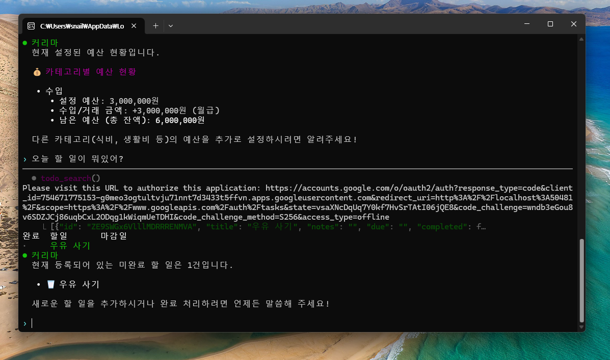
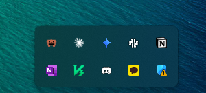

최종 결과물 주말 동안 틈틈히 업데이트를 시켰다.

나만의 개인 비서를 만들고 싶어서 한번 확장해서 만들어보았다. 참고로 클로드 컨셉이다.

안쪽에서 기본적인 일정 등등을 할 수 있고 혹시 몰라서 코덱스, 클로드도 연동 시켜놓았다.

배포는 안했고 본인이 구글 콘솔에서 인증을 받아서 직접 설정해야지 사용할 수 있다.

https://github.com/snail5039-code/personal-financial-management

자세한 것은 깃헙 참고