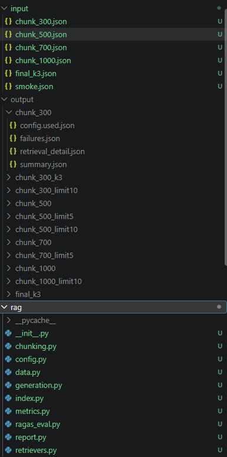
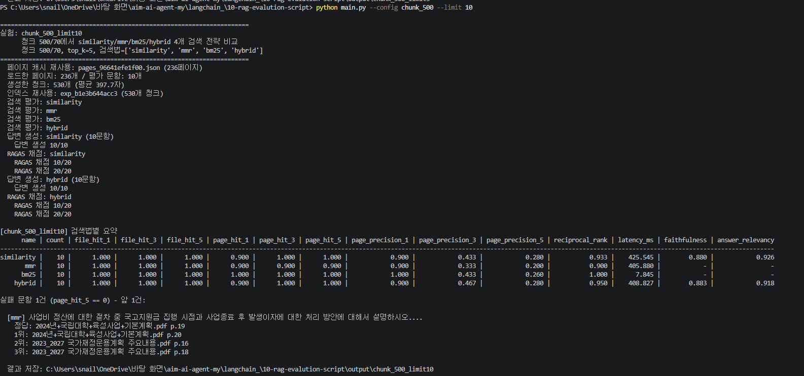
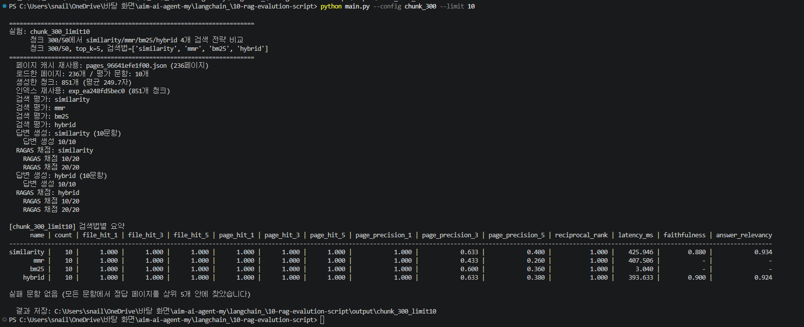

오늘 한 것은 claude한테 프롬프트를 줘서 같이 plan을 세운 다음에 코드는 claude가 구현하는 것을 해보았다.

RAG에서
문서를 불러오기 → 청크 → 인덱싱(검색기, 백터스토어) → 검색 방법 → 검색 평가 순으로 진행

나는 프롬프트를 이렇게 주었다.

```markdown
지금 해야될 것

클로드랑 같이 rag 파이프라인 설계 하기

config 설정 값을 줘서 json파일로 만든다음에 그거를 가지고 테스트 하기
- 예를 들어 청크, 아니면 검색법, llm 라가스 평가, 주디 평가


이때 argparse를 사용해서 옵션을 주어서 목적에 맞게 사용하기

* 파일 구조의 경우
input output이 있고
input 안에서는 ex) chunk_300.json -> 안에는 청킹 사이즈, 검색방법, 검색 평가가 들어가있다.

output 안에는 input으로 받은 값으로 golden_set.json을 사용해서 검색 결과를 비교 및 출력 한다. 파일 저장은 json으로
실행은 main.py로 실행하며 main.py 파일 안에 기본적인 함수 로직이 있으며 argparse를 통해서 python main.py --chunk_300.json 이런식으로
실행한다.


즉 이거에 대해서 청크 사이즈나 검색방법 검색 평가에 대해 같이 얘기를 해보고 그에 대한것을 우선 같이 설계 하자

코드는 설계가 완료되면 claude코드가 구현한다.
```

결과는 나쁘지 않게 나왔다.





데이터 셋의 경우

```markdown
### 제공 데이터

- 검색 대상 문서: `data/public/*.pdf`
- 평가 데이터: `data/public/public_paragraph_golden_set.json`
- 출처: https://huggingface.co/datasets/allganize/RAG-Evaluation-Dataset-KO

golden set의 `question`은 검색 질의, `target_answer`는 기준 답변, `target_file_name`과 `target_page_no`는 정답 위치를 나타낸다.

`PyPDFLoader`가 만든 `source`에는 `data/public/파일명.pdf`처럼 경로가 포함될 수 있지만, golden set의 `target_file_name`에는 파일명만 들어 있다. 두 값을 바로 비교할 수 있도록 `Path(source).name`을 사용해 경로를 제거한다. 이 코드는 아래에 제공되어 있으므로 별도로 구현하지 않는다.

또한 `PyPDFLoader`의 `page`는 첫 페이지를 0으로 나타내지만 golden set의 `target_page_no`는 첫 페이지를 1로 나타낸다. 비교에 사용할 `page_no`에는 `page + 1`을 저장한다.
```

참고를 하면 된다.

처음에 방향을 잡기가 어려웠을 뿐 내가 직접 코드를 만지는 것이 아니기 때문에 생각보다 수월하게 해서 시간이 많이 남았었다!

강사님 config, input, output 가이드 라인!

```markdown
### RAG 실험 프로그램에 있으면 좋은 것

### input으로 받으면 좋은 것

| 항목 | 용도 |
|---|---|
| 문서 경로 | 검색에 사용할 PDF 선택 |
| 평가 데이터 경로 | 질문, 기준 답변, 정답 문서와 페이지가 있는 Golden set 선택 |
| `chunk_size` | 문서를 나눌 청크 크기 설정 |
| `chunk_overlap` | 인접 청크가 겹치는 범위 설정 |
| 임베딩 모델 | 문서와 질문을 벡터로 변환할 모델 선택 |
| 검색 전략 | Similarity, MMR, BM25, Hybrid 중 활용할 방식 선택 |
| `k` | 가져올 검색 결과 수 설정 |
| `fetch_k` | MMR이나 Hybrid에서 먼저 가져올 후보 수 설정 |
| `lambda_mult` | MMR의 관련성과 다양성 비율 설정 |
| `weights` | Hybrid의 벡터 검색과 키워드 검색 비율 설정 |
| `context_k` | 답변 생성에 사용할 검색 문서 수 설정 |
| 프롬프트 경로 | 답변 생성에 사용할 프롬프트 파일 선택 |
| 생성 모델 | 답변 생성에 사용할 모델 선택 |
| 평가 모델 | 생성된 답변의 품질을 평가할 모델 선택 |
| 생성 평가 지표 | Faithfulness, Answer Relevancy, Answer Correctness 등 사용할 지표 선택 |

이 항목들을 input으로 분리하면 코드를 수정하지 않고 실험 조건을 바꿀 수 있다. 실행할 때 사용한 값을 결과와 함께 저장하면 어떤 조건이 검색 및 생성 품질에 영향을 주었는지 비교하고, 같은 실험을 다시 재현할 수 있다. 모든 항목을 반드시 입력으로 받을 필요는 없으며, 비교하려는 조건과 실행마다 달라질 수 있는 값을 중심으로 선택한다.

### output으로 나오면 좋은 것

#### 사용한 input

- 실험 이름
- 사용한 문서와 평가 데이터
- 청킹 설정
- 임베딩 모델
- 검색 전략과 검색 설정
- 생성 모델과 프롬프트
- 평가 모델과 생성 평가 지표

실험 결과에 실제 사용한 input을 함께 남기면 서로 다른 실험을 비교하거나 같은 실험을 다시 실행하기 쉽다.

#### 검색 결과

- 질문
- 사용한 검색 전략
- 검색된 문서 목록
- 각 문서의 검색 순위
- 문서 파일명과 페이지 번호
- 검색된 청크 본문
- 검색 시간
- 정답 파일과 페이지를 찾았는지 여부

평균 점수만 제공하지 않고 질문별 검색 결과를 함께 제공해야 검색에 성공하거나 실패한 이유를 확인할 수 있다.

#### 검색 평가 결과

- 평가 지표(File Hit@k, Page Hit@k, MRR 등)
- 평균 검색 시간
- 검색 전략별 결과 비교
- 검색 성능이 좋아지거나 나빠진 질문 사례

#### 전략별 Hit@k 미적중 결과

각 검색 전략에서 Hit@k에 실패한 문항을 따로 모아 보면 검색 실패 원인을 분석하는 데 도움이 된다.

- 사용한 검색 전략
- 평가 문항 순번
- 실패한 Hit@k 종류: File Hit@k 또는 Page Hit@k
- 질문
- 정답 파일명과 정답 페이지
- 실제로 검색된 상위 k개 문서
- 검색된 문서의 순위, 파일명, 페이지, 청크 본문
- 필요하다면 정답 문서가 k위 밖에서 검색되었는지 여부와 실제 순위

전략별 미적중 결과를 함께 보면 다음 내용을 분석할 수 있다.

- 특정 전략이 반복해서 놓치는 질문 유형
- 정답 파일은 찾았지만 정답 페이지는 찾지 못한 경우
- 정답 페이지를 찾았지만 k위 밖에 배치한 경우
- 청크 크기나 검색 결과 수를 바꾸면 개선될 가능성이 있는 사례

#### 생성 결과

- 질문
- 답변 생성에 사용한 검색 문맥
- 생성된 답변
- 인용한 문서
- 생성 시간

#### 생성 평가 결과

- 평가 지표(Faithfulness, Answer Relevancy, Answer Correctness 등)
- 검색 전략별 평균 점수
- 잘못 생성되거나 근거가 부족한 답변 사례

### 결과를 보여 주는 방식

- 실험별 핵심 결과를 표로 비교할 수 있으면 좋다.
- 평균 지표와 질문별 상세 결과를 모두 확인할 수 있으면 좋다.
- 점수가 가장 좋아진 사례와 나빠진 사례를 확인할 수 있으면 좋다.
- 검색 전략별 Hit@k 미적중 문항만 모아서 볼 수 있으면 좋다.
- 사용한 input에서 어떤 값을 바꿨는지 표시되면 좋다.
- JSON이나 JSONL처럼 이후 분석에 다시 사용할 수 있는 형태로 저장되면 좋다.

### 실험할 때 신경 쓸 것

- 한 번에 하나의 input만 바꾸고 나머지는 고정한다.
- 같은 Golden set과 같은 문항 수로 결과를 비교한다.
- 검색 점수뿐 아니라 실제로 검색된 청크 본문을 확인한다.
- 정답 문서를 찾았더라도 해당 청크에 답의 근거가 있는지 확인한다.
- 검색 성능과 생성 답변의 품질을 구분해서 평가한다.
- 평균 점수만으로 결론을 내리지 않고 실패 사례도 확인한다.
```

`RAG_EXPERIMENT_GUIDE 라인`

```markdown
### RAG 실험 설계

RAG 파이프라인을 여러 조건에서 실행하고 결과를 비교한다. 검색 및 생성 품질에 영향을 주는 요소를 선택하여 실험하고, 평가 결과를 근거로 적절한 설정을 탐색한다.

코딩 과정에서는 Claude Code를 사용하여 프로젝트 구조를 설계하고 코드를 작성한다.

이 과정에서 탐색할 수 있는 조건은 무엇인지, 결과를 비교하려면 어떤 데이터가 필요한지 생각해 본다.
```

```markdown
#### config

실험 조건을 코드에 직접 작성하면 조건을 바꿀 때마다 코드를 수정해야 한다. 실험 조건을 config 파일로 분리하면 동일한 코드를 사용하면서 여러 설정을 실행하고 보존할 수 있다.

config에는 문서와 평가 데이터의 경로, 청킹 설정, 검색 설정, 생성 설정, 평가 방법 등을 필요한 범위에서 정의할 수 있다. config의 형식과 항목은 프로그램 구조에 맞게 설계한다.
```

```markdown
#### CLI 명령어

CLI를 사용하면 프로그램을 실행할 때 터미널에서 값을 전달할 수 있다. Python에서는 `argparse`를 사용하여 필요한 명령줄 옵션을 정의할 수 있다.

```powershell
python app.py --document-path data.pdf --result-dir outputs --experiment-name chunk-test
```

옵션 이름은 프로그램의 목적에 맞게 정한다. 이름에 하이픈(`-`)이 있으면 Python에서는 언더스코어(`_`)로 접근한다.
```

```python
import argparse

parser = argparse.ArgumentParser()
parser.add_argument("--document-path")
parser.add_argument("--result-dir")
parser.add_argument("--experiment-name")
args = parser.parse_args()

print(args.document_path)
print(args.result_dir)
print(args.experiment_name)
```
