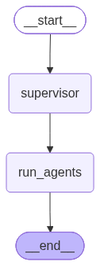
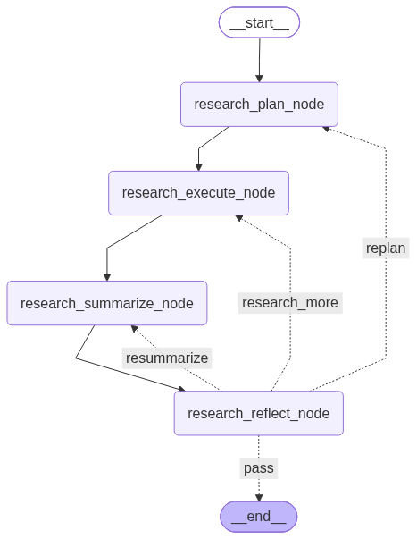
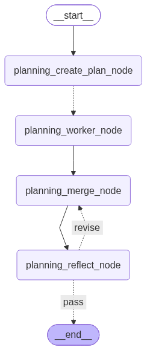
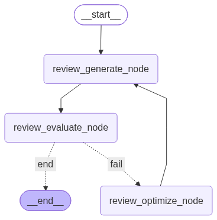
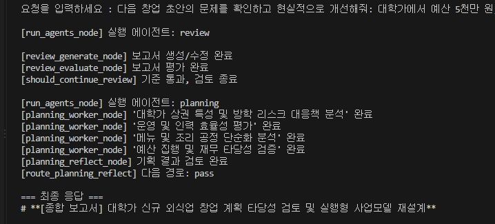

# 오늘 만든 것

사용자 요청에 맞춰 조사(research), 기획(planning), 검토(review)를 조합하는 멀티 에이전트 보고서 시스템을 만들었다. 핵심은 Supervisor가 역할과 순서를 고르고, 각 역할의 LangGraph 서브그래프가 결과를 만든 뒤 다음 역할에 전달하는 것이다.

**현재 구현 패턴**: Supervisor는 StateGraph, Research는 조사 계획·실행·요약에 Reflection 분기, Planning은 Orchestrator-Worker에 Reflection 재병합, Review는 점수 기반 Evaluator-Optimizer다. 처음의 `PROGRESS.md`에는 Review를 단순 Reflection으로 계획했지만 실제 구현은 Evaluator-Optimizer로 바뀌었다.

## 프로젝트 파일 구조

- `src/main.py`: 입력 루프·체크포인터용 `HumanMessage` 전달·진행 표시·최종 텍스트 출력
- `src/model.py`: Gemini 모델과 Google Search 도구를 결합한 모델
- `src/logger.py`: `logs/agent.log` 기록
- `src/agents/{supervisor,research,planning,review}/nodes.py`: State와 노드 함수
- `src/agents/{supervisor,research,planning,review}/graph.py`: 노드와 엣지 연결, compile
- `src/agents/{research,planning,review}/prompts.py`: 역할별 프롬프트
- `src/agents/{research,planning,review}/tools.py`: 서브그래프를 `query -> str`로 감싸는 호출 창구
- `src/draw_graph.py`: 네 그래프를 PNG로 저장

## 전체 실행 흐름

```plain text
사용자 입력
  -> main.py: query에는 이번 입력만 넣고 messages에는 HumanMessage(user_input)를 넣음
  -> supervisor_graph.invoke(..., config={"configurable": {"thread_id": "report-session-1"}})
  -> InMemorySaver가 같은 thread_id 기준으로 이전 State/messages를 복원
  -> supervisor_node: 누적 messages를 보고 필요한 역할 목록 선택
  -> run_agents_node: 목록 순서대로 role tool 호출
     -> research_graph.invoke({"query": ...})
     -> planning_graph.invoke({"query": 앞 단계 결과가 포함된 맥락})
     -> review_graph.invoke({"query": 앞 단계 결과가 포함된 맥락})
  -> final_result 출력
  -> run_agents_node가 AIMessage(final_result)를 messages에 반환해 체크포인터에 저장
```

Supervisor의 `SupervisorDecision.agents`는 `research / planning / review` 목록이다. `run_agents_node`는 선택된 순서대로 호출하고, 결과를 `[조사 결과]`, `[작성 결과]`, `[검토 결과]`라는 표지와 함께 `current_context`에 덧붙인다. 따라서 다음 역할이 앞선 결과를 입력으로 받는다. 아무 역할도 선택하지 않으면 별도 안내 프롬프트로 응답한다.

### Supervisor 실제 그래프



이 그림에는 서브그래프 내부가 펼쳐지지 않는다. Supervisor에서는 역할 도구가 `run_agents` 노드 안에서 호출되므로 Research/Planning/Review 그림을 각각 봐야 한다.

## 1. Research: 계획 → 조사 → 요약 → 되돌아보기

`ResearchState`의 주요 값은 `query`, `research_plan`, `research_raw`, `research_result`다. 검토용 `research_router`, `research_feedback`, `research_iteration`도 저장한다.

- `research_plan_node`: 무엇을 조사할지 3~5개 항목으로 계획한다.
- `research_execute_node`: `search_llm`으로 검색 조사를 실행한다.
- `research_summarize_node`: 원자료에서 사실·근거·출처·가정을 구분해 정리한다.
- `research_reflect_node`: 요청, 계획, 원자료, 요약을 함께 보고 다음 경로를 구조화해서 반환한다.

```python
class ResearchReflection(BaseModel):
    research_router: Literal["pass", "replan", "research_more", "resummarize"]
    research_feedback: str

def route_research_reflect(state: ResearchState):
    if state.get("research_iteration", 0) >= MAX_RESEARCH_ITERATIONS:
        return "pass"
    return state["research_router"]
```

경로는 `pass -> 종료`, `replan -> 계획부터`, `research_more -> 조사부터`, `resummarize -> 요약부터`다. `MAX_RESEARCH_ITERATIONS=2`로 무한 반복을 제한한다. 현재 `research_feedback`은 State에 저장되지만, 다시 들어가는 plan/execute/summarize 노드의 프롬프트 입력에는 직접 전달되지 않는다. 따라서 "피드백 내용을 반영해 정교하게 재조사"하는 동작은 추가 개선 과제다.

### Research 실제 그래프



## 2. Planning: 작업 분배와 병렬 Worker

`planning_create_plan_node`는 구조화 출력 `AnalysisPlan(tasks: list[AnalysisTask])`으로 작업을 나눈다. `planning_assign_workers_node`는 작업마다 `Send("planning_worker_node", worker_state)`를 반환한다. 여러 Worker 실행 결과는 `Annotated[list, operator.add]` reducer가 `results`에 모은다. 완료 순서가 달라도 `task_id`로 정렬해 하나의 보고서로 병합한다.

```python
class PlanningState(TypedDict):
    query: str
    tasks: list
    results: Annotated[list, operator.add]
    planning_result: str
    planning_feedback: str
    planning_router: str
    planning_iteration: int

def planning_assign_workers_node(state: PlanningState):
    return [
        Send("planning_worker_node", {
            "query": state["query"],
            "task_id": task_id,
            "title": task.title,
            "description": task.description,
        })
        for task_id, task in enumerate(state["tasks"])
    ]
```

여기서 `planning_assign_workers_node`는 일반 노드로 등록하지 않고, create-plan 뒤 `add_conditional_edges`의 라우팅 함수로 연결한다. 각 Worker가 `{"results": [작업 결과]}`를 반환하면 reducer가 합친다. `planning_merge_node`는 Worker 결과와 `planning_feedback`을 받아 초안을 만들거나 수정한다. `planning_reflect_node`가 `pass` 또는 `revise`를 정하고, `revise`면 merge로 돌아간다. 최대 검토 횟수는 2다.

### Planning 실제 그래프



그림에는 Worker 노드 하나만 보이지만 런타임에서는 task 수만큼 `Send`가 생성된다.

## 3. Review: 점수로 통과 여부 판단

Review는 `review_generate_node -> review_evaluate_node`를 거친다. 평가 결과는 `accuracy`, `completeness`, `realism`, `structure` 네 항목의 1~10점과 근거다. 각 항목이 모두 8점 이상이면 종료하고, 하나라도 미달이면 `review_optimize_node`가 구체적인 개선 지시를 만들어 `history`에 누적한다. 이후 generate가 이전 결과와 개선 지시를 읽어 다시 작성한다. 최대 평가는 4회다.

```python
evaluation = result.model_dump()
evaluation["overall_pass"] = all(
    evaluation[name]["score"] >= PASS_THRESHOLD
    for name in EVALUATION_CRITERIA
)

# evaluate 뒤 조건부 엣지
{"end": END, "fail": "review_optimize_node"}
# optimize 뒤에는 generate로 복귀
```

평가 점수는 LLM의 판단이며 객관적인 정답 검증과 같지는 않다. `MAX_ITERATIONS`에 도달하면 기준 미달이어도 종료한다. 현재 Review tool은 점수표가 아니라 최종 `review_result` 문자열을 Supervisor로 반환한다.

### Review 실제 그래프



## 프롬프트와 State를 나눈 이유

프롬프트 문장은 각 역할의 `prompts.py`에 두고, `nodes.py`가 `.format(...)` 또는 `SystemMessage`로 값을 전달한다. State는 노드 간 공유 데이터이며 각 노드는 수정한 키만 dict로 반환한다. 역할별 `tools.py`가 서브그래프를 호출한 뒤 `research_result / planning_result / review_result`만 문자열로 꺼내므로 Supervisor는 내부 그래프 변경을 몰라도 된다.

```python
@tool
def planning(query: str) -> str:
    """조사 결과를 바탕으로 보고서를 작성한다."""
    result = planning_graph.invoke({"query": query})
    return result["planning_result"]
```

## 실제 실행에서 확인한 것

실행 명령은 `src` 디렉터리에서 `python main.py`다. 그래프 재생성은 `python draw_graph.py`로 한다. 최종 글자 출력은 모델 토큰 스트리밍이 아니라 `stream_text()`가 완성된 `final_result`를 글자별로 표시하는 방식이다.



`src/logs/agent.log`의 2026-09-18 실행 기록에는 초기 요청에서 `research -> planning -> review`가 순서대로 실행된 기록이 남아 있다. 이어서 후속 요청 "방금 계획에서 영업시간만 오후 10시까지로 바꿔줘."를 입력했을 때는 Supervisor가 이전 대화 내용을 참고해 `['planning']`만 선택했다.

```plain text
[supervisor_node] selected_agents=['research', 'planning', 'review']
[research_plan_node] 조사 계획 수립 완료
[research_execute_node] 검색 조사 완료
[research_summarize_node] 조사 결과 정리 완료
[route_research_reflect] route=pass
[planning_create_plan_node] tasks=5
[planning_assign_workers_node] workers=5
[route_planning_reflect] route=pass
[review_evaluate_node] iteration=1 overall_pass=True

후속 요청: 방금 계획에서 영업시간만 오후 10시까지로 바꿔줘.
[supervisor_node] selected_agents=['planning']
[planning_create_plan_node] tasks=5
[planning_assign_workers_node] workers=5
[route_planning_reflect] route=pass
```

이 테스트의 핵심은 후속 요청에 `대학가`, `예산 5천만 원`, `인력 2명`, `음식점 창업`을 다시 적지 않았는데도 같은 `thread_id`의 체크포인터가 이전 `HumanMessage`와 `AIMessage`를 복원해 Supervisor 판단에 사용했다는 점이다. 즉, 이제 기억은 `main.py`의 `last_result` 문자열 조립이 아니라 `InMemorySaver + messages + thread_id`로 처리된다.

## 구현하며 헷갈렸던 점과 결정

- **Plan-and-Execute라는 이름**: Research의 plan은 조사할 항목을 나누지만, 지금 형태는 순차 노드 흐름이다. Planning의 Worker 분배(`Send`)와는 다르다.
- **`tasks`와 `results`**: `tasks`는 앞으로 맡길 작업 목록, `results`는 Worker가 실제 작성해 합쳐진 결과다. `planning_result`는 merge가 만든 보고서다.
- **Worker가 하나로 보이는 그래프**: 그래프는 Worker 종류 한 개를 그리며 `Send` 개수만큼 런타임 실행이 생긴다. 완료 로그 순서는 작업 목록 순서와 달라질 수 있어 `task_id` 정렬이 필요했다.
- **Router와 State**: reflect 노드가 `planning_router` 또는 `research_router` 값을 State에 남기고, 라우팅 함수가 그 값을 읽어 경로를 고른다. 라우팅 함수 자체는 별도 작업 노드가 아니다.
- **기획 revise의 복귀 위치**: Worker 초안이 `results`에 이미 있으므로 현재 구현은 계획/Worker를 다시 돌리지 않고 merge로 돌아가 피드백을 적용한다.
- **Review의 개선 지시 저장**: `history`는 자동으로 쌓이지 않는다. optimize가 `{"history": [항목]}`을 반환하고 `operator.add` reducer가 누적한다. generate는 마지막 `improvement`를 읽는다.
- **후속 대화 기억**: 처음에는 `last_result`를 직접 저장해 다음 `query`에 붙였지만, 최종 구현에서는 `InMemorySaver` 체크포인터를 사용했다. `main.py`는 매 턴 `HumanMessage(user_input)`를 넘기고, `run_agents_node`는 최종 답변을 `AIMessage(final_result)`로 반환한다. 같은 `thread_id`에서는 이 메시지들이 누적되어 Supervisor가 이전 맥락을 볼 수 있다.
- **처음 설계와 최종 코드의 차이**: 다른 작업 세션에서는 Review를 단순 critique/revise Reflection으로 구상했지만, 실제로는 4개 기준 점수와 상한 횟수가 있는 Evaluator-Optimizer를 선택했다.

## 현재 한계와 다음 개선

Research의 검토 피드백을 재조사 노드에 더 직접적으로 전달하기, Review 종료 시 통과 실패 여부를 최종 응답에 분명히 표시하기, 최종 결과를 단순한 단계별 문자열 누적 대신 하나의 제출용 보고서로 종합하기가 남아 있다. 최종 제출 전 Human-in-the-Loop 승인은 아직 구현하지 않았다. 현재는 체크포인터로 대화 맥락을 이어가며, 콘솔의 에이전트 이름/순서와 `logs/agent.log`를 실행 추적에 활용한다.

**근거**: 현재 `multi-agent-practice/src`의 `nodes.py`, `graph.py`, `prompts.py`, `tools.py`, `main.py`, 그래프 PNG, 실행 로그와 이전 구현 대화 기록.
