# 26.09.22 46일차(Python [가상 금융 업무 에이전트 미니 프로젝트 설계])

## [TIL] 직접 만든 초안에서 Claude와 함께 보완한 Virtual Bank Agent 설계

오늘은 코드를 많이 구현하는 날이라기보다 **가상 금융 업무 에이전트를 어떤 기준으로 설계해야 하는지 감을 잡는 데 집중한 날**이었다.

먼저 AI의 도움 없이 계좌·카드·공통 기능의 흐름과 필요한 정보를 직접 초안으로 만들었다. 그다음 Claude와 함께 초안을 하나씩 검토하면서 빠진 분기, 승인 위치, 재실행 범위, 상태 전이, 저장 실패와 복구 기준을 보완했다.

```plain text
내가 직접 초안 작성
→ 기능별 요청·필요 정보·분기 정리
→ Claude와 초안 검토
→ 빠진 예외·승인·복구 흐름 보완
→ Supervisor / 도메인 Agent / 기능 Agent 구조로 정리
→ 구현 전에 지켜야 할 설계 기준 확정
```

오늘의 결과는 “AI가 처음부터 대신 만든 설계”가 아니다. **내가 먼저 생각한 초안을 기준으로 Claude와 대화하며 이유를 확인하고 수정한 설계**다. 하루 종일 설계에 시간을 쓴 이유도 코드를 빨리 만드는 것보다, 요청이 어디로 이동하고 State가 언제 바뀌며 실패했을 때 어디로 돌아오는지를 이해하기 위해서였다.

프로젝트 저장소: [virtual-bank-agent](https://github.com/snail5039-code/virtual-bank-agent)

---

## 1. 프로젝트 목표

은행 앱의 계좌 조회, 이체, 카드 조회·정지·재발급 같은 업무를 사용자의 자연어 요청으로 처리하는 LangGraph 기반 AI Agent를 만든다.

```plain text
자연어 요청
→ 업무 분류
→ 필요한 정보 확인
→ 실행 가능 여부 검증
→ 변경 내용 제안
→ 사용자 승인
→ 데이터 저장
→ 결과 안내
```

| 구분 | 주요 기능 |
| --- | --- |
| 계좌 | 목록·잔액·거래 조회, 즉시이체, 조건부 이체, 나눔 이체, 계좌 별명 변경 |
| 카드 | 카드 조회, 일시 잠금, 잠금 해제, 분실 정지, 재발급, 신청 조회·수정·취소 |
| 공통 | 대상 확인, 추가 질문, 인증, 승인·거절·수정, 저장, 로그, 실패 복구 |

---

## 2. 내가 먼저 만든 설계 초안

처음에는 계좌, 카드, 공통이라는 큰 카테고리를 나누고 각 기능에 필요한 정보를 적었다. 이후 기능별로 요청부터 종료까지 어떤 순서로 흘러가야 하는지 손으로 그리고 [draw.io](http://draw.io)로 옮겼다.

### 2.1 손으로 시작한 기능 설계

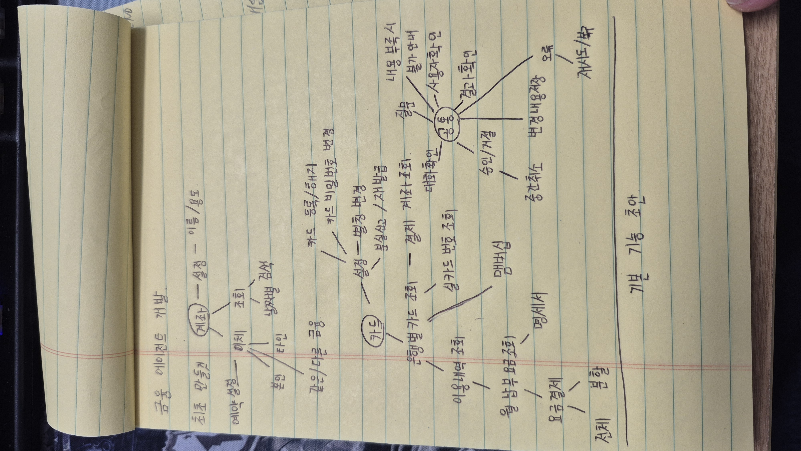

처음부터 완벽한 다이어그램을 만들기보다 내가 알고 있는 은행 앱의 흐름을 기준으로 기능을 먼저 나열했다. 이 단계에서는 “무슨 기능이 필요한가”에 집중했다.

### 2.2 기본 카테고리

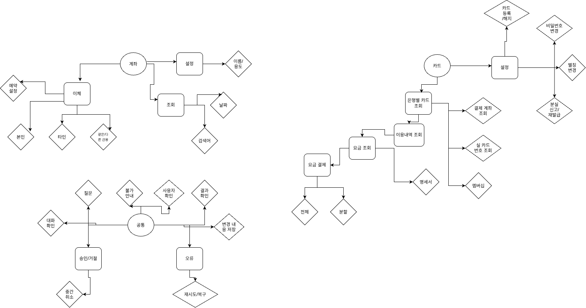

기본 카테고리는 계좌, 카드, 공통으로 나눴다. 이후 기능마다 필요한 정보가 다르다는 것을 확인하고 세부 다이어그램을 추가했다.

### 2.3 계좌·카드·공통에 필요한 정보

계좌 기능 초안

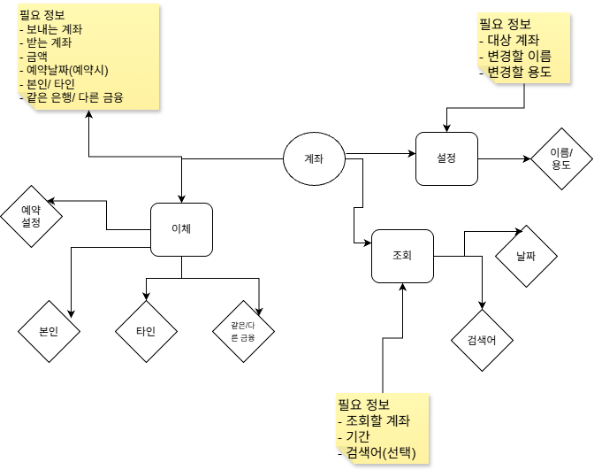

카드 기능 초안

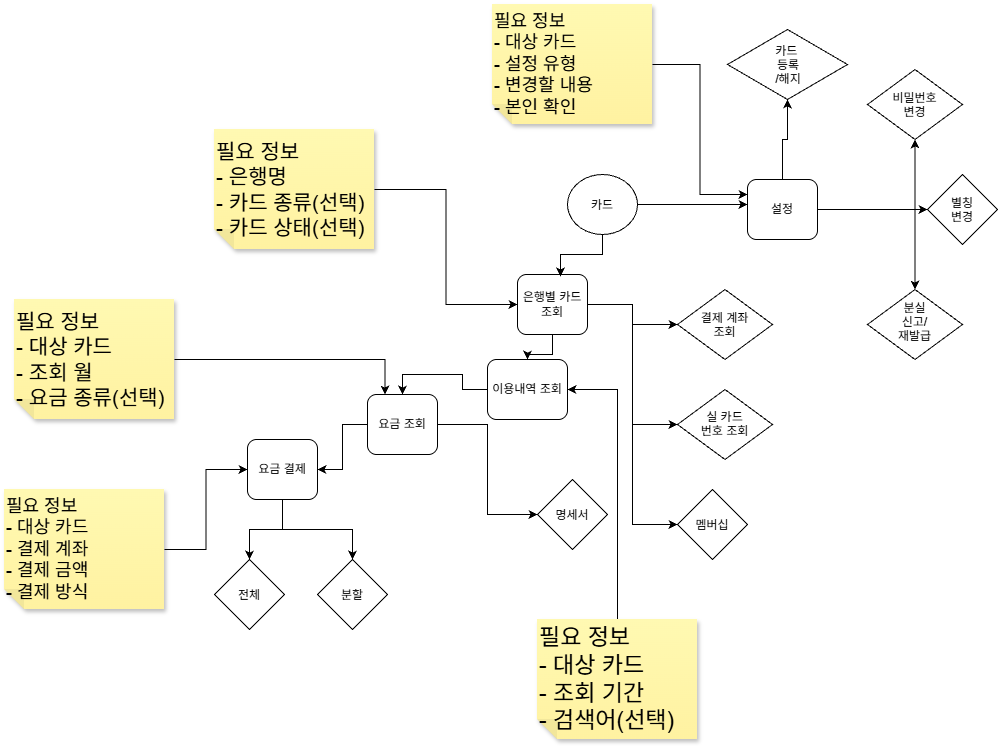

공통 기능 초안

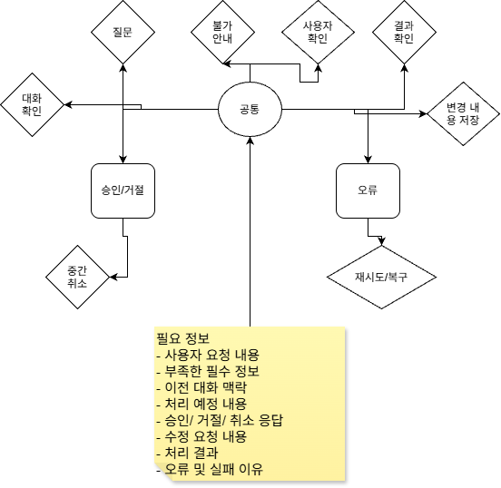

기능 이름만 적는 것이 아니라 **실행하려면 어떤 값이 필요한지**를 같이 적었다.

- 즉시이체는 출금 계좌, 입금 계좌, 금액이 필요하다.

- 조건부 이체는 출금 계좌, 입금 계좌, 남길 금액이 필요하다.

- 나눔 이체는 하나의 출금 계좌와 여러 입금 계좌별 금액이 필요하다.

- 카드 재발급은 대상 카드, 배송지, 기존 신청 상태가 필요하다.

- 정보가 부족하면 실행하지 않고 사용자에게 다시 질문해야 한다.

---

## 3. 내가 만든 기능별 세부 흐름

큰 카테고리를 정한 뒤 계좌 조회·이체·설정, 카드 조회·결제·설정, 공통 처리를 각각 더 작은 흐름으로 나눴다.

### 3.1 계좌

계좌 조회

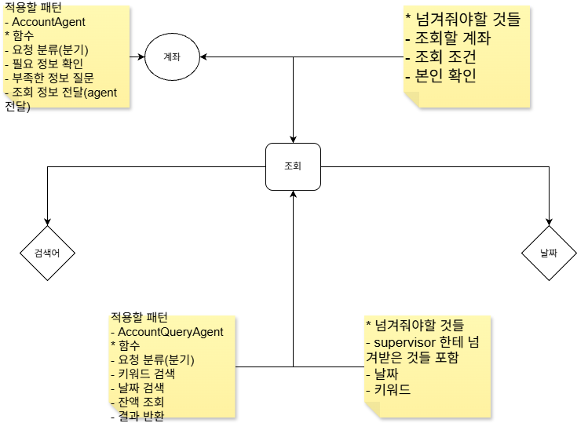

계좌 이체

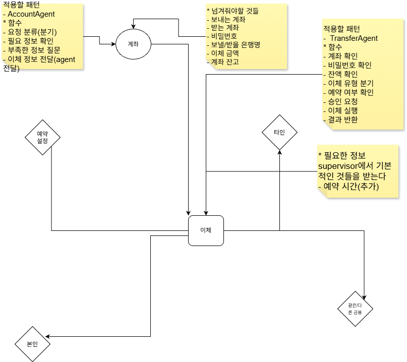

계좌 설정

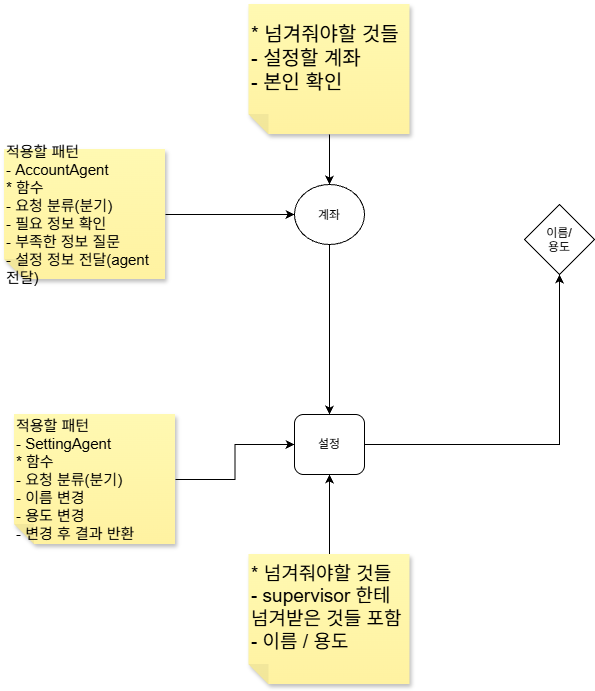

### 3.2 카드

카드 조회·결제

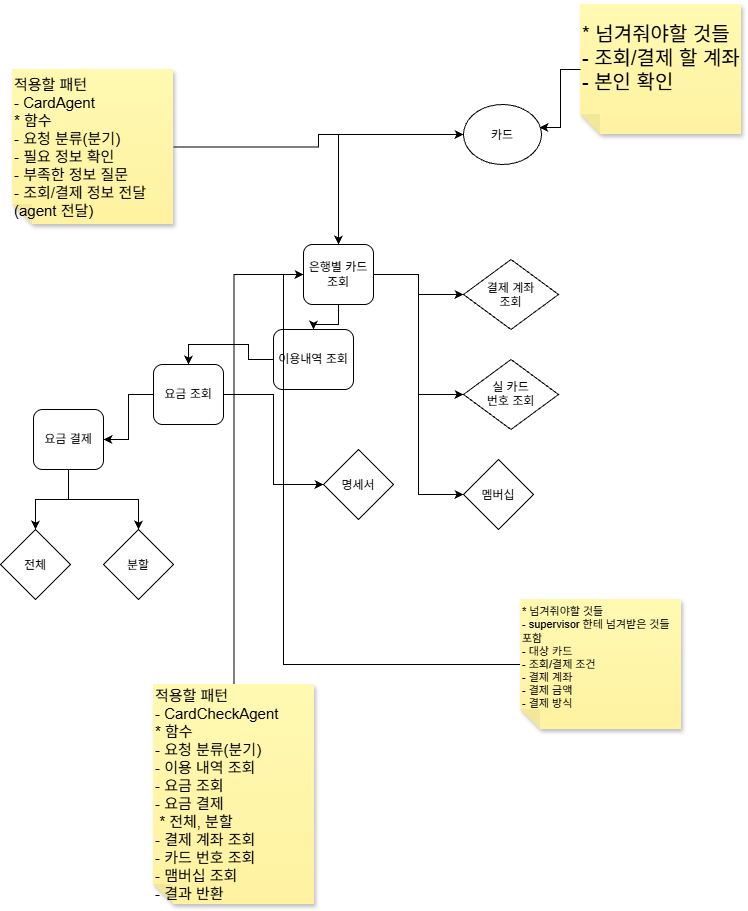

카드 설정

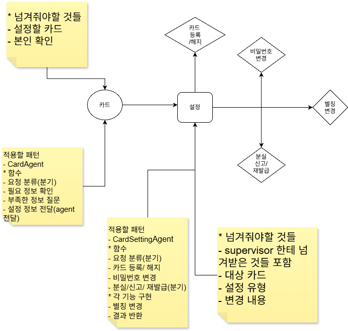

### 3.3 공통

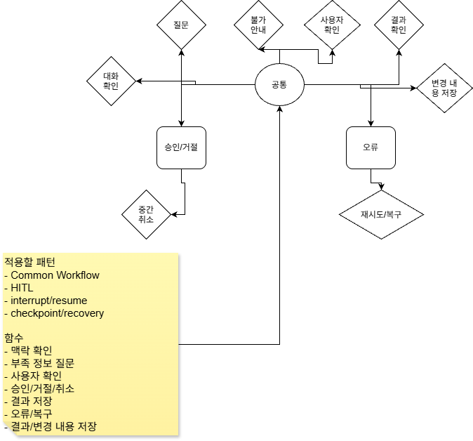

이 단계까지는 내가 기능을 중심으로 만든 초안이다. 흐름은 보였지만, 실제 LangGraph로 구현할 때 필요한 **재실행 범위, 승인 노드의 위치, State 변경 시점, 하위 Agent의 잘못된 분류 복구**가 충분히 정리되지 않았다.

---

## 4. Claude와 함께 초안을 보완한 과정

내 초안을 Claude에게 넘겨 전체를 새로 만들어 달라고 한 것이 아니라, 내가 정한 흐름을 기준으로 다음 질문을 하나씩 확인했다.

- 이 분기는 어느 Agent가 판단해야 하는가?

- 필요한 정보는 어느 단계에서 검사해야 하는가?

- 사용자가 승인 전에 금액을 바꾸면 어디로 돌아가야 하는가?

- `interrupt()`가 재개될 때 어떤 코드가 다시 실행되는가?

- 저장에 실패하면 데이터는 어떤 상태여야 하는가?

- 카드 상태와 재발급 신청 상태는 어떻게 구분해야 하는가?

- 하위 Agent가 자기 도메인이 아니라고 판단하면 어디로 돌려보내야 하는가?

| 초안에서 부족했던 점 | 보완한 내용 |
| --- | --- |
| 기능 목록은 있지만 Agent의 책임이 겹침 | Supervisor → 도메인 Agent → 기능 Agent의 3단계로 분리 |
| 승인과 실행이 한 흐름에 섞임 | propose → approve → execute로 분리 |
| interrupt 재개 시 부작용 중복 가능 | interrupt가 있는 노드에는 저장·기록 같은 부작용을 두지 않음 |
| 정보 부족 시 돌아갈 위치가 불명확 | 기능 Agent에서 필요한 정보를 확인하고 질문 후 같은 단계로 복귀 |
| 잘못된 도메인 분류의 복구 없음 | 하위 Agent가 도메인 불일치를 반환하면 Supervisor로 1회 반송 |
| 카드와 재발급 상태가 섞임 | 카드 상태와 재발급 신청 상태를 별도로 정의 |

---

## 5. 보완한 전체 구조

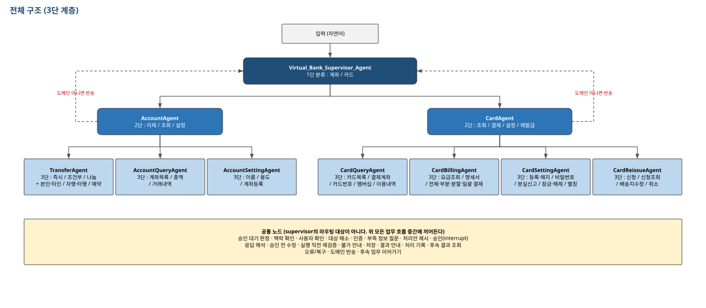

```plain text
1단 Supervisor
→ 계좌 / 카드 도메인 분류

2단 도메인 Agent
→ 계좌: 이체 / 조회 / 설정
→ 카드: 조회 / 결제 / 설정 / 재발급

3단 기능 Agent
→ 즉시이체 / 조건부 이체 / 나눔 이체처럼 실제 업무 종류 분류
→ 필요한 정보 확인
→ 검증·승인·실행 흐름으로 연결
```

선택지를 한 Agent에 모두 주지 않고 층마다 3~4개로 줄였다. **필요 정보 확인은 3단 기능 Agent에서 한다.** 2단에서는 “이체”까지는 알 수 있지만 즉시이체인지 조건부 이체인지 모르기 때문에 무엇이 부족한지 정확히 판단할 수 없다.

---

## 6. 보완한 전체 실행 흐름

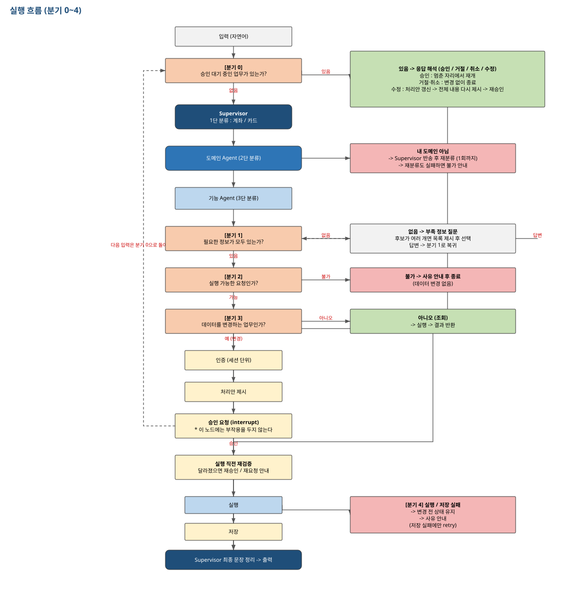

```plain text
입력
→ 승인 대기 중인 업무가 있는지 먼저 확인
  ├─ 있음: 승인 / 거절 / 취소 / 수정으로 해석하고 기존 업무 재개
  └─ 없음: 새 요청으로 분류
→ Supervisor → 도메인 Agent → 기능 Agent
→ 필요한 정보 확인
  ├─ 부족: 추가 질문 후 다시 확인
  └─ 충족: 실행 가능 여부 검증
→ 조회 업무면 바로 실행
→ 변경 업무면 제안 → 승인 → 재검증 → 실행 → 저장
→ 결과 안내
```

### 되돌아오는 경로

- 정보가 부족하면 기능 Agent의 정보 확인 단계로 돌아간다.

- 승인 전에 사용자가 내용을 수정하면 제안을 다시 만들고 전체 내용을 다시 보여준다.

- 하위 Agent가 자기 도메인이 아니라고 판단하면 Supervisor로 돌아간다.

- 승인 뒤 실행 직전에 잔액이나 상태가 바뀌면 다시 승인받거나 재요청을 안내한다.

- 저장 실패 시 변경 전 상태를 유지하고 실패를 기록한다.

---

## 7. 설계하면서 정한 핵심 원칙

### 7.1 조회와 변경을 구분한다

읽기만 하는 조회는 승인 없이 실행한다. JSON 데이터에 쓰기가 발생하는 업무는 모두 승인받는다. 기준을 “돈 또는 민감정보인가?”가 아니라 **파일을 변경하는가?**로 잡았다.

### 7.2 interrupt 노드에는 부작용을 두지 않는다

```python
def propose_node(state):   # 계산만 하고 저장하지 않음
def approve_node(state):   # interrupt()만 담당
def execute_node(state):   # 승인 뒤 실제 저장
```

`interrupt()` 뒤 재개는 멈춘 줄 다음부터 이어지는 것이 아니라 해당 노드를 처음부터 다시 실행한다. 따라서 승인 노드에서 파일 저장이나 요청 기록을 하면 같은 작업이 두 번 실행될 수 있다.

### 7.3 수치와 성공 여부는 Python이 결정한다

LLM은 문장을 자연스럽게 만들 수 있지만 잔액, 이체 금액, 처리 성공 여부를 새로 판단하게 하지 않는다. 실제 Python 함수의 반환값을 그대로 사용한다.

### 7.4 공통 처리는 Agent보다 공통 Node로 둔다

인증, 대상 확인, 승인, 재검증, 저장, 로그는 Supervisor의 새로운 도메인이 아니라 여러 기능 사이에 반복해서 들어가는 공통 단계다.

---

## 8. 계좌·카드·공통 기능의 보완 설계

### 8.1 계좌 기능

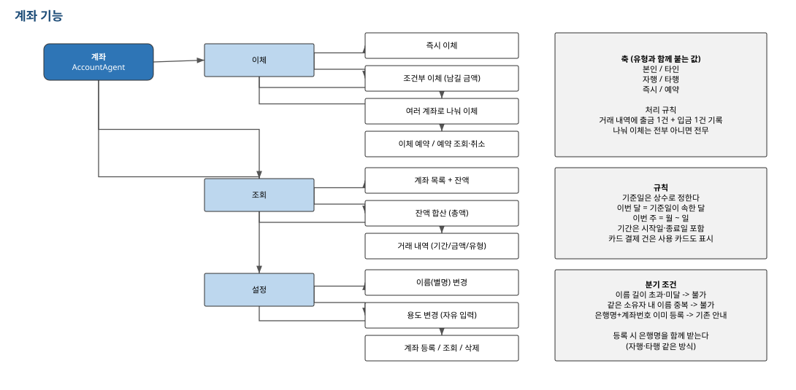

계좌는 조회, 이체, 설정으로 나눴다. 이체는 다시 즉시, 조건부, 나눔 이체로 나누고 각 유형이 요구하는 정보와 검증 조건을 다르게 둔다.

### 8.2 카드 기능

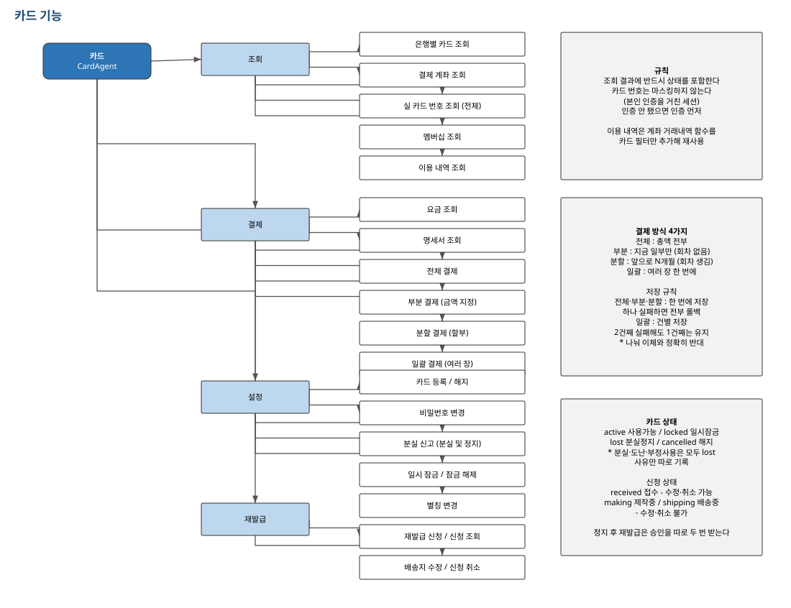

카드는 조회, 결제, 설정, 재발급으로 나눴다. 분실 정지와 일시 잠금은 모두 카드를 사용하지 못하게 하지만 상태와 다음 행동이 다르므로 같은 기능으로 처리하지 않는다.

### 8.3 공통 기능

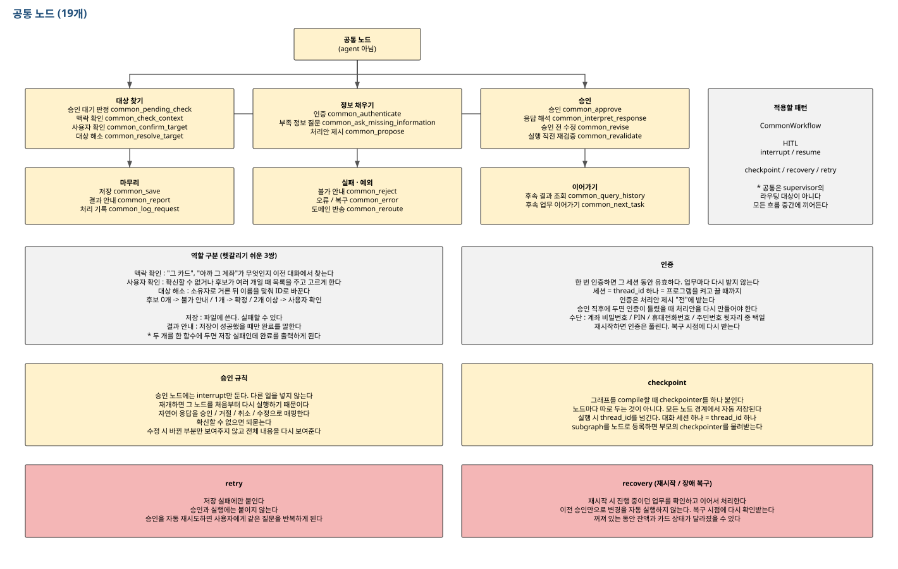

공통 기능에는 대상 확인, 인증, 제안, 승인, 재검증, 실행, 저장, 실패 안내, 로그가 들어간다.

---

## 9. 상태 전이까지 설계한 이유

기능 이름만 나누면 “현재 상태에서 이 요청이 가능한가?”를 판단하기 어렵다. 그래서 카드 상태와 재발급 신청 상태의 이동 규칙도 따로 만들었다.

### 9.1 카드 상태 전이

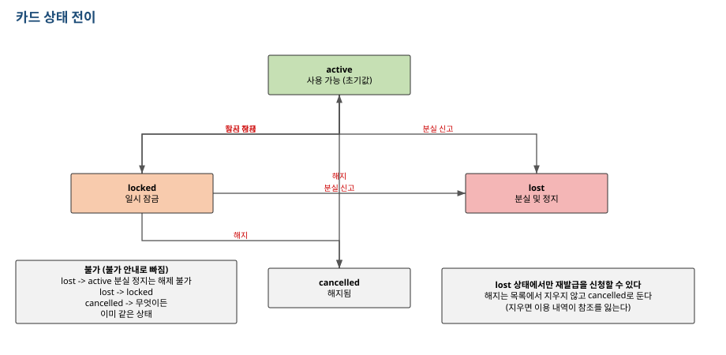

- 사용 가능 카드만 일시 잠금할 수 있다.

- 일시 잠금 카드는 잠금 해제할 수 있다.

- 사용 가능 또는 일시 잠금 카드 모두 분실 정지할 수 있다.

- 분실 정지 카드는 잠금 해제로 다시 사용 가능하게 만들지 않는다.

### 9.2 재발급 신청 상태 전이

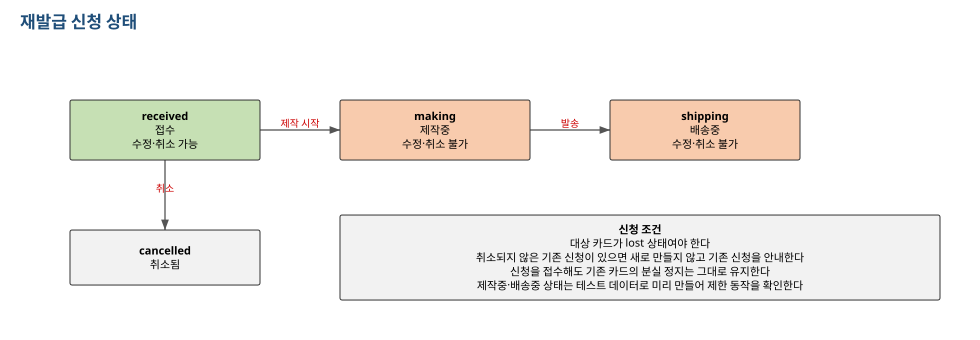

- 접수 상태에서는 배송지 수정과 신청 취소가 가능하다.

- 제작이 시작된 뒤에는 수정·취소할 수 없다.

- 같은 카드에 취소되지 않은 신청이 있으면 중복 신청하지 않는다.

- 재발급 실패나 취소가 발생해도 이미 완료된 카드 분실 정지는 되돌리지 않는다.

---

## 10. State를 설계할 때 확인한 것

| State 영역 | 역할 |
| --- | --- |
| 요청 | 원문, 요청 ID, 현재 업무 종류 |
| 라우팅 | 도메인, 도메인 내부 기능, 세부 업무 종류 |
| 대상 | 출금·입금 계좌, 카드, 재발급 신청 등 |
| 필요 정보 | 금액, 남길 금액, 배송지, 조회 조건 등 |
| 승인 | 제안 내용, 승인 대기 여부, 승인·거절·수정 결과 |
| 실행 결과 | 성공·실패 상태, 변경된 값, 오류 메시지 |
| 복구 | 재실행 횟수, 반송 횟수, 저장 전 스냅샷 등 |

값이 언제 생기고 언제 바뀌는지도 함께 생각해야 했다. 이체 금액은 자연어에서 바로 확정되는 것이 아니라 대상 계좌를 찾고 현재 잔액을 확인한 뒤 검증을 통과해야 실행 가능한 값이 된다.

---

## 11. 구현 순서도 설계의 일부였다

처음에는 계좌·카드·공통 모듈을 각각 모두 만든 뒤 마지막에 연결하려고 했다. 하지만 그렇게 하면 입력부터 출력까지 실제로 도는 업무가 오래 생기지 않는다. Claude와 검토한 뒤 구현 순서를 “가로”에서 “세로”로 바꿨다.

```plain text
0단계: logger와 data_store 같은 기반 만들기
1단계: 계좌 조회 하나로 입력부터 출력까지 관통
2단계: 즉시이체 하나로 승인과 저장 흐름 완성
3단계: 조건부·나눔 이체와 계좌 설정 확장
4단계: 카드 기능 확장
5단계: 전체 통합 점검
```

기능을 많이 벌리는 것보다 작은 업무 하나가 처음부터 끝까지 흐르도록 만든 뒤 같은 패턴을 확장하는 방식이 더 안전하다는 것을 배웠다.

---

## 12. 오늘 구현된 기반 코드

오늘의 중심은 설계였지만 설계를 실제 코드에 연결하기 위한 기반 두 가지는 구현되어 있다.

### 12.1 `logger.py`

- 턴 시작과 종료를 한 묶음으로 기록한다.

- 성공한 턴은 한 줄로 요약하고 실패·예외가 있는 턴은 상세 로그를 남긴다.

- interrupt 재개 시 재실행된 노드를 표시한다.

- 비밀번호, PIN, 주민등록번호 뒷자리, 전화번호를 마스킹한다.

- 한글 너비를 고려해 로그 열을 맞춘다.

- 파일이 최대 크기를 넘으면 새 로그 파일로 회전한다.

### 12.2 `data_store.py`

- 작업본이 없으면 `initial_data.json`에서 복사한다.

- 원본은 읽기 전용으로 보호한다.

- 임시 파일에 먼저 쓴 뒤 교체하는 방식으로 저장한다.

- 저장 실패 시 이전 작업본을 유지한다.

- `_`로 시작하는 실행 중 임시 키는 JSON에 저장하지 않는다.

- reset으로 작업본을 원본 상태로 되돌릴 수 있다.

### 12.3 확인 결과

- 로그 테스트에서 성공 요약, 실패 상세 기록, 재실행 표시, 마스킹, 한글 정렬, 파일 회전을 확인했다.

- data_store 테스트는 **35개 확인 항목 모두 통과**했다.

- `graph.py`, `functions.py`, `main.py`는 아직 역할 안내와 기본 틀만 있으며 실제 Agent 업무 구현은 다음 단계다.

즉, 오늘은 프로젝트가 완성된 날이 아니라 **설계 기준을 세우고 로그·저장 기반을 준비한 날**이다.

---

## 13. 초안에서 최종 설계로 바뀐 핵심

1. 기능 목록만 나열하던 구조에서 요청의 이동 경로를 설명하는 구조로 바뀌었다.

1. 계좌와 카드를 한 Agent가 모두 판단하지 않고 층별로 책임을 나눴다.

1. 필요한 정보 확인 위치를 3단 기능 Agent로 내렸다.

1. 승인과 실행을 분리하고 interrupt 노드에서 부작용을 제거했다.

1. 승인 전 수정, 잘못된 도메인 분류, 저장 실패처럼 되돌아오는 경로를 추가했다.

1. 카드 상태와 재발급 신청 상태를 따로 정의했다.

1. State에 승인·복구·오류 관련 필드를 추가했다.

1. 청구서 기능은 범위가 너무 넓어져 이번 1차 구현에서 제외했다.

1. 구현 순서를 기능별 가로 확장에서 작은 업무 하나를 세로로 관통하는 방식으로 바꿨다.

---

## 14. 헷갈린 점

처음에는 Agent를 많이 나누면 무조건 설계가 좋아지는 줄 알았다. 하지만 Agent는 판단 책임이 분명한 곳에 사용하고, 인증·승인·저장처럼 여러 흐름에서 반복되는 단계는 공통 Node로 두는 편이 더 이해하기 쉬웠다.

`interrupt()`도 실행을 멈춘 위치에서 그대로 이어지는 것으로 생각했다. 실제로는 노드가 처음부터 다시 실행되기 때문에 interrupt가 있는 노드에서 파일을 저장하거나 요청을 기록하면 중복 실행될 수 있다.

필요 정보 확인도 Supervisor나 2단 도메인 Agent에서 하면 될 것처럼 보였다. 하지만 “이체”만 알아서는 금액이 필요한지, 남길 금액이 필요한지, 여러 계좌별 금액이 필요한지 정할 수 없다. 세부 유형을 정한 3단 기능 Agent에서 확인해야 한다.

설계에 하루를 거의 다 사용했기 때문에 처음에는 진행이 느린 것처럼 느껴졌다. 하지만 코드를 먼저 만들었다면 승인·수정·실패 흐름이 뒤섞인 뒤 다시 고쳤을 가능성이 크다. 오늘은 코드를 많이 작성하기보다 **설계를 어떤 순서와 기준으로 해야 하는지 느낀 것이 가장 큰 결과**였다.

---

## 15. 오늘 배운 것 정리

### 내가 직접 한 것

- 계좌, 카드, 공통 기능의 기본 카테고리를 정했다.

- 각 기능에 필요한 정보와 분기 조건을 적었다.

- 손그림과 [draw.io](http://draw.io)로 기능별 요청 흐름을 만들었다.

- 조회, 이체, 설정, 카드 업무의 세부 패턴을 나눴다.

### Claude와 함께 보완한 것

- 초안에서 빠진 승인·수정·실패·복구 경로를 찾았다.

- Supervisor, 도메인 Agent, 기능 Agent의 책임을 분리했다.

- interrupt 재실행 범위를 기준으로 propose, approve, execute를 나눴다.

- 카드와 재발급 신청의 상태 전이를 정의했다.

- State 필드와 값이 바뀌는 시점을 정리했다.

- 구현 순서를 세로 관통 방식으로 바꿨다.

### 설계할 때 먼저 확인할 질문

```plain text
사용자 요청은 어떤 도메인과 기능으로 이동하는가?
→ 실행에 필요한 정보는 무엇인가?
→ 정보가 부족하면 어디에서 다시 질문하는가?
→ 조회인가, 데이터를 바꾸는 업무인가?
→ 승인은 어느 시점에 받는가?
→ interrupt 재개 시 어떤 노드가 다시 실행되는가?
→ 실행 직전 무엇을 다시 검증하는가?
→ 저장 실패 시 이전 상태를 어떻게 지키는가?
→ 성공·실패·수치는 누가 결정하는가?
→ 다음 기능을 추가해도 기존 책임이 흔들리지 않는가?
```

오늘은 기능 구현량보다 설계 과정이 더 중요했다. **내가 먼저 초안을 만들고, Claude와 질문을 주고받으며 이유를 이해한 뒤 보완했기 때문에 앞으로 Agent 구조를 설계할 때 무엇부터 확인해야 하는지 조금씩 감을 잡을 수 있었다.**

---

## 16. 다음 단계

1. 계좌 조회 하나를 입력부터 출력까지 연결한다.

1. Supervisor → Account Agent → Account Query Agent 라우팅을 확인한다.

1. State가 각 Node에서 어떻게 바뀌는지 로그로 확인한다.

1. 조회 흐름이 완성되면 즉시이체의 propose → approve → execute를 구현한다.

1. 작은 흐름 하나를 완성할 때마다 테스트와 Git 커밋을 남긴다.

관련 문서:

- [프로젝트 저장소](https://github.com/snail5039-code/virtual-bank-agent)

- [설계 기획서](https://github.com/snail5039-code/virtual-bank-agent/blob/master/%EA%B8%B0%ED%9A%8D%EC%84%9C.md)

- [직접 작성한 초안](https://github.com/snail5039-code/virtual-bank-agent/blob/master/%EC%84%A4%EA%B3%84%20%EC%B4%88%EC%95%88/%EA%B8%B0%ED%9A%8D%EC%84%9C_%EC%88%98%EA%B8%B0(%EC%B4%88%EC%95%88).txt)

- [초안과 보완 내용 대조](https://github.com/snail5039-code/virtual-bank-agent/blob/master/%EC%84%A4%EA%B3%84%20%EC%A4%91/%EA%B8%B0%ED%9A%8D%EC%84%9C_%EC%88%98%EA%B8%B0(%EC%A7%84%ED%96%89).txt)

- [정리된 설계](https://github.com/snail5039-code/virtual-bank-agent/blob/master/%EC%84%A4%EA%B3%84%20%EC%A4%91/%EA%B8%B0%ED%9A%8D%EC%84%9C_%EC%88%98%EA%B8%B0(%EC%A0%95%EB%A6%AC).txt)
