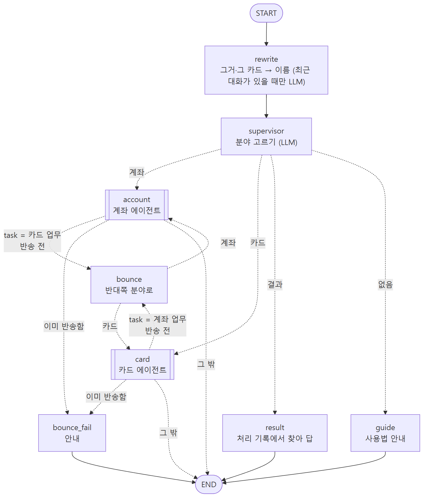
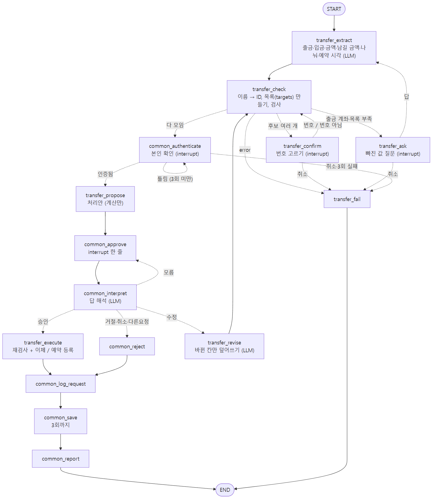
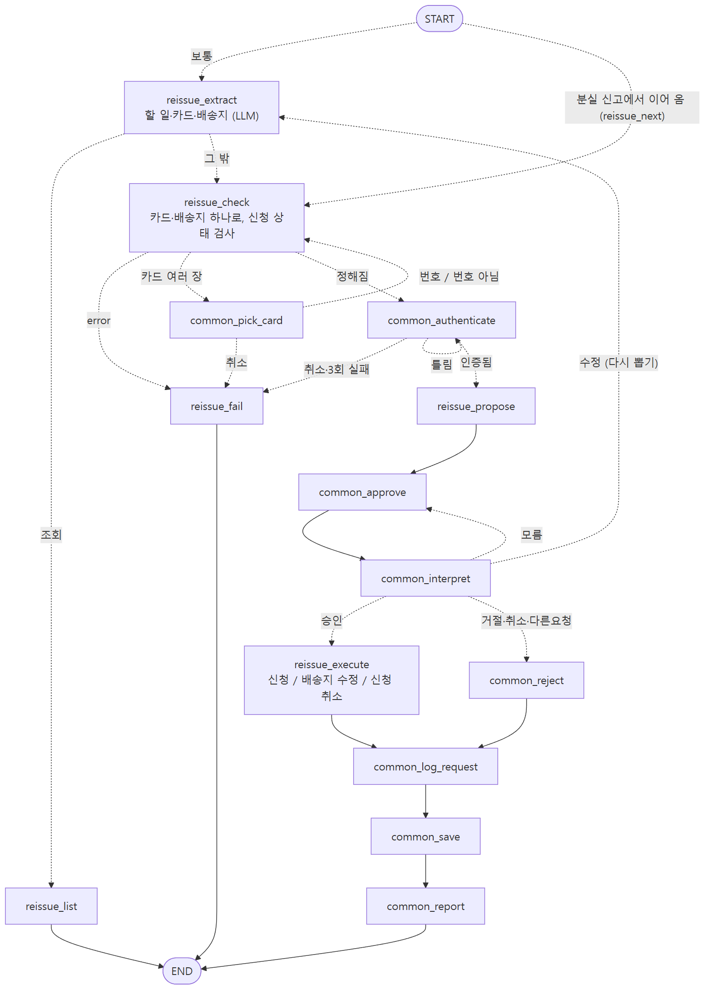

# 26.09.28 47일차(Python 가상 금융 업무 에이전트 구현 및 마무리)

## [TIL] 직접 만든 설계를 실제 LangGraph 프로젝트로 완성하기

46일차에는 내가 먼저 만든 초안을 Claude와 함께 검토하면서 전체 구조와 안전 기준을 정했다. 이후에는 그 설계를 한 번에 구현하지 않고 **공통 기반 → 계좌 → 카드 → 결과 조회·복구 → 보완 → 정리** 순서로 나누어 구현했다.

이번 프로젝트의 목표는 단순히 자연어로 은행 기능을 호출하는 것이 아니었다. 조회와 변경을 구분하고, 변경 업무는 반드시 **본인 확인 → 처리안 → 사용자 승인(Human-in-the-Loop) → 실행 → 저장 → 결과 안내**를 거치게 만드는 것이 핵심이었다.

프로젝트 저장소: [virtual-bank-agent](https://github.com/snail5039-code/virtual-bank-agent)

---

## 1. 최종 실행 흐름


프로그램은 먼저 그래프가 이전 질문이나 승인을 기다리고 있는지 확인한다. 멈춘 업무가 있으면 새 요청으로 분류하지 않고 그 답으로 재개한다. 대기 중인 업무가 없을 때만 최근 대화를 보고 “그 카드”, “거기서” 같은 표현을 실제 이름으로 바꾼 뒤 Supervisor로 보낸다.

```plain text
입력
→ 멈춘 업무 확인
→ 대화 맥락으로 요청 보완
→ 1단 Supervisor
→ 2단 도메인 Agent
→ 3단 기능 Agent
→ 조회는 즉시 응답
→ 변경은 인증·처리안·승인 후 실행
→ 처리 기록과 데이터 저장
```

---

## 2. Supervisor와 3단 Agent 구조



전체 구조는 세 단계로 나눴다.

| 단계 | 역할 |
| --- | --- |
| 1단 Supervisor | 계좌 / 카드 / 처리 결과 조회 / 업무 아님으로 분류 |
| 2단 도메인 Agent | 계좌는 조회·거래 내역·이체·설정, 카드는 조회·설정·재발급·결제로 분류 |
| 3단 기능 Agent | 필요 정보 추출, 검증, 추가 질문, 인증, 승인, 실행, 저장 |

1단이 잘못 분류한 경우 도메인 Agent가 한 번 반송할 수 있게 했다. 두 번째도 맞지 않으면 무한히 오가지 않고 안내 후 종료한다.

---

## 3. LLM과 Python의 역할 분리

LLM은 사용자 문장에서 업무와 값을 추출하고 분류하는 데만 사용했다. 금액 계산, 잔액 검사, 이름을 ID로 변환하는 작업, 실제 성공 여부는 Python 함수가 담당한다.

```plain text
LLM: "생활비에서 저축으로 10만원"에서 계좌 이름과 금액 추출
Python: 계좌 검색 → 잔액 검사 → 이체 금액 계산 → 실행 → 결과 확정
```

초안에는 마지막에 LLM이 결과를 자연스럽게 정리하는 단계가 있었지만, 금액이나 성공 여부가 바뀔 위험이 있어 제거했다. 사용자가 보는 최종 값은 Python이 계산한 값을 그대로 사용한다.

---

## 4. Human-in-the-Loop를 안전하게 구현한 방법

변경 업무는 조회와 달리 데이터가 바뀐다. 그래서 공통 흐름을 다음처럼 만들었다.

```plain text
검사 → 본인 확인 → 처리안 생성 → 승인 대기
→ 승인 해석 → 실행 → 처리 기록 → 원자적 저장 → 결과 안내
```

LangGraph의 `interrupt()`는 재개할 때 노드의 중단 지점 다음 줄이 아니라 **그 노드를 처음부터 다시 실행**한다. 승인 노드 안에서 저장까지 하면 재개 시 중복 실행될 수 있으므로 처리안 노드(계산만), 승인 노드(interrupt만), 실행 노드(승인 후 변경)로 분리했다.

승인 대기 중 “5만원만 보내줘”처럼 수정하면 다시 검사하고 새 처리안을 보여준다. 거절·취소도 처리 기록에 남긴다.

---

## 5. 계좌 Agent 구현



계좌 Agent에는 목록·잔액·거래 내역 조회와 즉시·조건부·나눠·예약 이체, 계좌 별명·용도 변경, 등록 계좌 관리 기능을 구현했다.

- 즉시 이체: 출금 계좌, 입금 계좌, 금액을 검증한 뒤 실행

- 조건부 이체: “40만원 남기고 나머지”처럼 실행 시점 잔액으로 금액 계산

- 나눠 이체: 여러 목적지 중 하나라도 실패하면 전체 실행하지 않음

- 예약 이체: 예약 시 승인하고, 실행 시각이 되면 스케줄러가 처리

- 등록 계좌: 상대 계좌를 주소록처럼 등록하고 이체 대상으로 사용

- 거래 내역: 기간·계좌·입출금 종류·금액 조건을 조합해 검색

승인 뒤 실제 실행 직전에 잔액을 다시 확인한다. 처리안을 보여준 뒤 다른 작업으로 잔액이 바뀌어도 잘못된 이체가 실행되지 않는다.

---

## 6. 카드 Agent 구현


카드 Agent에는 카드 목록·상세 조회, 일시 잠금·해제, 분실 정지, 해지·별칭·비밀번호 변경, 카드 등록, 재발급, 카드 요금 조회·결제를 구현했다.

카드 이름이 부분 일치해 여러 장이 검색되면 임의로 선택하지 않고 후보를 보여주고 번호로 고르게 한다. 분실 정지 카드는 잠금 해제가 불가능하고, 카드 번호 조회는 본인 확인 뒤에만 가능하다.

비밀번호와 PIN은 평문으로 저장하지 않고 PBKDF2 해시와 salt로 저장·비교한다. 입력은 터미널에서 가리고 로그에도 원문을 남기지 않는다.

---

## 7. 재발급과 연속 업무



재발급은 분실 정지된 카드만 신청할 수 있다. 접수 상태에서는 배송지 수정·취소가 가능하지만 제작 중·배송 중에는 제한한다.

“카드를 분실했으니 정지하고 재발급해줘” 요청은 두 작업을 한 번에 저장하지 않았다.

```plain text
분실 정지 처리안 → 승인 1 → 분실 정지 저장
→ 재발급 처리안 → 승인 2 → 재발급 신청 저장
```

두 번째 승인을 거절해도 이미 승인한 분실 정지는 유지된다. 각 변경을 별도의 사용자 결정으로 나눈 것이다.

---

## 8. 카드 요금과 분할 결제


신용카드 청구서 조회와 전체·부분·분할·일괄 결제를 구현했다. 분할 결제는 첫 회차를 즉시 납부하고, 나머지 회차는 예약 이체와 같은 스케줄러에서 납부한다.

일괄 결제는 여러 청구서를 한 번에 처리하되 한 건의 잔액이 부족해도 이미 성공한 다른 건은 유지한다. 각 청구서의 성공·실패를 따로 기록해 결과를 정확히 보여준다.

---

## 9. State와 대화 기억

Checkpointer는 `thread_id`별 State를 유지하므로 새 요청이 시작돼도 지난 업무 값이 남을 수 있다. 이를 막기 위해 `new_request()`에서 업무용 필드를 비우고, 세션 인증과 직전 이체 정보처럼 다음 요청에 필요한 값만 유지했다.

최근 5턴의 요청과 응답을 별도로 보관해 “그 카드”, “거기서” 같은 말을 실제 카드·계좌 이름으로 풀어 쓴다. 대화 기억은 편의를 위한 맥락이고, 실제 처리 결과 조회는 LLM 기억이 아니라 저장된 처리 기록을 기준으로 답한다.

---

## 10. 저장·복구·스케줄러

데이터는 `initial_data.json` 원본과 `data.json` 작업본을 분리했다. 저장할 때는 임시 파일에 전부 쓴 뒤 `os.replace()`로 교체하는 원자적 저장 방식을 사용한다. 저장에 실패하면 최대 3번 시도하고, 끝까지 실패하면 기존 작업본을 유지한다.

예약 이체와 분할 회차는 30초마다 확인하는 스케줄러 스레드에서 실행한다. 입력 처리와 동시에 파일을 쓰지 않도록 하나의 잠금을 사용하고, 스케줄러 결과는 큐에 모았다가 사용자 입력 사이에 출력한다.

승인·질문 대기 중 프로그램을 종료하면 진행 중 업무를 데이터에 남긴다. 다시 실행할 때 자동으로 변경을 실행하지 않고, 사용자가 처음부터 다시 진행할지 확인한다.

---

## 11. 단계별 구현과 테스트

기능을 한 번에 완성하지 않고 단계마다 확인 스크립트를 만들었다.

| 구분 | 개수 | 확인 범위 |
| --- | --- | --- |
| 단계별 | 28개 | 로그·저장소·입력 루프·Supervisor·계좌·카드·결과 조회·복구 |
| 보완 | 14개 | 대화 기억·스케줄러·분할 자동 납부·후속 조회 조건·버그 수정 |
| 최종 결과 | 42개 | 2026-09-28 정리 뒤 전체 실행, 오류 없이 완료 |

대표적으로 음수 금액, 잔액 부족, 승인 뒤 잔액 변경, 저장 실패, 본인 확인 3회 실패, 과거 시각 예약, 예약 실행 시 잔액 부족, 제작 중 재발급 수정 제한, 초과 납부, 승인 대기 중 다른 요청, 잘못된 날짜 형식, 재시작 복구를 확인했다.

---

## 12. 설계에서 실제 구현으로 바뀐 점

처음 계획한 공통 노드는 17개였지만 최종 구현에서는 8개로 줄었다. “무엇이 부족한가”, “무엇을 질문할 것인가”는 업무마다 달라서 억지로 공통화하면 공통 노드 안에서 다시 복잡하게 분기했기 때문이다.

이체 유형 분류 노드도 없앴다. 조건부·나눠·예약은 서로 배타적인 종류가 아니라 함께 나타날 수 있는 축이므로, 뽑힌 값이 있는지로 동작을 결정했다.

서브그래프를 Tool처럼 호출하는 구조 대신 Supervisor 그래프 안의 노드로 넣었다. 그래야 같은 State와 Checkpointer를 사용하면서 interrupt 재개 흐름을 자연스럽게 유지할 수 있었다.

---

## 13. 구현하면서 해결한 문제

| 문제 | 해결 |
| --- | --- |
| 지난 요청 값이 새 요청에 섞임 | 새 요청마다 업무 필드를 초기화 |
| 예외 뒤 이전 요청이 다시 실행됨 | 실제 interrupt가 있는 경우만 대기 상태로 판단 |
| 예약 시각이 9시간 밀림 | 사용자가 말한 시각을 로컬 기준으로 처리 |
| 부분 일치 카드가 여러 장 검색됨 | 정확히 같은 이름 우선, 아니면 번호 선택 |
| 예약이 입력할 때만 실행됨 | 30초 스케줄러·잠금·출력 큐 추가 |
| 예약 결과를 “됐어?”로 찾지 못함 | 예약·분할 실행도 처리 기록에 저장 |
| 민감값이 평문과 로그에 노출됨 | PBKDF2 해시·가린 입력·로그 마스킹 |

---

## 14. 이번 프로젝트에서 배운 점

- `interrupt()` 재개는 노드 재실행이므로 승인 노드에 부작용을 두면 안 된다.

- HITL은 승인 버튼 하나가 아니라 대기 감지, 인증, 처리안, 승인 해석, 수정, 거절, 기록까지 포함한 전체 흐름이다.

- LLM은 분류·추출에 사용하고, 금액·상태·성공 여부는 결정적인 Python 코드가 책임져야 한다.

- State를 유지하는 것만큼 새 요청에서 무엇을 지울지도 중요하다.

- 설계는 구현 중 바뀔 수 있지만, 바뀐 이유를 기록하면 최종 구조를 설명할 수 있다.

- 기능마다 확인 스크립트를 만든 덕분에 마지막 리팩터링 뒤에도 같은 시나리오로 회귀를 확인할 수 있었다.

---

## 15. 남은 한계와 다음 단계

현재 Checkpointer는 `InMemorySaver`라 프로그램이 꺼지면 그래프 State 자체는 사라진다. 진행 중 업무의 요약만 데이터에 남겨 처음부터 다시 시작하게 했다. 실제 서비스라면 SQLite나 DB 기반 Checkpointer를 사용할 수 있다.

최근 대화 기억은 프로그램이 켜진 동안의 5턴만 유지한다. 장기 기억은 LangGraph Store 같은 별도 저장소가 필요하다.

현재 확인 스크립트는 실제 실행 결과를 출력해 검증하는 방식이다. 다음에는 핵심 함수와 그래프 분기를 `pytest`의 assert 기반 자동 테스트로 바꾸고, 파일 저장소도 실제 DB 트랜잭션으로 확장해 보고 싶다.

---

## 추가!

이번 프로젝트를 한 줄로 정리하면 다음과 같다.

> 직접 만든 설계를 기준으로, LLM이 판단할 부분과 Python이 책임질 부분을 나누고, 사용자의 승인 없이는 금융 데이터가 바뀌지 않는 LangGraph 멀티 에이전트를 단계별로 구현하고 검증했다.
