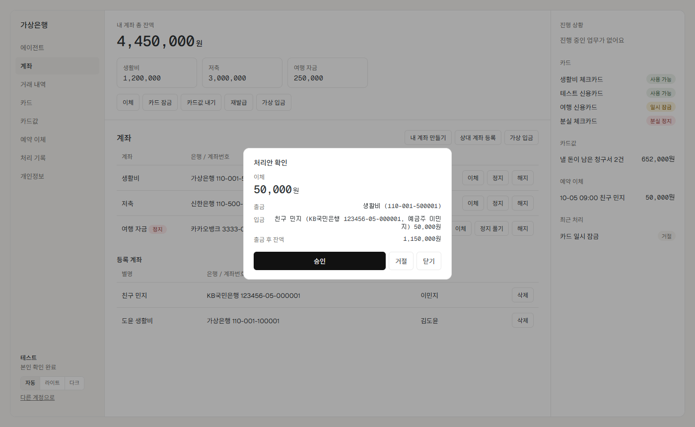
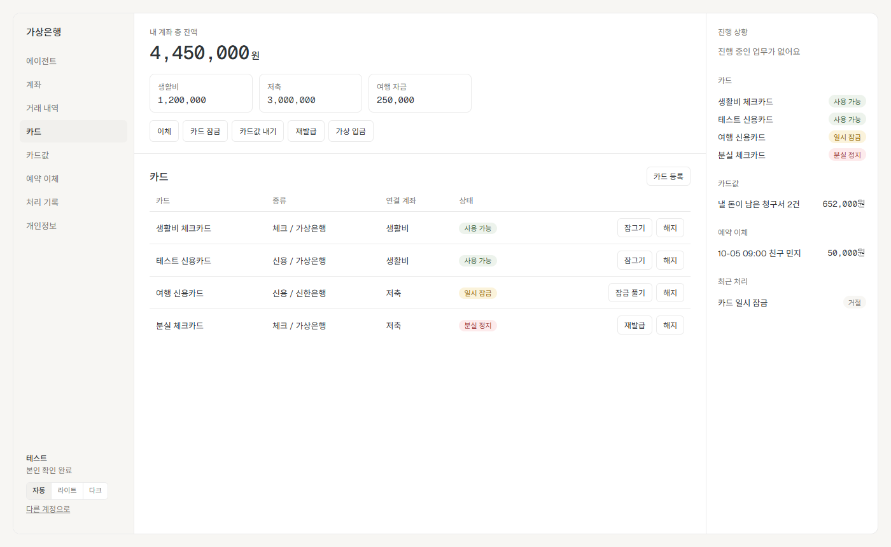
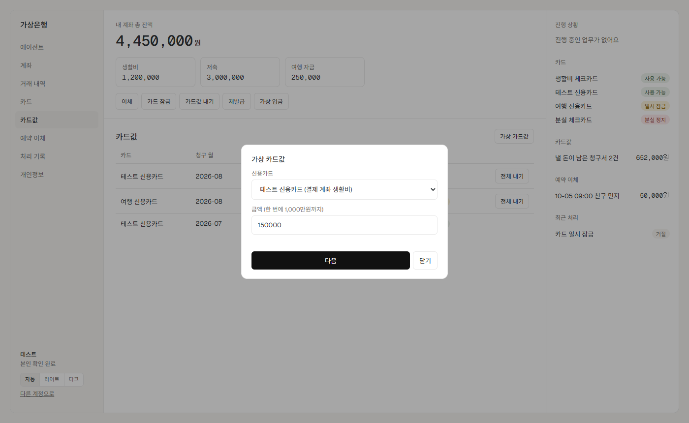
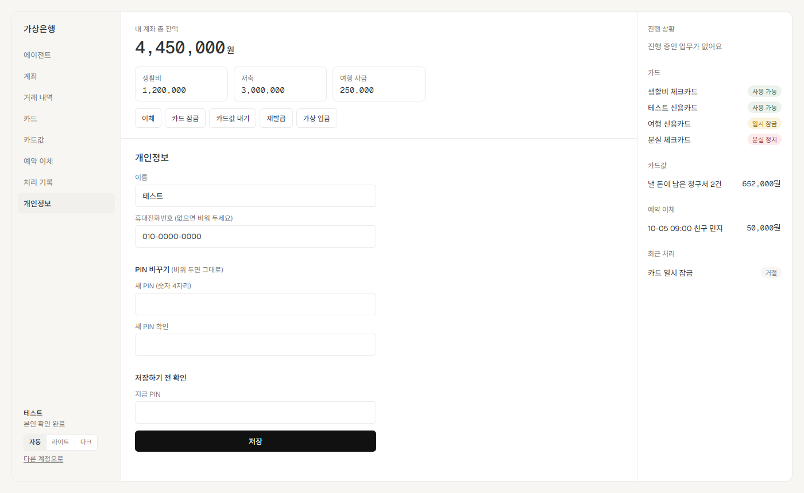
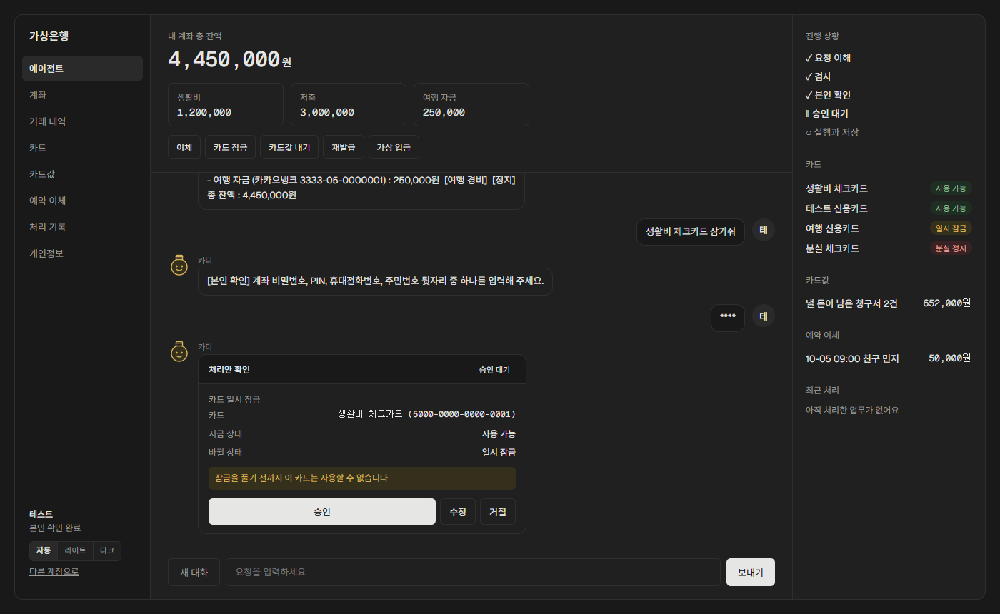
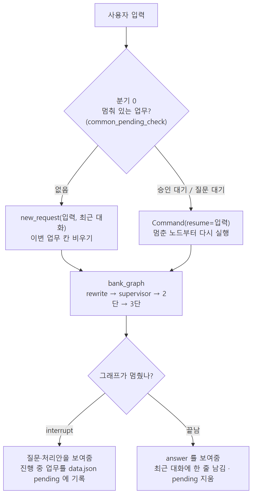
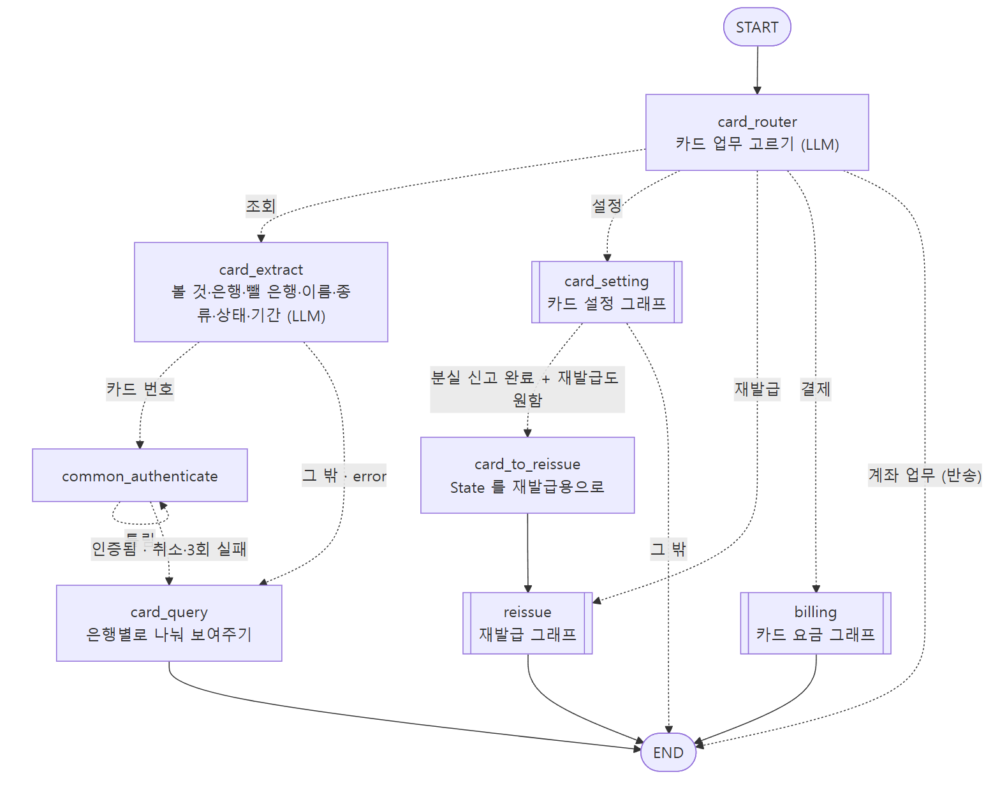
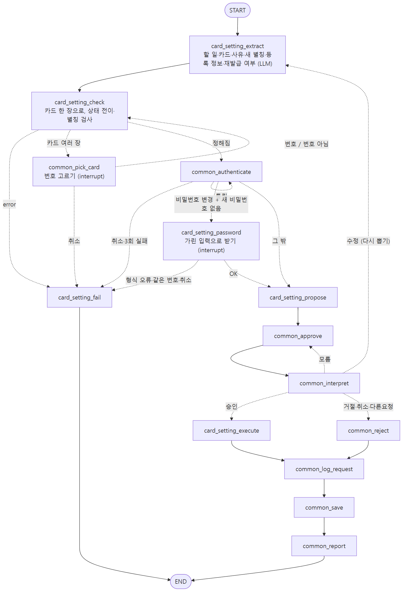
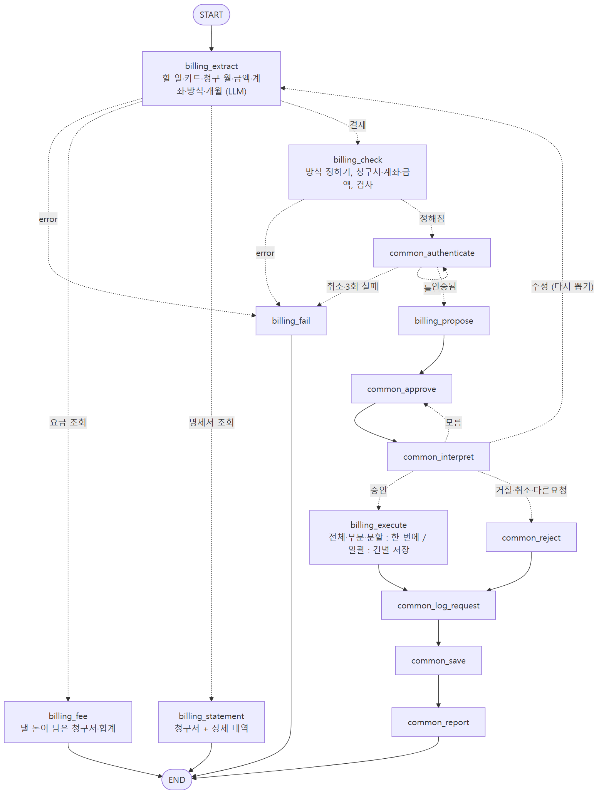

# 26.09.29 48일차(Python 가상 금융 업무 에이전트 웹 버전·최종 설계·회고)

## [TIL] 웹 버전 완성, 최종 설계 정리, 회고

47일차에 LangGraph 기반 가상 금융 업무 에이전트의 기능 구현을 마쳤다. 48일차에는 터미널 버전은 그대로 두고, 같은 에이전트를 웹에서 사용할 수 있도록 FastAPI와 Next.js를 연결했다. 그 뒤 저장소에 직접 작성한 **최종_**[**설계.md**](http://설계.md)**와 **[**회고.md**](http://회고.md)** 원문**을 기준으로 설계와 구현 과정을 정리했다.

프로젝트 저장소: [virtual-bank-agent](https://github.com/snail5039-code/virtual_bank_agent)

---

## 웹 버전

터미널 버전(`src/`)은 과제 제출본이라 그대로 두고, 같은 에이전트를 웹 화면으로 쓰는 버전을 `web/`에 따로 만들었다. 에이전트 코드는 `src/`를 복사한 `web/bank/`를 쓰고, 데이터도 웹 전용 `web/data/`를 쓴다.

| 구분 | 하는 일 | 주소 |
| --- | --- | --- |
| FastAPI (`web/server.py`) | 에이전트 실행, 버튼 업무, 계정 고르기, 스케줄러. `/api`만 제공 | `http://127.0.0.1:8000` |
| Next.js (`web/frontend/`) | 사용자 화면. `/api/...` 요청을 FastAPI로 전달 | `http://localhost:3000` |


첫 화면에서 계정을 눌러 바로 들어간다. 가상 은행이라 로그인 비밀번호는 없고, 돈이나 상태가 바뀌는 업무만 PIN 등으로 본인 확인을 한다. 새 계정은 이름과 PIN을 정해서 만들 수 있다.


웹 버전에는 여러 사람별 데이터·대화·재시작 복구·알림 분리, 분야별 캐릭터, 메뉴형 조회 화면을 넣었다.



처리안은 카드로 보여주며 승인·수정·거절 버튼으로 답할 수 있다. 버튼 업무도 에이전트와 같은 본인 확인 → 실행 직전 재검사 → 실행 → 처리 기록 → 저장 → 안내 순서를 따른다.

### 실행 방법

웹 버전도 터미널 버전과 같은 Gemini API 키를 사용하며 Node.js가 추가로 필요하다.

```bash
npm --prefix web/frontend install
uv run python web/server.py
npm --prefix web/frontend run dev
```

FastAPI와 Next.js 서버를 모두 켠 뒤 브라우저에서 `http://localhost:3000`을 연다. 시험용 `테스트` 계정에는 계좌 3개(정지 계좌 1개 포함), 등록 계좌 2개, 카드 4장(잠금·분실 정지 포함), 낼 카드값 2건, 예약 이체 1건이 들어 있다. 본인 확인 PIN은 `1234`다. 처음 상태로 돌리려면 `web/data/data.json`을 지우고 FastAPI를 다시 켠다.

### 터미널 버전에 더한 기능

- **계정별 분리**: 계정 선택과 새 계정 생성이 가능하며 사람마다 데이터, 에이전트 대화, 재시작 복구, 알림이 따로 관리된다.

- **분야별 캐릭터**: 1단 Supervisor가 고른 분야에 따라 뱅키(안내), 머니(계좌), 카디(카드), 로기(처리 결과)가 답한다.

- **처리안 카드**: 승인·수정·거절 버튼으로 답한다. 본인 확인 중에는 입력칸이 비밀번호 칸으로 바뀌고 대화에는 `****`만 남는다.

- **진행 상황**: 오른쪽 패널에서 요청 이해 → 검사 → 본인 확인 → 승인 대기 → 실행과 저장 중 현재 단계를 보여준다.

- **메뉴 화면**: 계좌, 거래 내역, 카드, 카드값, 예약 이체, 처리 기록을 LLM 호출 없이 데이터에서 바로 읽어 보여준다.

- **버튼 업무**: 이체·예약 이체, 카드 잠금·해제·해지·재발급, 카드값 납부, 계좌 만들기·정지·해지, 상대 계좌와 카드 등록, 가상 입금, 가상 카드값을 지원한다.

- **같은 안전 절차**: 버튼 업무도 LLM만 거치지 않을 뿐 검사 → 처리안 → 본인 확인 → 실행 직전 재검사 → 실행 → 기록 → 저장 순서를 지킨다.

- **개인정보**: 현재 PIN 확인 후 이름, 휴대전화번호, PIN을 바꿀 수 있다.

- **화면 모드**: 자동 / 라이트 / 다크 모드를 지원한다.

### 메뉴 화면과 버튼 업무



카드 화면은 카드 상태에 따라 지금 실행할 수 있는 버튼만 보여준다. 에이전트가 질문이나 승인을 기다리는 중에는 버튼 업무를 막아 같은 데이터가 동시에 변경되지 않게 했다.

### 가상 입금과 가상 카드값

시험용으로 계좌 잔액을 넣거나 신용카드에 이번 달 청구서를 만들어 직접 납부 흐름을 확인할 수 있다.



### 개인정보

현재 PIN을 확인한 뒤 이름, 휴대전화번호와 PIN을 변경할 수 있다. PIN 같은 민감정보는 해시로 저장하고 대화나 로그에는 실제 값을 남기지 않는다.



### 다크 모드



---

# 가상 금융 업무 에이전트 — 최종 설계

구현을 다 끝내고 실제 코드에 맞춰 정리한 설계다.

그래프 그림은 코드에서 뽑은 연결을 기준으로 그렸고, 화살표에 분기 조건을 적었다.

## 1. 전체 구조

```plain text
src/
├── main.py         입력 받기, 멈춘 업무 확인, 대화 기억, 재시작 복구, 30초 스케줄러
├── state.py        모든 그래프가 같이 쓰는 state
├── data_store.py   data.json 읽기/저장
├── logger.py       실행 로그
├── functions/      계산만 하는 함수 (계좌, 이체, 카드, 재발급, 결제, 공통)
└── agents/         노드와 그래프
    ├── supervisor/   1단
    ├── account/      2단 계좌 → transfer(이체), setting(계좌 설정) 3단
    ├── card/         2단 카드 → setting(카드 설정), reissue(재발급), billing(결제) 3단
    ├── result/       결과 조회 ("아까 이체 됐어?")
    └── common/       공통 노드
```

- 3단 그래프를 2단 그래프의 노드로, 2단 그래프를 1단 그래프의 노드로 넣었다.

- 노드는 흐름만 정하고, 계산은 `functions/`가 한다. LLM은 말에서 값을 뽑고 분류만 한다.

- 저장은 `common_save` 한 곳에서만 한다.

| 단계 | 고르는 것 | 선택지 |
| --- | --- | --- |
| 1단 supervisor | 분야 | 계좌 / 카드 / 결과 / 없음 |
| 2단 account_router | 계좌 업무 | 조회 / 거래내역 / 이체 / 설정 / (카드 업무면 반송) |
| 2단 card_router | 카드 업무 | 조회 / 설정 / 재발급 / 결제 / (계좌 업무면 반송) |
| 3단 extract | 할 일과 필요한 값 | 업무마다 다름 (이체면 금액, 남길 금액, 예약 시각 등) |

---

## 2. 실행 흐름



1. 입력이 들어오면 먼저 멈춰 있는 업무(승인, 질문 대기)가 있는지 본다.

1. 있으면 입력을 그 답으로 넘겨서 멈춘 곳부터 이어간다.

1. 없으면 이전 업무 값을 비우고 새 요청으로 시작한다.

1. 그래프가 멈추면 질문이나 처리안을 보여주고, 진행 중인 업무를 `data.json`의 `pending`에 적어둔다.

1. 끝나면 답을 보여주고 최근 대화에 남긴다. 최근 대화는 5턴까지 남긴다.

켜져 있는 동안은 스케줄러가 30초마다 예약 이체와 분할 결제를 확인한다. 결과는 큐에 모아뒀다가 다음 입력 때 보여준다.

### 변경 업무 공통 흐름

```plain text
값 뽑기(extract) → 검사(check)
  ├ 안 됨        → 이유 안내하고 끝(fail)
  ├ 후보 여러 개  → 번호로 고르기 → 다시 검사
  ├ 빠진 값      → 질문 → 다시 값 뽑기
  └ 다 모임      → 본인 확인 → 처리안 → 승인 대기 → 답 해석
                    ├ 승인   → 실행 직전 재검사 → 실행
                    ├ 거절·취소·다른 요청 → 거절 기록
                    ├ 수정   → 다시 검사 → 새 처리안
                    └ 모름   → 다시 묻기
                  → 처리 기록 → 저장(3번까지) → 결과 안내
```

조회는 값 뽑기 다음에 바로 답하고 끝난다.

### 분기 조건 한눈에 보기

| 분기 | 언제 |
| --- | --- |
| 조회 | 읽기만 하는 요청 (조회, 거래 내역, 목록, 요금 조회, 명세서) → 인증·승인 없이 바로 답 |
| 변경 | 데이터가 바뀌는 요청 → 본인 확인, 처리안, 승인을 거침 |
| 승인 | 답 해석이 "승인" → 실행 |
| 거절 | "거절", "취소", "다른 요청" → 저장하지 않고 거절로만 기록 |
| 실패 | 검사에서 안 됨(잔액 부족, 없는 계좌 등) / 질문·본인 확인 중 취소 / 본인 확인 3번 틀림 / 실행 직전 재검사 실패 / 저장 3번 실패 |

---

## 3. 그래프별 연결

### 1단 supervisor


- `rewrite`가 최근 대화를 보고 "그 카드" 같은 말을 실제 이름으로 바꾼다.

- `supervisor`가 계좌 / 카드 / 결과 / 없음으로 나눈다.

- 2단이 "내 업무가 아니다"라고 하면 반대쪽으로 한 번 넘긴다(`bounce`). 두 번째도 아니면 안내하고 끝낸다.

### 2단 계좌


- 조회와 거래 내역은 노드 하나로 바로 답한다.

- 이체와 설정은 3단 그래프로 보낸다.

### 3단 이체


- 이체 종류를 따로 분류하지 않고 뽑은 값으로 정한다. 남길 금액이 있으면 조건부, 목록이 2개 이상이면 나눠, 예약 시각이 있으면 예약이다.

- 안 되는 경우: 계좌를 못 찾음, 보내는 계좌와 받는 계좌가 같음, 금액이 0 이하, 잔액 부족, 예약 시각이 지남, 조건부·나눠 이체를 예약하려고 함.

- 나눠 이체는 하나라도 안 되면 전부 실행하지 않는다.

- 승인 뒤 실행 직전에 잔액을 다시 본다.

### 3단 계좌 설정


- 할 일: 별명·용도 변경, 상대 계좌 등록·삭제·조회, 예약 이체 조회·취소.

- 별명은 내 다른 계좌와 겹치면 안 된다. 등록할 때 빠진 정보가 있으면 그것만 다시 묻는다.

### 2단 카드



- 조회는 2단 안에서 끝낸다. 카드 번호 조회만 본인 확인을 한다.

- 분실 신고 뒤에 재발급도 원하면 재발급 그래프로 이어서 보낸다.

### 3단 카드 설정



- 할 일: 분실 신고, 잠금, 잠금 해제, 해지, 별칭 변경, 비밀번호 변경, 카드 등록.

- 카드 상태: 사용 가능 ↔ 잠금, 둘 다 → 분실 정지 / 해지. 분실 정지는 해지만 가능하다.

- 카드 이름이 똑같은 걸 먼저 찾고, 여러 장이면 번호로 고르게 한다.

### 3단 재발급


- 분실 정지된 카드만 신청할 수 있다.

- 신청 상태: 접수 → 제작중 → 배송중. 접수일 때만 배송지 수정과 취소가 된다.

- "분실했으니 정지하고 재발급해줘"는 승인을 두 번 따로 받는다. 재발급을 거절해도 분실 정지는 그대로다.

### 3단 카드 요금



- 할 일: 요금 조회, 명세서 조회, 결제(전체 / 부분 / 분할 / 일괄).

- 분할은 첫 회차를 바로 내고, 나머지는 한 달마다 스케줄러가 낸다. 분할 중에는 남은 금액을 한 번에 다 낼 때만 결제할 수 있다.

- 일괄 결제는 한 건씩 내고 바로 저장한다. 중간에 실패해도 앞에 낸 건은 남는다.

---

## 4. 공통 노드

| 노드 | 하는 일 |
| --- | --- |
| `common_pending_check` | 멈춰 있는 업무가 있는지 확인 ([main.py](http://main.py)가 입력마다 부름) |
| `common_pick_card` | 카드가 여러 장이면 번호로 고르기 |
| `common_authenticate` | 본인 확인. 한 번 하면 계속 유지, 3번 틀리면 끝 |
| `common_approve` | 처리안을 보여주고 답을 기다림 (interrupt만) |
| `common_interpret` | 답을 승인 / 거절 / 취소 / 수정 / 다른 요청 / 모름으로 해석 |
| `common_reject` | 거절 안내 |
| `common_log_request` | 처리 기록 남기기 |
| `common_save` | 저장. 실패하면 3번까지 다시 |
| `common_report` | 저장이 실패했으면 실패로 안내 |

---

## 5. State와 데이터

- 새 요청이 오면 이전 업무 값을 전부 비운다. 본인 확인과 직전 이체만 남긴다.

- 체크포인터는 메모리라 끄면 사라진다. 그래서 오래 남아야 하는 건 `data.json`에 둔다.

- `initial_data.json`은 읽기만 하고, 변경은 `data.json`에만 저장한다. 임시 파일에 다 쓰고 바꿔 끼우는 방식이다.

- 비밀번호, PIN, 주민번호 뒷자리는 해시로 저장한다.

---

## 6. 초안에서 바뀐 점

### 구현 전에 바뀐 것

| 바꾼 것 | 이유 |
| --- | --- |
| 승인 기준을 "민감정보, 돈"에서 "데이터가 바뀌는지"로 | 분실 정지는 돈이 안 움직여도 승인이 필요했다 |
| 맨 앞에 멈춘 업무 확인 추가 | 없으면 "응, 진행해"가 새 요청으로 분류된다 |
| 승인 노드를 처리안 / 승인 / 실행으로 분리 | interrupt 뒤 다시 시작하면 노드를 처음부터 실행해서 저장이 두 번 될 수 있다 |
| subgraph를 tool이 아니라 노드로 | tool로 감싸면 다시 실행되는 범위가 커진다 |
| 부족한 정보 확인을 2단 → 3단 | 2단에서는 뭐가 부족한지 알 수 없다 |
| 반송 경로, 되돌아가는 흐름(질문, 수정, 거절) 추가 | 성공하는 경우만 있고 잘못됐을 때 돌아갈 길이 없었다 |
| 카드 agent 2개 → 4개 | 한 agent에 기능이 너무 많았다 |
| 마지막 "LLM 최종 검토" 삭제 | LLM이 금액을 다시 쓰면 틀릴 수 있다 |

### 구현하면서 바뀐 것

| 바꾼 것 | 이유 |
| --- | --- |
| 공통 노드 17개 → 8개 | 업무마다 물어보는 게 달라서, 모두 똑같이 거치는 것만 남겼다 |
| 이체 유형 분류 노드 삭제 | "40만원 남기고 내일 보내줘"처럼 여러 유형이 같이 온다 |
| 1단에 결과 / 없음 추가, 앞에 rewrite | 결과 조회는 계좌도 카드도 아니고, "그 카드"는 분류 전에 풀어야 했다 |
| 조회를 3단 agent 대신 2단 노드로 | 조회는 승인, 저장이 없어서 노드 하나로 충분했다 |
| 예약 이체에 30초 스케줄러, 큐, 잠금 | 입력이 없으면 예약이 실행되지 않았다 |
| 조건부, 나눠 이체는 예약 불가 | 조건부는 실행할 때 금액이 바뀔 수 있다 |
| 비밀번호를 해시로 저장 | 파일에 그대로 들어 있었다 |
| 재시작 복구는 처음부터 다시 | 꺼진 동안 잔액이나 상태가 바뀌었을 수 있다 |
| 카드 이름은 똑같은 이름 먼저 | "생활비 카드"에 "생활비 신용카드"까지 걸렸다 |
| 분할 결제 남은 회차 자동 납부 | 회차만 만들고 내는 기능이 없었다 |
| 등록한 계좌로도 이체 | 등록만 되고 이체는 못 했다 |
| 폴더 나누기 (agents/ 층별, functions/ 업무별) | 파일 하나가 700줄까지 길어졌다 |
| langsmith 빼고 파일 로그만 | 로그로도 충분히 확인할 수 있었다 |

### 하지 않은 것

- 재시작할 때 첫 문장 뒤에 답한 것까지 복원하기: 첫 문장으로 처음부터 다시 한다.

- 카드로 가맹점 결제하기: 범위 밖이라 안내만 한다.

- 장기 기억(자주 쓰는 계좌, 배송지): 대화 기억은 켜져 있는 동안만 남는다.

- 비슷한 분기 함수 합치기: 합치면 오히려 읽기 어려워진다.

- 긴 함수 나누기: 기능을 더 붙일 때 나누기로 했다.

---

# 회고

## 1. 설계와 구현 과정에서 배운 점

- 초안에서 노드, 그래프, 상태를 계획할 때는 간단하게 구현하면 될 줄 알았는데, 생각보다 훨씬 세세하게 구현해야 한다는 걸 깨달았다.

- 노드를 어떻게 이어서 그래프를 만들어야 제대로 돌아가는지 직접 확인할 수 있었다.

- 처음에는 LLM한테 모든 걸 맡기려고 했다. 그런데 날짜, 시간, 금액 계산처럼 정해진 규칙대로 해야 하는 건 Python 함수로 처리하는 게 안전해서, LLM은 값을 뽑는 역할만 맡겼다.

- 설계가 중간중간 계속 바뀌었다. 처음부터 전체를 다 설계하기보다는, 부분부분 설계하면서 전체 틀을 잡아가는 게 좋겠다고 생각했다.

- 기능마다 테스트를 만들어 두니까 어디가 안 맞는지, 새 기능을 넣었을 때 다른 곳에 문제가 생기지 않았는지 바로 확인할 수 있어서 좋았다.

- 승인 기능은 본인 확인, 중간 수정, 거절 등 분기가 생각보다 많아서 헷갈렸다.

- 비밀번호 같은 민감정보는 보안을 신경써야한다는 점을 배웠다.(해쉬함수를 통해 암호화하고, 터미널 같은 경우에는 가렸다)

## 2. 어려웠던 점과 해결 과정

- 초안은 간단하게 만들었지만, 막상 Claude 에이전트와 같이 만들어 보니 빠진 것이 많았다. 그래서 중간중간 추가하는 과정이 필요했다.

- 노드를 이어 보니 생각보다 흐름대로 흘러가지 않는 경우가 있었다. 간혹 LLM이 판단을 잘못하면 계좌 그래프가 아니라 카드 그래프로 빠지는 경우도 있었다.

- 새로 요청을 했는데 전에 했던 요청 값이 남아 있어서 서로 섞이는 문제가 있었다.

- 예약 이체는 사용자가 무언가를 입력해야 [main.py](http://main.py)가 돌면서 예약 시간이 지났는지 확인하고 이체하는 방식이었다. 그래서 가만히 두면 예약 이체가 제대로 실행되지 않았다. 30초마다 스레드로 확인하게 바꿨더니, 이번에는 입력하는 중간에 결과가 화면에 끼어드는 현상이 생겼다.

- 가상 금융 업무 에이전트라서 민감한 작업에는 승인 기능을 많이 넣었다. 그런데 승인을 기다리는 중에 사용자가 다른 요청을 하거나 프로그램을 끄면 어떻게 처리할지 고민이 됐다.

- 파일 하나의 코드가 너무 길어져서 보기 힘들었다. 코드는 에이전트가 대신 써 주지만 나도 쉽게 읽을 수 있어야 해서, 어떻게 나눌지 고민했다.

- 비슷한 코드가 여러 곳에 반복되면서 코드를 볼 때 헷갈렸다.

## 3. 남은 한계와 개선하고 싶은 점

- Supervisor가 하위 Agent들에게 요청을 나누어 보내는 구조라 LLM 호출이 많아 답이 나오기까지 몇 초씩 시간이 걸린다.

- 현재는 프로그램을 종료 시 진행 중이던 업무가 사라지고 처음부터 다시 시작해야 한다.

- 대화 기억은 프로그램이 켜져 있는 동안 최근 5턴만 기억해서 사용자별 특성을 기억하지 못한다.

- 로그인 기능이 없어 한 명의 사용자만 이용이 가능하다.

- 테스트에 경우 결과를 출력해서 맞는지 직접 눈으로 확인해야했다.

- 아직 긴 함수가 남아있다.
