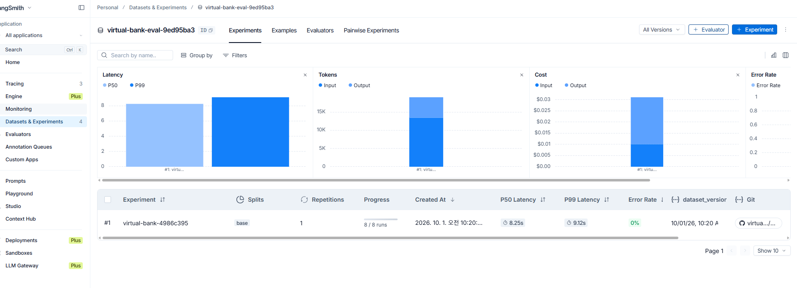
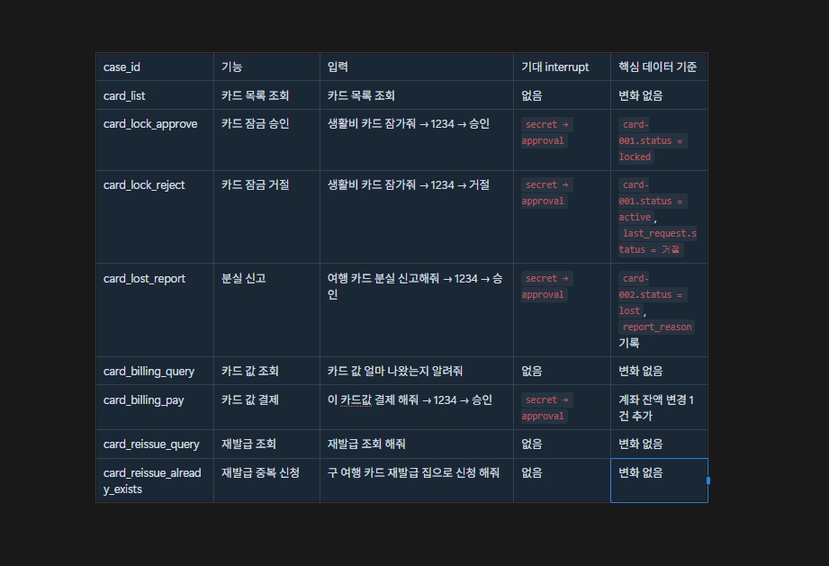

# 26.10.01 50일차(LangGraph Evaluation · Golden Set · LangSmith)

## [TIL] Golden Set으로 LangGraph Agent 평가하기

오늘은 가상 은행 Agent를 눈으로만 테스트하던 방식에서 벗어나, **Golden Set을 기준으로 반복 평가하는 구조**를 만들었다.

평가 대상은 계좌와 카드 기능이며, 단순히 최종 답변만 보는 것이 아니라 다음 세 가지를 함께 검사했다.

```plain text
사용자 입력
→ Agent 실행
→ interrupt 흐름 수집
→ 실행 전·후 JSON 비교
→ 답변 / interrupt / 데이터 상태 평가
→ 로컬 결과 출력 또는 LangSmith 실험 등록
```

이번 실습은 `30-langgraph-evaluation.ipynb`의 구조를 참고해 현재 가상 은행 프로젝트에 맞게 바꾸었다.

---

## 1. Golden Set이란?

Golden Set은 Agent가 제대로 동작했는지 비교할 **기대값 모음**이다.

우리 프로젝트에서는 정답을 한 문장으로만 두지 않고 세 부분으로 나눴다.

```python
"reference": {
    "answer_criteria": "...",
    "expected_interrupts": [...],
    "expected_data": {...},
}
```

| 항목 | 검사 내용 |
| --- | --- |
| `answer_criteria` | Agent의 실제 답변이 만족해야 하는 의미 기준 |
| `expected_interrupts` | 질문, 인증, 승인 같은 중단 흐름과 순서 |
| `expected_data` | 실행 후 계좌·카드·거래 데이터의 최종 상태 |

---

## 2. 왜 세 가지를 같이 평가했는가?

은행 Agent는 답변만 자연스럽다고 해서 정상 동작한 것이 아니다.

예를 들어 이체 완료라고 답했더라도 인증이나 승인을 건너뛰었거나, 실제 잔액이 바뀌지 않았다면 실패다.

```plain text
답변 평가      → 사용자에게 올바르게 안내했는가?
interrupt 평가 → 필요한 질문·인증·승인을 올바른 순서로 거쳤는가?
데이터 평가    → JSON 데이터가 기대한 값으로 바뀌었는가?
```

---

## 3. Golden Set 기본 구조

```python
{
    "case_id": "transfer_approve",
    "inputs": {
        "turns": [
            "생활비에서 저축으로 10만원 보내줘",
            "1234",
            "승인",
        ],
    },
    "reference": {
        "answer_criteria": "생활비에서 저축으로 100,000원 이체 완료를 안내한다.",
        "expected_interrupts": ["secret", "approval"],
        "expected_data": {
            "accounts": {
                "acc-001": {"balance": 1331800},
                "acc-002": {"balance": 2380000},
            },
            "transactions_added": 2,
            "last_request": {
                "task_type": "이체",
                "status": "완료",
            },
        },
    },
}
```

- `case_id`는 함수명이 아니라 결과를 구분하는 케이스 이름이다.

- `inputs.turns`는 여러 턴에 걸친 실제 사용자 입력 순서다.

- `reference`는 실제 실행 결과와 비교할 기대값이다.

---

## 4. interrupt 흐름 이해하기

```plain text
question  → 필요한 정보가 빠져 Agent가 다시 물어봄
secret    → 비밀번호 같은 민감 정보를 입력받음
approval  → 실제 데이터 변경 전 최종 승인을 받음
```

이체 승인이나 카드 잠금은 보통 다음 순서로 진행된다.

```plain text
요청 → secret → approval → 실제 실행
```

리스트 조회나 카드값 조회처럼 데이터를 바꾸지 않는 기능은 interrupt 없이 끝난다.

---

## 5. run_agent()의 역할

`run_agent()`는 평가 함수가 아니라, Golden Set의 입력으로 Agent를 실제 실행하고 평가 재료를 모으는 함수다.

```python
def run_agent(inputs):
    config = {
        "configurable": {"thread_id": str(uuid4())},
        "recursion_limit": 40,
    }

    shutil.copy(INITIAL_DATA, DATA)
    data_store.setup(DATA, INITIAL_DATA)

    before = load_data()
    result = bank_graph.invoke(
        new_request(first_turn, []),
        config=config,
    )
```

핵심 흐름은 다음과 같다.

1. 케이스마다 새로운 `thread_id`를 만든다.

1. `initial_data.json`을 복사해 같은 초기 상태에서 시작한다.

1. 첫 요청으로 그래프를 실행한다.

1. interrupt가 발생하면 다음 turn으로 `Command(resume=...)` 한다.

1. 최종 답변, interrupt 목록, 실행 전·후 데이터를 반환한다.

---

## 6. target 함수는 무엇인가?

```python
def bank_eval_target(inputs):
    return run_agent(inputs)
```

target 함수는 **평가할 Agent를 실행하는 입구**다.

LangSmith는 이 함수를 각 데이터셋 사례에 실행하고, 반환된 결과를 evaluator에 전달한다. 기대값 자체가 target인 것은 아니다.

---

## 7. 답변 평가: LLM Judge

```python
def evaluate_answer(inputs, outputs, reference_outputs):
    return answer_judge(
        inputs=inputs["turns"][0],
        outputs=outputs["answer"],
        reference_outputs=reference_outputs["answer_criteria"],
    )
```

LLM Judge는 실제 답변과 기대 문장을 완전히 똑같이 비교하지 않는다. 금액, 처리 결과, 안내 내용이 의미상 맞는지 판단한다.

이 방식은 자연스러운 문장 변화에 강하지만, Agent 실행 후 Judge LLM을 한 번 더 호출하므로 케이스당 시간이 더 걸린다. interrupt와 데이터 평가는 규칙 비교라서 LLM이 필요 없다.

---

## 8. interrupt 평가

```python
def evaluate_interrupts(inputs, outputs, reference_outputs):
    expected = reference_outputs["expected_interrupts"]
    actual = outputs["interrupts"]
    passed = actual == expected
```

interrupt는 종류뿐 아니라 **순서까지 완전히 같은지** 검사한다.

예를 들어 기대값이 `["secret", "approval"]`인데 실제값이 `["approval", "secret"]`이라면 실패다.

---

## 9. 데이터 상태 평가

`evaluate_data()`는 `before`와 `after`를 비교한다.

현재 검사하는 대표 항목은 다음과 같다.

| 키 | 의미 |
| --- | --- |
| `changed` | 전체 데이터 변경 여부 |
| `accounts` | 특정 계좌의 최종 잔액 |
| `cards` | 카드 상태와 분실 사유 |
| `card_statements` | 카드 청구서 잔액과 결제 상태 |
| `transactions_added` | 추가된 거래내역 개수 |
| `schedules_added` | 추가된 예약 이체 개수 |
| `last_request` | 마지막 요청의 업무 종류와 상태 |

이 이름들은 LangGraph의 예약어가 아니라 Golden Set과 평가 함수가 공유하는 프로젝트 내부 약속이다.

---

## 10. 계좌 Golden Set

먼저 8개 계좌·이체 케이스를 만들었다.

| case_id | 목적 |
| --- | --- |
| `account_list` | 계좌 목록과 잔액 조회 |
| `transfer_approve` | 일반 이체 승인 |
| `transfer_reject` | 일반 이체 거절 |
| `transfer_missing_amount` | 금액 누락 시 되묻기 |
| `transfer_insufficient` | 잔액 부족 처리 |
| `conditional_transfer` | 일정 금액을 남기고 나머지 이체 |
| `account_history` | 이번 달 출금 내역 조회 |
| `scheduled_transfer` | 예약 이체 등록 |

---

## 11. 카드 Golden Set 확장

다음으로 카드 기능 8개를 추가해 총 16개 사례로 확장했다.


주요 케이스는 카드 목록, 잠금 승인·거절, 분실 신고, 카드값 조회·결제, 재발급 내역 조회, 중복 재발급 신청이다.

카드 재발급 사례는 처음에 승인 흐름을 기대했지만, 초기 데이터에 이미 재발급 신청이 존재했다. 실제 코드는 중복 신청을 먼저 발견하고 인증과 승인 전에 종료하므로 다음과 같이 수정했다.

```plain text
기존 예상: secret → approval → 재발급 추가
실제 흐름: 기존 신청 발견 → 안내 → 종료
최종 기대: interrupt 없음, 데이터 변경 없음
```

---

## 12. 실패를 통해 Golden Set 보정하기

Golden Set은 임의로 정하는 것이 아니라 실제 구현과 초기 데이터를 확인해 작성해야 한다.

카드값 결제 사례에서는 실제 요청 기록의 `task_type`이 `카드값 결제`가 아니라 `카드값 전체 결제`였다. 따라서 소스 코드와 실행 결과를 확인한 뒤 기대값을 실제 업무 규칙에 맞게 수정했다.

조건부 이체도 계산 결과를 다시 확인해 생활비 계좌에 400,000원을 남기고 1,031,800원을 이체하는 기준으로 맞췄다.

---

## 13. 로컬에서 평가 실행하기

```powershell
uv run python evaluation/run_eval.py
```

각 사례마다 다음 내용을 보기 좋게 출력한다.

```plain text
case_id
입력
실제 답변
기대 interrupt / 실제 interrupt
답변 평가 PASS 또는 FAIL
interrupt 평가 PASS 또는 FAIL
data 평가 PASS 또는 FAIL
pending 여부
전체 결과
LLM Judge 코멘트
```

로컬 실행은 평가 구조를 한 단계씩 확인하고 실패 원인을 바로 찾을 때 편리했다.

---

## 14. LangSmith 데이터셋 만들기

```python
def create_dataset():
    client = Client()

    dataset = client.create_dataset(
        dataset_name=f"virtual-bank-eval-{uuid4().hex[:8]}",
    )

    client.create_examples(
        dataset_id=dataset.id,
        examples=[
            {
                "inputs": case["inputs"],
                "outputs": case["reference"],
                "metadata": {"case_id": case["case_id"]},
            }
            for case in golden_set
        ],
    )

    return dataset
```

Golden Set의 `inputs`는 LangSmith 입력으로, `reference`는 정답 출력으로 등록했다. `case_id`는 실험 화면에서 사례를 구분할 metadata로 넣었다.

---

## 15. LangSmith 평가 실행

```python
def run_langsmith_eval():
    client = Client()
    dataset = create_dataset()

    experiment = client.evaluate(
        bank_eval_target,
        data=dataset.id,
        evaluators=[
            evaluate_answer,
            evaluate_interrupts,
            evaluate_data,
        ],
        experiment_prefix="virtual-bank",
        metadata={"mode": "langsmith"},
    )

    return experiment
```

`client.evaluate()`는 데이터셋의 각 사례에 `bank_eval_target`을 실행하고, 세 evaluator로 결과를 채점한다.

`experiment_prefix="virtual-bank"`는 LangSmith 실험 이름 앞에 붙는 구분용 이름이다.

---

## 16. LangSmith에서 확인한 결과



LangSmith의 **Datasets & Experiments**에서 생성한 데이터셋과 실험을 확인했다. 당시 계좌 Golden Set 8개를 먼저 실행해 `8 / 8 runs`, Error Rate 0%가 표시되었고, 각 행을 열어 실제 답변과 evaluator 결과를 확인할 수 있었다.

이후 로컬 Golden Set에 카드 8개를 추가해 총 16개 사례로 확장했다.

---

## 17. 전체 파일 역할

```plain text
evaluation/
├─ golden_set.py          입력과 기대값을 저장
├─ run_eval.py            Agent 실행, 로컬 평가, 결과 출력
└─ run_langsmith_eval.py  데이터셋 생성과 LangSmith 실험 실행
```

- `golden_set.py`: 무엇이 정답인지 정의한다.

- `run_eval.py`: 실제 Agent를 실행하고 세 기준으로 평가한다.

- `run_langsmith_eval.py`: 같은 target과 evaluator를 LangSmith에서 반복 실행한다.

---

## 18. 헷갈린 점

처음에는 target 함수가 Golden Set의 기대값을 뜻한다고 생각했다. 하지만 target은 평가 대상 Agent를 실행하는 함수이고, 기대값은 `reference`에 따로 들어간다.

또한 `last_request`, `transactions_added` 같은 이름이 데이터에 원래 존재하는 예약어처럼 보였다. 실제로는 평가를 위해 우리가 정한 키이며, `evaluate_data()`에서 같은 이름으로 읽도록 맞춘 것이다.

재발급 신청도 변경 기능이므로 무조건 인증과 승인이 나올 것으로 예상했다. 하지만 현재 초기 데이터에는 이미 신청이 있어 중복 검사에서 먼저 종료되었다. 평가 기준은 기능 이름만 보고 정하지 않고 실제 코드 경로와 초기 상태를 함께 봐야 한다.

---

## 추가!

오늘 배운 것 정리

- Golden Set은 입력과 기대 결과를 모아 둔 평가 기준이다.

- 은행 Agent는 답변뿐 아니라 interrupt 흐름과 데이터 상태를 함께 검사해야 한다.

- `run_agent()`는 평가 재료를 수집하는 실행기다.

- `bank_eval_target()`은 LangSmith가 호출할 평가 대상 함수다.

- LLM Judge는 자연어 답변을 의미 기준으로 평가한다.

- interrupt와 데이터 상태는 직접 만든 규칙으로 빠르게 검사한다.

- 각 사례는 `initial_data.json`에서 새로 시작해야 서로 영향을 주지 않는다.

- Golden Set은 실제 코드 경로와 초기 데이터를 확인하며 보정해야 한다.

- 로컬 평가와 LangSmith 평가는 같은 target과 evaluator를 재사용할 수 있다.

```plain text
Golden Set 작성
→ run_agent로 실제 실행
→ 답변 / interrupt / 데이터 비교
→ 실패 원인 확인
→ 기대값 또는 구현 검토
→ LangSmith에서 실험 단위로 추적
```

---

## 19. 전체 기능 Golden Set 최종 확장

마지막으로 `src`에 구현된 기능을 다시 읽고, 계좌와 카드의 주요 흐름을 더 넓게 검사하도록 Golden Set을 확장했다.

처음에는 계좌 8개와 카드 8개로 총 16개 사례를 만들었고, 이후 계좌 설정, 등록 계좌, 예약 이체 취소, 카드 조회, 카드 설정, 청구서 결제 방식, 재발급 수정·취소, 결과 조회, 지원하지 않는 요청까지 포함해 총 40개 사례로 늘렸다.



추가한 대표 케이스는 다음과 같다.

- 계좌 설정: 별명 변경, 용도 변경

- 등록 계좌: 목록 조회, 추가, 삭제

- 예약 이체: 목록 조회, 취소

- 카드 조회: 결제 계좌, 카드 번호, 멤버십, 이용 내역

- 카드 설정: 잠금 해제, 해지, 별칭 변경, 비밀번호 변경, 카드 등록

- 카드 청구: 명세서 조회, 부분 결제, 분할 결제

- 재발급: 신규 신청, 배송지 수정, 신청 취소

- 기타: 최근 요청 결과 조회, 지원하지 않는 요청 안내

이번에 새로 넣은 `fixture`는 테스트용 초기 상태를 만드는 장치다. 예를 들어 예약 이체 취소나 재발급 배송지 수정처럼 이미 대상 데이터가 있어야 실행할 수 있는 케이스는 Golden Set 안에 준비 데이터를 적어 두고, `apply_fixture()`가 실행 직전에 복사본 데이터에만 반영한다.

```plain text
Golden Set의 fixture
→ 테스트 전용 데이터 준비
→ apply_fixture()가 복사본 data에 반영
→ Agent 실행
→ before / after 비교
```

그래서 원본 `initial_data.json`은 건드리지 않고, 각 테스트 케이스마다 필요한 상황만 잠깐 만들어서 평가할 수 있었다.

데이터 평가 함수도 함께 확장했다. 기존에는 계좌 잔액, 카드 상태, 거래 내역, 마지막 요청 정도를 봤다면, 이제는 등록 계좌 추가/삭제, 카드 추가, 분할 결제 내역, 재발급 신청, 예약 이체 상태처럼 더 많은 컬렉션을 확인한다.

```plain text
기존: 답변 + interrupt + 기본 데이터 변화
확장: 전체 기능 흐름 + fixture 기반 사전 상태 + 컬렉션별 상태 검사
```

최종적으로 로컬 실행 명령은 그대로 유지했다.

```powershell
uv run python evaluation/run_eval.py
```

이제 실패가 나오면 단순히 답변 문장만 보는 것이 아니라, 입력 흐름, interrupt 순서, before/after 데이터 차이를 같이 확인하면서 Golden Set이 잘못된 것인지 실제 기능 흐름이 다른 것인지 구분할 수 있다.

---

## 20. 왜 평가를 굳이 해야 하나?

이번 실습을 하면서 가장 크게 든 의문은 두 가지였다.

```plain text
LLM Judge 평가를 꼭 해야 하나?
요즘 AI가 코드를 잘 짜주는데 굳이 이런 평가 구조까지 만들어야 하나?
```

먼저 LLM Judge는 꼭 필요한 것은 아니다. 답변이 정해진 문구나 숫자 중심이라면 키워드, 정규식, JSON 비교처럼 규칙 기반 평가만으로도 충분하다. 오히려 규칙 기반 평가는 빠르고, 비용이 적고, 결과가 흔들리지 않는다는 장점이 있다.

하지만 은행 Agent의 최종 답변은 자연어라서 매번 표현이 조금씩 달라질 수 있다. 예를 들어 다음 두 문장은 글자는 다르지만 의미는 같다.

```plain text
100,000원 이체가 완료되었습니다.
생활비 계좌에서 저축 계좌로 10만원을 보냈습니다.
```

이런 경우 문자열 완전 일치로 평가하면 정상 답변도 실패할 수 있다. 그래서 답변 영역에는 LLM Judge를 쓰고, interrupt와 데이터 상태는 직접 비교하는 방식으로 나눴다.

```plain text
답변 평가      → LLM Judge가 의미 기준으로 확인
interrupt 평가 → 리스트 순서 직접 비교
데이터 평가    → before / after JSON 직접 비교
```

두 번째 의문은 AI가 코드를 잘 짜주는데 평가가 왜 필요한가였다. 결론부터 말하면, AI가 코드를 잘 짜주는 것과 그 코드가 계속 맞게 동작하는지는 다른 문제다.

AI가 기능을 빠르게 만들어 줄 수는 있지만, 다음 문제까지 자동으로 보장해 주지는 않는다.

- 기존 기능이 새 수정 때문에 깨졌는지

- 승인이나 인증 흐름을 건너뛰지 않았는지

- 말로는 완료라고 했는데 실제 데이터가 바뀌었는지

- 초기 데이터 상태 때문에 예상과 다른 흐름으로 빠지는지

- 나중에 프롬프트나 라우터를 고쳤을 때 같은 입력이 여전히 통과하는지

이번에도 실제로 재발급 신청, 카드값 결제, 조건부 이체, 분할 결제, 카드 이용 내역에서 기대값과 실제 코드 흐름이 달랐다. 이 차이는 눈으로 대화 몇 번 해보는 것만으로는 놓치기 쉽다.

그래서 이번 평가의 목적은 AI를 못 믿어서가 아니라, AI가 만들어 준 기능을 계속 믿을 수 있게 기준을 세우는 것이다.

실무에서는 더 좋은 모델로 개발했더라도 운영 단계에서 비용이나 속도 때문에 더 가벼운 LLM으로 바꾸는 경우가 있다. 예를 들어 비싼 모델은 답변 품질이 좋지만 호출 비용이 크고, 작은 모델은 빠르고 저렴하지만 라우팅이나 추론 품질이 흔들릴 수 있다. 이때 Golden Set이 있으면 모델을 바꿔도 기존 업무 흐름이 유지되는지 비교할 수 있다.

```plain text
비싼 모델 → 품질은 좋지만 비용과 지연 시간 부담
가벼운 모델 → 빠르고 저렴하지만 답변·라우팅 품질 저하 가능
Golden Set → 모델을 바꿔도 핵심 기능이 유지되는지 확인하는 기준
```

```plain text
AI가 구현 속도를 올려 준다
평가가 신뢰도를 지켜 준다
Golden Set은 그 신뢰도를 반복 확인하는 기준표다
```

정리하면 LLM Judge는 선택 사항이고, 모든 평가에 넣을 필요는 없다. 하지만 Golden Set 자체는 필요하다. 특히 은행 Agent처럼 실제 상태 변경, 인증, 승인, 잔액, 카드 상태가 얽힌 시스템에서는 답변보다 데이터와 흐름 검증이 더 중요하다.
