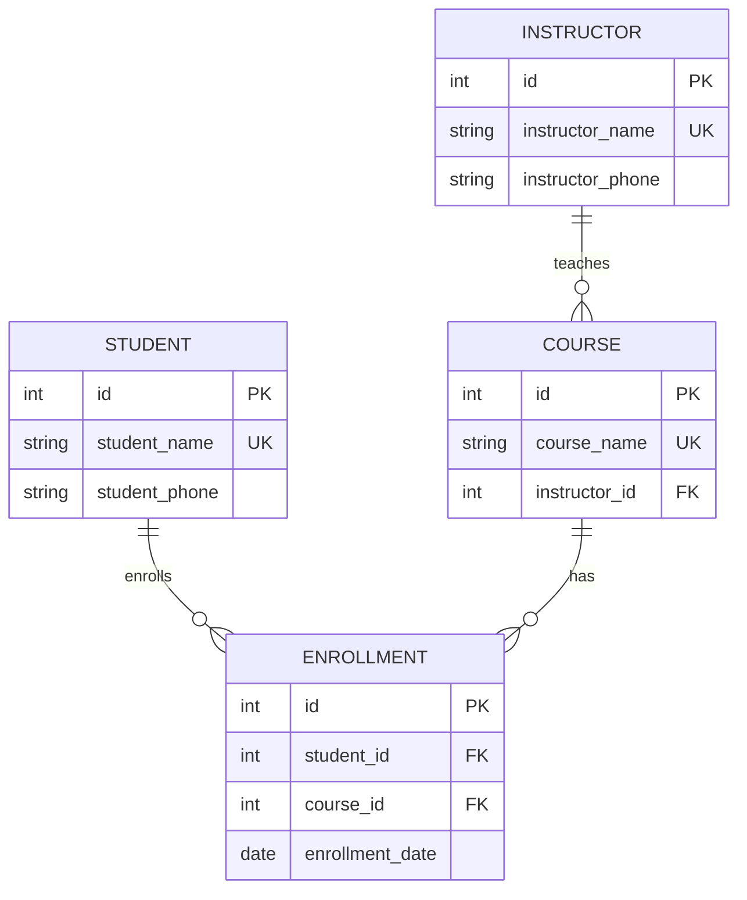

# 26.10.07 53일차(Database Design · 정규화 · ERD)

## [TIL] 데이터베이스 설계, 키, 정규화, ERD 흐름 정리하기

오늘은 SQL을 작성하기 전에 먼저 해야 하는 **데이터베이스 설계**를 정리했다. 요구사항에서 어떤 데이터를 저장해야 하는지 찾고, 테이블 사이의 관계를 정한 뒤, 키와 제약조건으로 데이터 무결성을 지키는 흐름을 배웠다.

이론과 실습은 다음 흐름으로 이어졌다.

```plain text
데이터베이스 설계란?
→ 키: 후보키, 기본키, 복합키, 외래키
→ 데이터 무결성: 개체, 참조, 도메인
→ 정규화: 1NF → 2NF → 3NF
→ 함수적 종속과 이상 현상
→ 반정규화
→ ERD 작성 순서
→ 수강신청 예제 ERD
→ ERD 설계 실습
```

---

## 1. 데이터베이스 설계란

데이터베이스 설계(Database Design)는 요구사항을 바탕으로 필요한 데이터와 데이터 사이의 관계를 정하는 과정이다.

단순히 테이블을 만드는 것이 아니라, 다음 내용을 함께 결정한다.

| 설계 대상 | 의미 | 예시 |
| --- | --- | --- |
| 개체(Entity) | 관리해야 할 대상 | 학생, 강좌, 강사 |
| 속성(Attribute) | 개체가 가지는 정보 | 학생명, 연락처, 강좌명 |
| 키(Key) | 행을 식별하거나 관계를 연결하는 컬럼 | id, student_id |
| 관계(Relationship) | 개체 사이의 연결 | 학생이 강좌를 신청한다 |

데이터베이스 설계를 잘못하면 같은 데이터가 여러 곳에 반복되고, 수정·삽입·삭제할 때 문제가 생긴다. 그래서 설계 단계에서 관계와 제약조건을 먼저 정리해야 한다.

---

## 2. 키(Key)

키(Key)는 행을 식별하거나 테이블 사이의 관계를 연결하는 데 사용하는 컬럼 또는 컬럼의 조합이다.

수강신청 예제에서는 **학생이 같은 강좌에 한 번만 신청할 수 있다**고 가정한다.

### 후보키(Candidate Key)

후보키는 각 행을 유일하게 구분할 수 있는 **최소한의 컬럼 조합**이다.

| 조건 | 의미 |
| --- | --- |
| 유일성 | 키 값이 같은 행이 둘 이상 존재하지 않는다 |
| 최소성 | 구성 컬럼을 하나라도 빼면 행을 유일하게 구분할 수 없다 |

수강신청에서 `학생ID` 하나만으로는 한 학생의 여러 신청을 구분할 수 없고, `강좌ID` 하나만으로도 여러 학생의 신청을 구분할 수 없다.

하지만 `(학생ID, 강좌ID)`를 함께 사용하면 한 학생이 어떤 강좌를 신청했는지 구분할 수 있으므로 후보키가 된다.

### 기본키(Primary Key)

기본키는 후보키 중에서 각 행을 식별하는 대표로 선택한 키이다.

- 중복을 허용하지 않는다.

- NULL을 허용하지 않는다.

- 테이블에서 각 행을 찾을 때 기준이 된다.

예제에서는 학생, 강좌, 강사, 수강신청 테이블에 정수형 `id`를 기본키로 둔다.

### 복합키(Composite Key)

복합키는 두 개 이상의 컬럼으로 구성된 키이다.

수강신청 테이블에서 `(학생ID, 강좌ID)`를 기본키로 선택하면 복합 기본키가 된다.

복합 기본키에서는 각 컬럼 값은 반복될 수 있다.

```plain text
학생ID 1 → 여러 강좌 신청 가능
강좌ID 1 → 여러 학생이 신청 가능
```

하지만 전체 조합은 중복될 수 없다.

```plain text
(학생ID 1, 강좌ID 1) → 한 번만 가능
```

### 외래키(Foreign Key)

외래키는 다른 테이블 또는 같은 테이블의 기본키나 고유 키를 참조하는 컬럼 또는 컬럼 조합이다.

```plain text
수강신청.student_id → 학생.id 참조
수강신청.course_id  → 강좌.id 참조
강좌.instructor_id  → 강사.id 참조
```

외래키는 테이블 사이의 관계를 연결하고, 존재하지 않는 학생이나 강좌로 수강신청이 들어가는 것을 막는다.

---

## 3. 데이터 무결성

데이터 무결성(Data Integrity)은 데이터의 정확성과 일관성이 유지되는 성질이다.

키와 제약조건을 사용하면 잘못된 데이터가 저장되는 것을 막을 수 있다.

| 무결성 | 의미 | 보장 방법 |
| --- | --- | --- |
| 개체 무결성 | 기본키는 중복되거나 NULL일 수 없다 | PRIMARY KEY |
| 참조 무결성 | 외래키 값은 참조 대상에 존재해야 한다 | FOREIGN KEY |
| 도메인 무결성 | 컬럼에는 정해진 타입과 범위의 값만 저장한다 | 데이터 타입, CHECK, NOT NULL |

### 개체 무결성

학생 테이블의 `id`는 반드시 값이 있어야 하고, 다른 학생과 중복될 수 없다.

```sql
id INT PRIMARY KEY
```

### 참조 무결성

수강신청의 `student_id`는 학생 테이블에 존재하는 `id` 값이어야 한다.

```sql
student_id INT NOT NULL REFERENCES student(id)
```

외래키만으로는 NULL을 막지 못하므로 반드시 연결되어야 하는 컬럼에는 `NOT NULL`을 함께 지정한다.

### 도메인 무결성

수강료처럼 음수가 될 수 없는 값은 `CHECK` 제약조건으로 범위를 제한한다.

```sql
tuition INT CHECK (tuition >= 0)
```

---

## 4. 정규화

정규화(Normalization)는 테이블을 나누어 불필요한 중복과 이상 현상을 줄이는 과정이다.

이번 예제에서는 다음과 같이 가정했다.

- 학생은 같은 강좌에 한 번만 신청할 수 있다.

- 강좌마다 담당 강사는 한 명이다.

- 학생과 강사는 동명이인이 없고 연락처가 하나이다.

- 강좌명은 중복되지 않는다.

### 중복으로 발생하는 이상 현상

수강신청 내역을 한 테이블에 모두 저장하면 같은 학생 정보와 강사 정보가 반복된다.

| 학생명 | 학생연락처 | 강좌명 | 강사명 | 강사연락처 | 신청일 |
| --- | --- | --- | --- | --- | --- |
| 김민준 | 010-1111-1111 | 파이썬 | 이지수 | 010-0000-0000 | 2026-03-01 |
| 김민준 | 010-1111-1111 | SQL | 이지수 | 010-0000-0000 | 2026-03-02 |
| 이서연 | 010-2222-2222 | 파이썬 | 이지수 | 010-0000-0000 | 2026-03-03 |

이렇게 저장하면 다음 문제가 생긴다.

- 수정 이상: 강사연락처를 일부 행에서만 수정하면 같은 강사의 연락처가 달라진다.

- 삽입 이상: 신청자가 없는 새 강좌만 저장하기 어렵다.

- 삭제 이상: SQL의 유일한 신청 기록을 삭제하면 강좌 정보도 사라진다.

---

## 5. 제1정규형(1NF)

제1정규형은 각 칸에 하나의 값만 저장하는 것이다.

한 칸에 여러 강좌를 같이 넣으면 1NF를 만족하지 않는다.

| 학생명 | 강좌명 |
| --- | --- |
| 김민준 | 파이썬, SQL |

이 경우 신청한 강좌마다 행을 나누어야 한다.

| 학생명 | 강좌명 |
| --- | --- |
| 김민준 | 파이썬 |
| 김민준 | SQL |

처음 제시한 수강신청 테이블은 이미 한 칸에 하나의 값만 있으므로 1NF를 만족한다.

---

## 6. 제2정규형(2NF)

제2정규형은 1NF를 만족하고, 후보키의 일부만으로 결정되는 일반 속성을 분리한 상태이다.

일반 속성은 어떤 후보키에도 포함되지 않는 속성이다.

원본 수강신청 테이블에서 `(학생명, 강좌명)`이 후보키라고 보면 다음 종속이 생긴다.

```plain text
학생명 → 학생연락처
강좌명 → 강사명, 강사연락처
(학생명, 강좌명) → 신청일
```

`학생연락처`는 후보키 전체가 아니라 `학생명`만으로 결정된다. `강사명`, `강사연락처`도 `강좌명`만으로 결정된다.

그래서 학생, 강좌, 수강신청 테이블로 나눈다.

### 학생 테이블

| id | 학생명 | 학생연락처 |
| --- | --- | --- |
| 1 | 김민준 | 010-1111-1111 |
| 2 | 이서연 | 010-2222-2222 |

### 강좌 테이블

| id | 강좌명 | 강사명 | 강사연락처 |
| --- | --- | --- | --- |
| 1 | 파이썬 | 이지수 | 010-0000-0000 |
| 2 | SQL | 이지수 | 010-0000-0000 |

### 수강신청 테이블

| id | 학생ID | 강좌ID | 신청일 |
| --- | --- | --- | --- |
| 1 | 1 | 1 | 2026-03-01 |
| 2 | 1 | 2 | 2026-03-02 |
| 3 | 2 | 1 | 2026-03-03 |

학생ID와 강좌ID는 각각 학생, 강좌 테이블의 `id`를 참조하는 정수형 외래키이다.

`(학생ID, 강좌ID)`에는 복합 UNIQUE 제약조건을 두어 같은 학생의 중복 신청을 막는다.

```sql
UNIQUE (student_id, course_id)
```

정수형 `id`를 부여하는 것 자체가 2NF의 조건은 아니다. 다만 실무에서는 참조하기 쉬운 대리키로 자주 사용한다.

---

## 7. 제3정규형(3NF)

제3정규형은 2NF를 만족하고, 일반 속성이 다른 일반 속성을 거쳐 결정되는 구조를 분리한 상태이다.

2NF의 강좌 테이블에는 다음 종속이 남아 있다.

```plain text
강좌명 → 강사명
강사명 → 강사연락처
```

강좌를 알면 강사명이 정해지고, 강사명을 알면 강사연락처가 정해진다.

같은 강사가 여러 강좌를 맡으면 연락처가 반복되므로 강사 테이블을 따로 분리한다.

### 강사 테이블

| id | 강사명 | 강사연락처 |
| --- | --- | --- |
| 1 | 이지수 | 010-0000-0000 |

### 강좌 테이블

| id | 강좌명 | 강사ID |
| --- | --- | --- |
| 1 | 파이썬 | 1 |
| 2 | SQL | 1 |

강사연락처가 바뀌면 강사 테이블의 한 행만 수정하면 된다.

---

## 8. 함수적 종속

함수적 종속은 A 값이 정해지면 B 값이 하나로 결정되는 관계이다.

```plain text
A → B
```

예제에서는 다음 관계가 있다.

```plain text
학생명 → 학생연락처
강좌명 → 강사명, 강사연락처
강사명 → 강사연락처
```

2NF에서 분리한 `학생연락처`처럼 후보키의 일부만으로 결정되는 것을 **부분 함수적 종속**이라고 한다.

3NF에서 분리한 `강사연락처`처럼 `강좌 → 강사 → 강사연락처`로 이어지는 것을 **이행적 함수적 종속**이라고 한다.

정규화는 결국 어떤 값이 어떤 값을 결정하는지 보고, 중복이 생기는 구조를 나누는 작업이다.

---

## 9. 반정규화

반정규화(Denormalization)는 조회 성능 등을 위해 의도적으로 데이터를 중복 저장하는 것이다.

예를 들어 강좌별 신청 인원을 매번 집계하지 않고, 강좌 테이블에 신청 인원 컬럼을 따로 저장할 수 있다.

```plain text
정규화    → 신청 인원은 수강신청 테이블에서 COUNT
반정규화  → 강좌 테이블에 enrollment_count 저장
```

조회는 간단해지지만 신청·취소가 발생할 때 집계 값도 함께 갱신해야 한다.

그래서 기본은 정규화한 구조로 설계하고, 실제 성능 문제가 확인되면 반정규화를 검토하는 것이 좋다.

---

## 10. ERD 작성 순서

ERD는 테이블 구조와 관계를 그림으로 표현한 것이다.

### 1단계: 요구사항 분석

서비스의 비즈니스 규칙을 정리한다.

```plain text
학생은 여러 강좌를 신청할 수 있다.
한 강좌는 여러 학생이 신청할 수 있다.
학생은 같은 강좌에 한 번만 신청할 수 있다.
각 강좌에는 담당 강사가 반드시 한 명 있다.
```

사용자가 서비스를 이용하는 과정도 시나리오로 작성한다.

```plain text
회원가입 → 강좌 검색 → 수강 신청
```

### 2단계: 개체 도출

요구사항에서 관리해야 할 대상을 찾는다.

```plain text
학생
강좌
강사
수강신청
```

### 3단계: 속성, 키, 관계 정리

각 개체에 필요한 속성과 기본키를 정한다.

관계는 1:1, 1:N, M:N 중 무엇인지 구분하고 외래키를 정한다.

M:N 관계는 연관 테이블로 표현한다.

```plain text
학생 M:N 강좌
→ 학생 1:N 수강신청 N:1 강좌
```

### 4단계: 정규화 반영

데이터 사이의 종속 관계를 확인하고 불필요한 중복을 줄인다.

강사 정보처럼 반복되는 데이터는 별도 테이블로 분리하고, 강좌 테이블에서 `instructor_id`로 참조한다.

---

## 11. 수강신청 ERD

정규화한 결과는 학생, 수강신청, 강좌, 강사 테이블로 표현할 수 있다.



각 테이블의 의미는 다음과 같다.

| 테이블 | 의미 |
| --- | --- |
| STUDENT | 학생 |
| COURSE | 강좌 |
| INSTRUCTOR | 강사 |
| ENROLLMENT | 수강신청 |

관계는 다음과 같이 읽는다.

- 학생은 신청 기록이 없거나 여러 개 가질 수 있다.

- 강좌는 신청 기록이 없거나 여러 개 가질 수 있다.

- 강사는 담당 강좌가 없거나 여러 개 가질 수 있다.

- 각 수강신청은 학생 한 명과 강좌 하나에 반드시 연결된다.

- 각 강좌에는 담당 강사가 반드시 한 명 있다.

수강신청의 `(student_id, course_id)`에는 복합 UNIQUE 제약조건을 적용해 같은 학생의 중복 신청을 막는다.

---

## 12. 테이블 정의 예시

PostgreSQL 기준으로 간단히 작성하면 다음과 같다.

```sql
CREATE TABLE student (
    id INT GENERATED ALWAYS AS IDENTITY PRIMARY KEY,
    student_name VARCHAR(50) NOT NULL UNIQUE,
    student_phone VARCHAR(20)
);

CREATE TABLE instructor (
    id INT GENERATED ALWAYS AS IDENTITY PRIMARY KEY,
    instructor_name VARCHAR(50) NOT NULL UNIQUE,
    instructor_phone VARCHAR(20)
);

CREATE TABLE course (
    id INT GENERATED ALWAYS AS IDENTITY PRIMARY KEY,
    course_name VARCHAR(100) NOT NULL UNIQUE,
    instructor_id INT NOT NULL REFERENCES instructor(id)
);

CREATE TABLE enrollment (
    id INT GENERATED ALWAYS AS IDENTITY PRIMARY KEY,
    student_id INT NOT NULL REFERENCES student(id),
    course_id INT NOT NULL REFERENCES course(id),
    enrollment_date DATE NOT NULL,
    UNIQUE (student_id, course_id)
);
```

`id`를 기본키로 두고, 실제 중복을 막아야 하는 학생명·강좌명·강사명에는 `UNIQUE NOT NULL`을 지정했다.

---

## 13. ERD 실습

### 가수·노래·음반

처음에는 단순하게 설계한다.

```plain text
가수 1:N 노래
음반 1:N 노래
```

기본 개체는 다음과 같이 잡을 수 있다.

| 개체 | 주요 속성 |
| --- | --- |
| 가수 | id, 가수명 |
| 음반 | id, 음반명, 발매일 |
| 노래 | id, 노래명, 가수ID, 음반ID |

복잡한 상황을 추가하면 관계가 바뀔 수 있다.

- 한 노래에 여러 가수가 참여한다면 가수와 노래는 M:N이다.

- 한 노래가 여러 음반에 수록될 수 있다면 노래와 음반도 M:N이다.

- 피처링, 작곡가, 작사가를 관리하려면 참여자 역할 테이블이 필요할 수 있다.

### 도서관 플랫폼

여러 도서관의 장서와 사용자 대출 기록을 관리한다면 다음 개체를 생각할 수 있다.

| 개체 | 주요 속성 |
| --- | --- |
| 도서관 | id, 도서관명, 주소 |
| 도서 | id, ISBN, 도서명, 저자 |
| 장서 | id, 도서관ID, 도서ID, 등록번호, 상태 |
| 사용자 | id, 이름, 연락처 |
| 대출 | id, 사용자ID, 장서ID, 대출일, 반납예정일, 반납일 |
| 예약 | id, 사용자ID, 도서ID, 예약일, 상태 |

도서와 장서를 분리하는 이유는 같은 책이라도 도서관마다 여러 권을 보유할 수 있기 때문이다.

```plain text
도서관 1:N 장서
도서 1:N 장서
사용자 1:N 대출
장서 1:N 대출
사용자 1:N 예약
도서 1:N 예약
```

연체는 대출 테이블의 `반납예정일`, `반납일`로 계산할 수도 있고, 연체료를 따로 저장해야 한다면 연체 테이블을 추가할 수도 있다.

---

## 14. 헷갈린 점

처음에는 기본키를 항상 하나의 컬럼으로만 만들어야 하는 줄 알았다. 그런데 수강신청처럼 두 컬럼의 조합으로 행을 구분하는 경우에는 `(학생ID, 강좌ID)` 같은 복합키도 가능하다. 다만 실무에서는 정수형 `id`를 기본키로 두고, 중복을 막아야 하는 조합에는 `UNIQUE`를 따로 거는 방식도 많이 쓴다.

외래키도 처음에는 단순히 "다른 테이블의 id를 저장하는 컬럼" 정도로 이해했는데, 실제로는 **참조 무결성**을 지키는 제약조건이다. 없는 학생ID나 없는 강좌ID로 수강신청이 들어가지 못하게 막아 준다.

2NF와 3NF도 헷갈렸다. 2NF는 복합 후보키의 일부만 보고 결정되는 속성을 분리하는 것이고, 3NF는 일반 속성이 다른 일반 속성을 거쳐 결정되는 구조를 분리하는 것이다.

```plain text
2NF 위반 → (학생명, 강좌명) 중 학생명만으로 학생연락처 결정
3NF 위반 → 강좌명으로 강사명이 결정되고, 강사명으로 강사연락처 결정
```

마지막으로 ERD를 그릴 때 M:N 관계를 바로 선 하나로만 표현하려고 했다. 관계형 DB에서는 M:N을 직접 저장하지 않고 연관 테이블로 풀어야 한다. 학생과 강좌 사이에는 수강신청 테이블을 두고, 신청일처럼 관계 자체가 가지는 속성도 그 테이블에 넣는다.

---

## 추가!

오늘 배운 것 정리

- 데이터베이스 설계는 요구사항에서 개체, 속성, 키, 관계를 정하는 과정이다.

- 후보키는 행을 유일하게 구분할 수 있는 최소 컬럼 조합이다.

- 기본키는 후보키 중 대표로 선택한 키이며 중복과 NULL을 허용하지 않는다.

- 복합키는 두 개 이상의 컬럼으로 구성된 키이다.

- 외래키는 다른 테이블의 기본키나 고유 키를 참조해 관계를 연결한다.

- 데이터 무결성은 개체 무결성, 참조 무결성, 도메인 무결성으로 나눌 수 있다.

- 정규화는 중복과 이상 현상을 줄이기 위해 테이블을 나누는 과정이다.

- 1NF는 한 칸에 하나의 값만 저장하는 것이다.

- 2NF는 후보키의 일부만으로 결정되는 일반 속성을 분리한다.

- 3NF는 일반 속성이 다른 일반 속성을 거쳐 결정되는 구조를 분리한다.

- 함수적 종속은 A가 정해지면 B가 하나로 결정되는 관계이다.

- 반정규화는 성능 등을 위해 의도적으로 중복을 저장하는 방식이다.

- M:N 관계는 연관 테이블로 풀고, 관계 자체의 속성은 연관 테이블에 둔다.

ERD를 작성할 때는 다음 순서로 생각하면 된다.

```plain text
요구사항에서 관리할 대상을 찾는다
→ 각 대상의 속성과 기본키를 정한다
→ 대상 사이의 관계를 1:1, 1:N, M:N으로 구분한다
→ M:N은 연관 테이블로 푼다
→ 외래키와 제약조건을 정한다
→ 함수적 종속을 보고 정규화한다
→ ERD에 테이블, PK, FK, 관계를 표시한다
```
