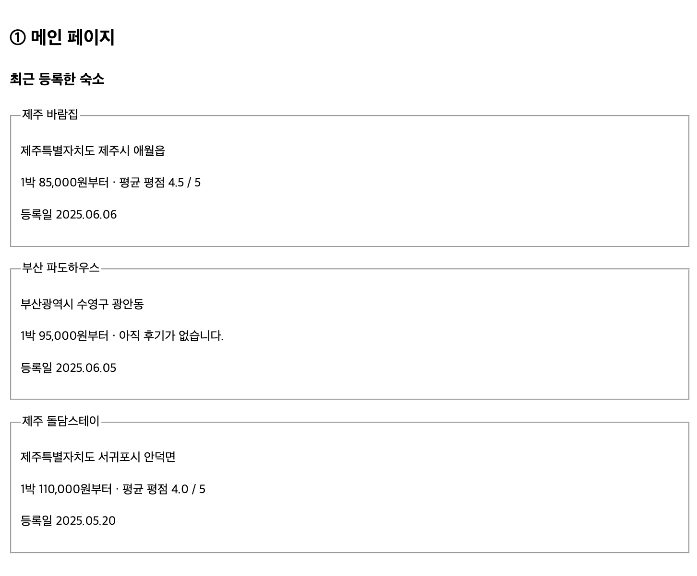
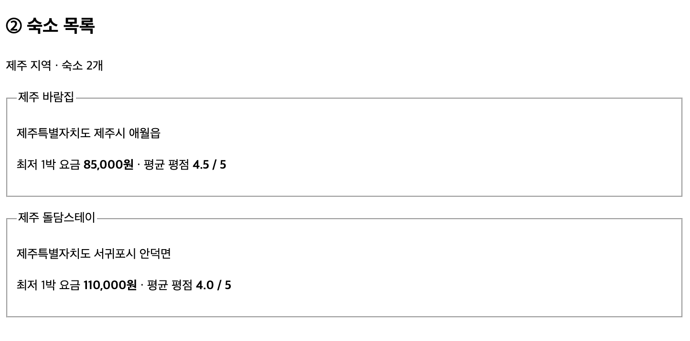
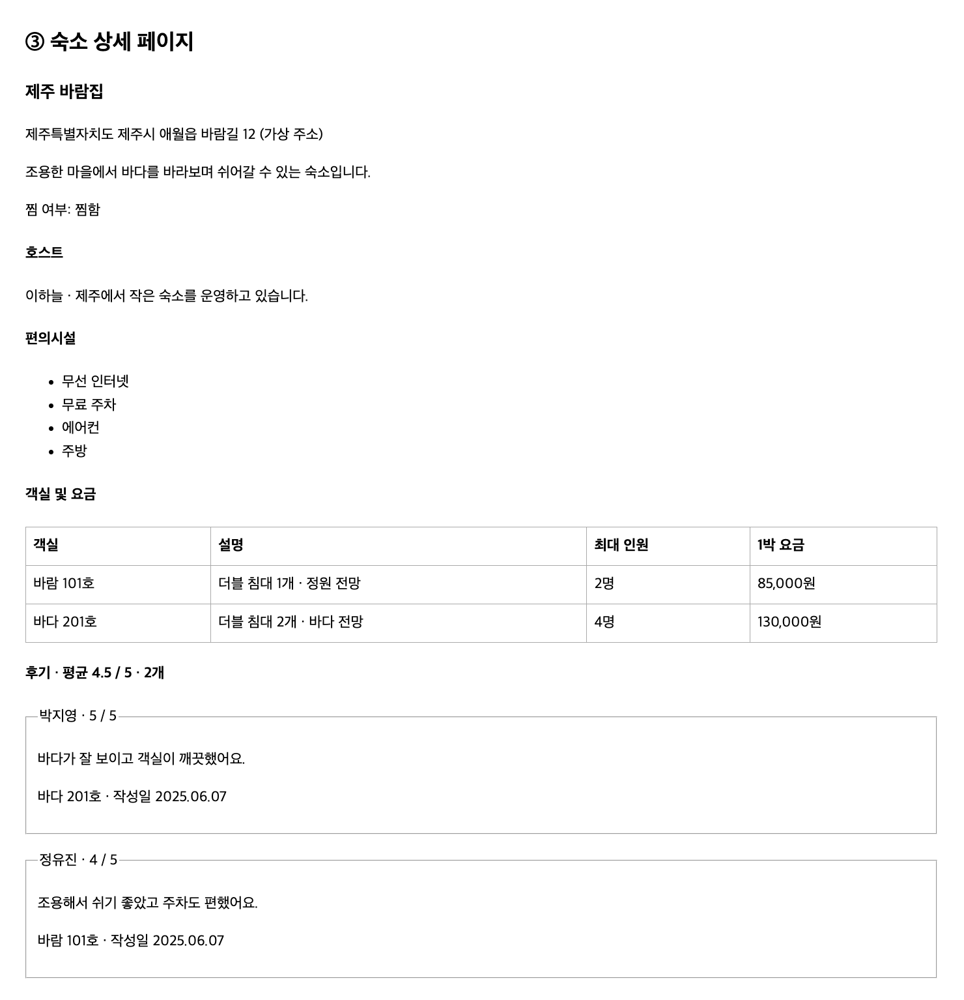
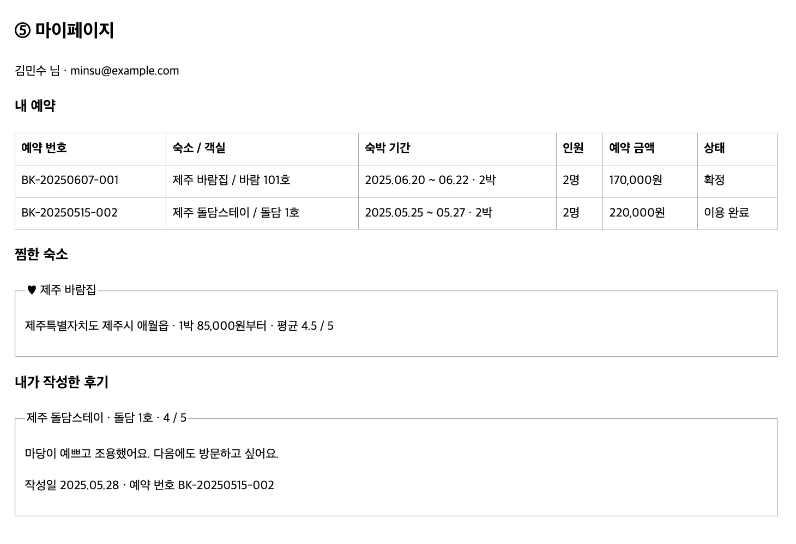
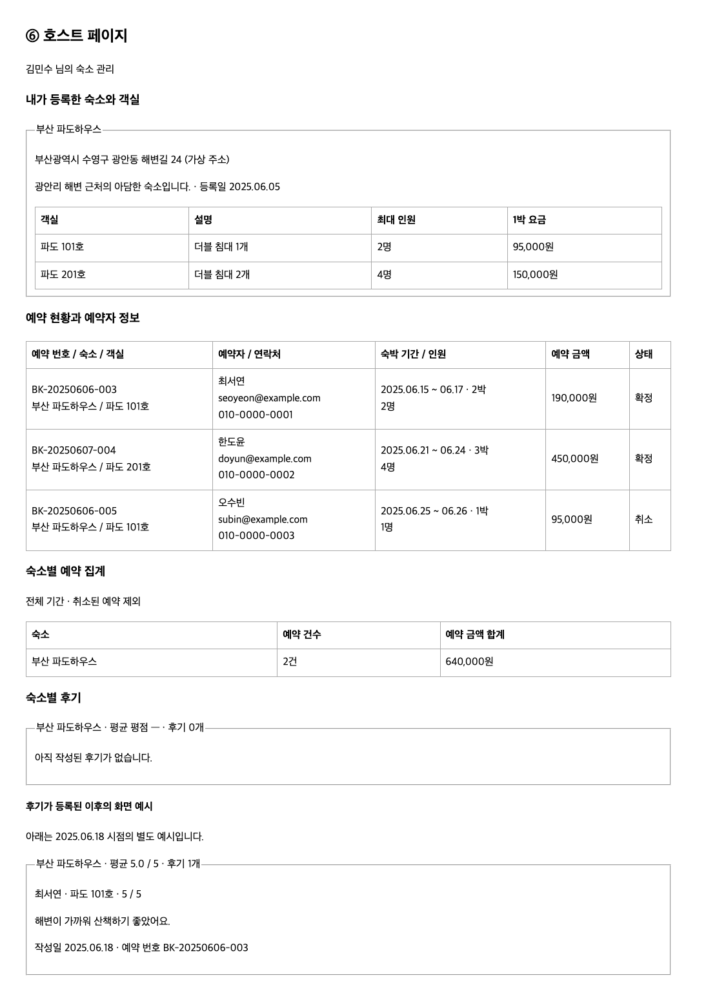
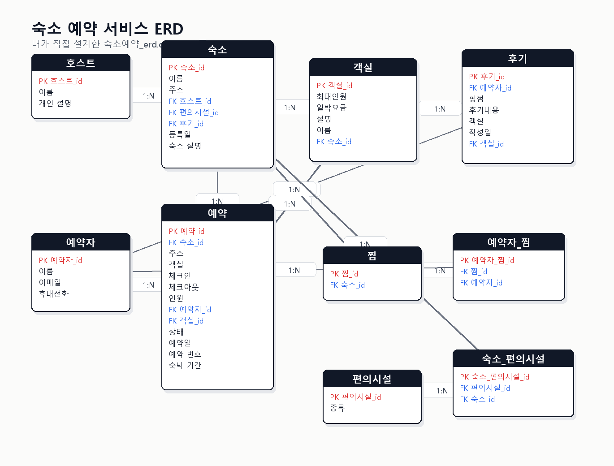

# 26.10.08 54일차(Database · PostgreSQL · ERD 및 SQL 작성 실습)

## [TIL] 숙소 예약 서비스 ERD 설계와 화면별 SQL 작성하기

오늘은 숙소 예약 서비스의 여섯 개 화면을 보고 필요한 데이터를 분석한 뒤, 직접 만든 **`숙소예약_erd.drawio`**를 기준으로 PostgreSQL 테이블과 화면별 조회 SQL을 작성했다.

ERD의 테이블과 관계는 바꾸지 않았고, 실제 DDL과 DML에서는 같은 의미를 가진 영어 테이블명과 컬럼명으로 옮겼다.

이론과 실습은 다음 흐름으로 이어졌다.

```plain text
화면 예시 확인
→ 내가 만든 ERD 구조 확인
→ ERD의 의미를 영어 테이블/컬럼으로 매핑
→ DDL 작성
→ 샘플 데이터 INSERT
→ 화면별 SELECT 작성
→ 조회 결과 확인
```

---

## 1. 화면 예시

### 1-1. 메인 페이지



최근 등록된 숙소를 보여주는 화면이다. 숙소명, 주소, 최저 1박 요금, 평균 평점, 등록일이 필요하다.

### 1-2. 숙소 목록



지역 조건으로 숙소를 조회한다. 한 숙소에 객실이 여러 개 있을 수 있으므로 최저 요금은 `MIN(room.price_per_night)`로 구한다.

### 1-3. 숙소 상세 페이지



숙소 기본 정보, 찜 여부, 호스트 정보, 편의시설, 객실 목록, 후기 목록이 필요하다.

### 1-4. 예약 확인 페이지


예약 번호 하나를 기준으로 예약 상세 정보를 보여준다.

### 1-5. 마이페이지



예약자 정보, 내 예약, 찜한 숙소, 내가 작성한 후기를 보여준다.

### 1-6. 호스트 페이지



호스트가 등록한 숙소와 객실, 예약 현황, 예약자 정보, 숙소별 예약 집계와 후기를 보여준다.

---

## 2. 직접 설계한 숙소 예약 ERD

아래 이미지는 이번 실습에서 직접 설계한 `숙소예약_erd.drawio`이다. 이후 테이블 생성과 조회 SQL은 이 구조를 기준으로 작성했다.



ERD의 한글 테이블/컬럼은 SQL 작성 시 다음처럼 영어 이름으로 매핑했다.

| ERD 테이블 | SQL 테이블 | 역할 |
| --- | --- | --- |
| 호스트 | host | 숙소를 등록하는 사용자 |
| 예약자 | guest | 예약을 생성하고 후기를 작성하는 사용자 |
| 편의시설 | amenity | 무선 인터넷, 무료 주차 같은 편의시설 |
| 숙소 | accommodation | 예약 가능한 숙소 |
| 객실 | room | 숙소 안의 객실과 요금 |
| 후기 | review | 예약자가 작성한 평점과 후기 |
| 예약 | booking | 예약 내역 |
| 찜 | wishlist | 찜 대상 숙소 |
| 예약자_찜 | guest_wishlist | 예약자와 찜의 연결 |
| 숙소_편의시설 | accommodation_amenity | 숙소와 편의시설의 연결 |

---

## 3. DDL: 영어 테이블명으로 테이블 생성

### 3-1. 기본 테이블

```sql
DROP TABLE IF EXISTS guest_wishlist CASCADE;
DROP TABLE IF EXISTS accommodation_amenity CASCADE;
DROP TABLE IF EXISTS wishlist CASCADE;
DROP TABLE IF EXISTS booking CASCADE;
DROP TABLE IF EXISTS review CASCADE;
DROP TABLE IF EXISTS room CASCADE;
DROP TABLE IF EXISTS accommodation CASCADE;
DROP TABLE IF EXISTS amenity CASCADE;
DROP TABLE IF EXISTS guest CASCADE;
DROP TABLE IF EXISTS host CASCADE;

CREATE TABLE host (
    host_id INT GENERATED ALWAYS AS IDENTITY PRIMARY KEY,
    name VARCHAR(50) NOT NULL,
    profile_description TEXT
);

CREATE TABLE guest (
    guest_id INT GENERATED ALWAYS AS IDENTITY PRIMARY KEY,
    name VARCHAR(50) NOT NULL,
    email VARCHAR(100) NOT NULL UNIQUE,
    phone VARCHAR(20)
);

CREATE TABLE amenity (
    amenity_id INT GENERATED ALWAYS AS IDENTITY PRIMARY KEY,
    amenity_type VARCHAR(50) NOT NULL UNIQUE
);
```

### 3-2. 숙소와 객실

```sql
CREATE TABLE accommodation (
    accommodation_id INT GENERATED ALWAYS AS IDENTITY PRIMARY KEY,
    name VARCHAR(200) NOT NULL,
    address VARCHAR(300) NOT NULL,
    host_id INT NOT NULL REFERENCES host(host_id),
    amenity_id INT REFERENCES amenity(amenity_id),
    review_id INT,
    registered_date DATE NOT NULL DEFAULT CURRENT_DATE,
    description TEXT
);

CREATE TABLE room (
    room_id INT GENERATED ALWAYS AS IDENTITY PRIMARY KEY,
    max_guests INT NOT NULL CHECK (max_guests > 0),
    price_per_night INT NOT NULL CHECK (price_per_night >= 0),
    description TEXT,
    name VARCHAR(100) NOT NULL,
    accommodation_id INT NOT NULL REFERENCES accommodation(accommodation_id),
    UNIQUE (accommodation_id, name)
);
```

### 3-3. 후기와 예약

ERD의 `후기`에는 `숙소_id`가 없으므로 `review → room → accommodation` 순서로 숙소별 후기를 조회한다.

```sql
CREATE TABLE review (
    review_id INT GENERATED ALWAYS AS IDENTITY PRIMARY KEY,
    guest_id INT NOT NULL REFERENCES guest(guest_id),
    rating NUMERIC(2,1) NOT NULL CHECK (rating BETWEEN 0 AND 5),
    content TEXT NOT NULL,
    room_name VARCHAR(100),
    written_date DATE NOT NULL DEFAULT CURRENT_DATE,
    room_id INT NOT NULL REFERENCES room(room_id)
);

ALTER TABLE accommodation
ADD CONSTRAINT fk_accommodation_review
FOREIGN KEY (review_id) REFERENCES review(review_id);

CREATE TABLE booking (
    booking_id INT GENERATED ALWAYS AS IDENTITY PRIMARY KEY,
    accommodation_id INT NOT NULL REFERENCES accommodation(accommodation_id),
    address VARCHAR(300),
    room_name VARCHAR(100),
    check_in DATE NOT NULL,
    check_out DATE NOT NULL,
    guest_count INT NOT NULL CHECK (guest_count > 0),
    guest_id INT NOT NULL REFERENCES guest(guest_id),
    room_id INT NOT NULL REFERENCES room(room_id),
    status VARCHAR(20) NOT NULL CHECK (status IN ('CONFIRMED', 'COMPLETED', 'CANCELED')),
    booked_date DATE NOT NULL DEFAULT CURRENT_DATE,
    booking_number VARCHAR(50) NOT NULL UNIQUE,
    nights INT NOT NULL CHECK (nights > 0),
    CHECK (check_out > check_in)
);
```

### 3-4. 찜과 편의시설 연결 테이블

```sql
CREATE TABLE wishlist (
    wishlist_id INT GENERATED ALWAYS AS IDENTITY PRIMARY KEY,
    accommodation_id INT NOT NULL REFERENCES accommodation(accommodation_id)
);

CREATE TABLE guest_wishlist (
    guest_wishlist_id INT GENERATED ALWAYS AS IDENTITY PRIMARY KEY,
    wishlist_id INT NOT NULL REFERENCES wishlist(wishlist_id),
    guest_id INT NOT NULL REFERENCES guest(guest_id),
    UNIQUE (wishlist_id, guest_id)
);

CREATE TABLE accommodation_amenity (
    accommodation_amenity_id INT GENERATED ALWAYS AS IDENTITY PRIMARY KEY,
    amenity_id INT NOT NULL REFERENCES amenity(amenity_id),
    accommodation_id INT NOT NULL REFERENCES accommodation(accommodation_id),
    UNIQUE (amenity_id, accommodation_id)
);
```

---

## 4. DML: 샘플 데이터 생성

```sql
INSERT INTO host (name, profile_description) VALUES
('Lee Haneul', 'I run a small accommodation in Jeju.'),
('Kim Minsu', 'I manage accommodations near Gwangalli Beach in Busan.');

INSERT INTO guest (name, email, phone) VALUES
('Kim Minsu', 'minsu@example.com', '010-1111-1111'),
('Park Jiyoung', 'jiyoung@example.com', '010-2222-2222'),
('Jung Yujin', 'yujin@example.com', '010-3333-3333'),
('Choi Seoyeon', 'seoyeon@example.com', '010-0000-0001'),
('Han Doyun', 'doyun@example.com', '010-0000-0002'),
('Oh Subin', 'subin@example.com', '010-0000-0003');

INSERT INTO amenity (amenity_type) VALUES
('Wi-Fi'), ('Free parking'), ('Air conditioner'), ('Kitchen');

INSERT INTO accommodation (name, address, host_id, amenity_id, registered_date, description) VALUES
('Jeju Wind House', 'Jeju-si, Aewol-eup, Baram-gil 12', 1, 1, '2025-06-06', 'A quiet place to rest while looking at the sea.'),
('Busan Wave House', 'Busan, Suyeong-gu, Gwangan-dong, Beach Road 24', 2, 1, '2025-06-05', 'A small accommodation near Gwangalli Beach.'),
('Jeju Stone Wall Stay', 'Seogwipo-si, Andeok-myeon, Doldam-gil 8', 1, 2, '2025-05-20', 'A quiet Jeju accommodation with a beautiful stone wall.');

INSERT INTO room (max_guests, price_per_night, description, name, accommodation_id) VALUES
(2, 85000, 'One double bed · garden view', 'Wind 101', 1),
(4, 130000, 'Two double beds · ocean view', 'Sea 201', 1),
(2, 95000, 'One double bed', 'Wave 101', 2),
(4, 150000, 'Two double beds', 'Wave 201', 2),
(2, 110000, 'Stone wall garden view', 'Stone 1', 3);

INSERT INTO accommodation_amenity (amenity_id, accommodation_id) VALUES
(1, 1), (2, 1), (3, 1), (4, 1),
(1, 2), (3, 2),
(1, 3), (2, 3);

INSERT INTO review (guest_id, rating, content, room_name, written_date, room_id) VALUES
(2, 5.0, 'The ocean view was great and the room was clean.', 'Sea 201', '2025-06-07', 2),
(3, 4.0, 'It was quiet and parking was convenient.', 'Wind 101', '2025-06-07', 1),
(1, 4.0, 'The yard was pretty and quiet. I want to visit again.', 'Stone 1', '2025-05-28', 5);

UPDATE accommodation SET review_id = 1 WHERE accommodation_id = 1;
UPDATE accommodation SET review_id = 3 WHERE accommodation_id = 3;

INSERT INTO booking (accommodation_id, address, room_name, check_in, check_out, guest_count, guest_id, room_id, status, booked_date, booking_number, nights) VALUES
(1, 'Jeju-si, Aewol-eup, Baram-gil 12', 'Wind 101', '2025-06-20', '2025-06-22', 2, 1, 1, 'CONFIRMED', '2025-06-07', 'BK-20250607-001', 2),
(3, 'Seogwipo-si, Andeok-myeon, Doldam-gil 8', 'Stone 1', '2025-05-25', '2025-05-27', 2, 1, 5, 'COMPLETED', '2025-05-15', 'BK-20250515-002', 2),
(2, 'Busan, Suyeong-gu, Gwangan-dong, Beach Road 24', 'Wave 101', '2025-06-15', '2025-06-17', 2, 4, 3, 'CONFIRMED', '2025-06-06', 'BK-20250606-003', 2),
(2, 'Busan, Suyeong-gu, Gwangan-dong, Beach Road 24', 'Wave 201', '2025-06-21', '2025-06-24', 4, 5, 4, 'CONFIRMED', '2025-06-07', 'BK-20250607-004', 3),
(2, 'Busan, Suyeong-gu, Gwangan-dong, Beach Road 24', 'Wave 101', '2025-06-25', '2025-06-26', 1, 6, 3, 'CANCELED', '2025-06-06', 'BK-20250606-005', 1);

INSERT INTO wishlist (accommodation_id) VALUES (1);
INSERT INTO guest_wishlist (wishlist_id, guest_id) VALUES (1, 1);
```

---

## 5. 화면별 조회 SQL 작성

### 5-1. 메인 페이지

```sql
SELECT
    a.accommodation_id,
    a.name AS accommodation_name,
    a.address,
    MIN(r.price_per_night) AS minimum_price_per_night,
    COALESCE(ROUND(AVG(rv.rating), 1), 0) AS average_rating,
    COUNT(rv.review_id) AS review_count,
    a.registered_date
FROM accommodation a
JOIN room r ON r.accommodation_id = a.accommodation_id
LEFT JOIN review rv ON rv.room_id IN (
    SELECT room_id FROM room WHERE accommodation_id = a.accommodation_id
)
GROUP BY a.accommodation_id, a.name, a.address, a.registered_date
ORDER BY a.registered_date DESC, a.accommodation_id DESC;
```

### 5-2. 숙소 목록

```sql
SELECT
    a.accommodation_id,
    a.name AS accommodation_name,
    a.address,
    MIN(r.price_per_night) AS minimum_price_per_night,
    COALESCE(ROUND(AVG(rv.rating), 1), 0) AS average_rating,
    COUNT(rv.review_id) AS review_count
FROM accommodation a
JOIN room r ON r.accommodation_id = a.accommodation_id
LEFT JOIN review rv ON rv.room_id IN (
    SELECT room_id FROM room WHERE accommodation_id = a.accommodation_id
)
WHERE a.address LIKE 'Jeju%'
GROUP BY a.accommodation_id, a.name, a.address
ORDER BY minimum_price_per_night, average_rating DESC;
```

### 5-3. 숙소 상세 페이지

```sql
SELECT
    a.accommodation_id,
    a.name AS accommodation_name,
    a.address,
    a.description,
    CASE WHEN EXISTS (
        SELECT 1
        FROM guest_wishlist gw
        JOIN wishlist w ON w.wishlist_id = gw.wishlist_id
        WHERE gw.guest_id = 1
          AND w.accommodation_id = a.accommodation_id
    ) THEN 'WISHED' ELSE 'NOT_WISHED' END AS wishlist_status,
    h.name AS host_name,
    h.profile_description AS host_description
FROM accommodation a
JOIN host h ON h.host_id = a.host_id
WHERE a.accommodation_id = 1;
```

```sql
SELECT am.amenity_type
FROM accommodation_amenity aa
JOIN amenity am ON am.amenity_id = aa.amenity_id
WHERE aa.accommodation_id = 1
ORDER BY am.amenity_id;

SELECT name AS room_name, description, max_guests, price_per_night
FROM room
WHERE accommodation_id = 1
ORDER BY price_per_night;

SELECT
    g.name AS reviewer_name,
    rv.rating,
    rv.content,
    rv.room_name,
    rv.written_date
FROM review rv
JOIN guest g ON g.guest_id = rv.guest_id
JOIN room r ON r.room_id = rv.room_id
WHERE r.accommodation_id = 1
ORDER BY rv.written_date DESC, rv.review_id DESC;
```

### 5-4. 예약 확인 페이지

ERD의 예약 테이블에는 예약 금액 컬럼이 없으므로 `room.price_per_night * booking.nights`로 계산한다.

```sql
SELECT
    b.booking_number,
    a.name AS accommodation_name,
    b.address,
    b.room_name,
    b.check_in,
    b.check_out,
    b.nights,
    b.guest_count,
    g.name AS guest_name,
    r.price_per_night,
    (r.price_per_night * b.nights) AS total_price,
    b.status,
    b.booked_date
FROM booking b
JOIN guest g ON g.guest_id = b.guest_id
JOIN accommodation a ON a.accommodation_id = b.accommodation_id
JOIN room r ON r.room_id = b.room_id
WHERE b.booking_number = 'BK-20250607-001';
```

### 5-5. 마이페이지

```sql
SELECT
    b.booking_number,
    a.name AS accommodation_name,
    b.room_name,
    b.check_in,
    b.check_out,
    b.nights,
    b.guest_count,
    (r.price_per_night * b.nights) AS total_price,
    b.status
FROM booking b
JOIN accommodation a ON a.accommodation_id = b.accommodation_id
JOIN room r ON r.room_id = b.room_id
WHERE b.guest_id = 1
ORDER BY b.check_in DESC;
```

```sql
SELECT
    a.name AS accommodation_name,
    a.address,
    MIN(r.price_per_night) AS minimum_price_per_night,
    COALESCE(ROUND(AVG(rv.rating), 1), 0) AS average_rating,
    COUNT(rv.review_id) AS review_count
FROM guest_wishlist gw
JOIN wishlist w ON w.wishlist_id = gw.wishlist_id
JOIN accommodation a ON a.accommodation_id = w.accommodation_id
JOIN room r ON r.accommodation_id = a.accommodation_id
LEFT JOIN review rv ON rv.room_id IN (
    SELECT room_id FROM room WHERE accommodation_id = a.accommodation_id
)
WHERE gw.guest_id = 1
GROUP BY a.accommodation_id, a.name, a.address;
```

```sql
SELECT
    a.name AS accommodation_name,
    rv.room_name,
    rv.rating,
    rv.content,
    rv.written_date
FROM review rv
JOIN room r ON r.room_id = rv.room_id
JOIN accommodation a ON a.accommodation_id = r.accommodation_id
WHERE rv.guest_id = 1
ORDER BY rv.written_date DESC;
```

### 5-6. 호스트 페이지

```sql
SELECT
    b.booking_number,
    a.name AS accommodation_name,
    b.room_name,
    g.name AS guest_name,
    g.email,
    g.phone,
    b.check_in,
    b.check_out,
    b.nights,
    b.guest_count,
    (r.price_per_night * b.nights) AS total_price,
    b.status
FROM booking b
JOIN guest g ON g.guest_id = b.guest_id
JOIN accommodation a ON a.accommodation_id = b.accommodation_id
JOIN room r ON r.room_id = b.room_id
WHERE a.host_id = 2
ORDER BY b.check_in;
```

```sql
SELECT
    a.name AS accommodation_name,
    COUNT(*) FILTER (WHERE b.status <> 'CANCELED') AS booking_count,
    SUM(r.price_per_night * b.nights) FILTER (WHERE b.status <> 'CANCELED') AS total_booking_price
FROM accommodation a
LEFT JOIN booking b ON b.accommodation_id = a.accommodation_id
LEFT JOIN room r ON r.room_id = b.room_id
WHERE a.host_id = 2
GROUP BY a.accommodation_id, a.name;
```

```sql
SELECT
    a.name AS accommodation_name,
    COALESCE(ROUND(AVG(rv.rating), 1), 0) AS average_rating,
    COUNT(rv.review_id) AS review_count,
    g.name AS reviewer_name,
    rv.room_name,
    rv.rating,
    rv.content,
    rv.written_date
FROM accommodation a
LEFT JOIN room r ON r.accommodation_id = a.accommodation_id
LEFT JOIN review rv ON rv.room_id = r.room_id
LEFT JOIN guest g ON g.guest_id = rv.guest_id
WHERE a.host_id = 2
GROUP BY a.accommodation_id, a.name, g.name, rv.room_name, rv.rating, rv.content, rv.written_date, rv.review_id
ORDER BY a.accommodation_id, rv.written_date DESC;
```

---

## 6. 조회 결과 확인

작성한 샘플 데이터를 기준으로 각 화면의 조건과 결과를 비교했다.

- 메인 페이지에서는 등록일이 최신인 순서로 숙소가 조회되고, 객실별 요금 중 최솟값과 후기 평균이 함께 표시된다.
- 제주 지역 목록에서는 주소가 제주로 시작하는 숙소 두 곳만 조회된다.
- 예약 번호 `BK-20250607-001`을 조회하면 제주 바람집, 바람 101호, 2박, 2명, 총 170,000원이 나온다.
- 마이페이지에서는 김민수의 예약 두 건, 찜한 숙소 한 건, 작성한 후기 한 건이 조회된다.
- 호스트 페이지에서는 취소 예약을 제외한 부산 파도하우스의 예약이 2건, 예약 금액 합계가 640,000원으로 집계된다.

---

## 7. 헷갈린 점

처음에는 화면에 보이는 값을 모두 컬럼으로 저장해야 한다고 생각했다. 하지만 예약 금액은 객실의 1박 요금과 숙박 기간으로 계산할 수 있으므로 `booking` 테이블에 `total_price`를 추가하지 않았다.

```sql
r.price_per_night * b.nights AS total_price
```

숙소별 평균 평점을 구할 때도 `review` 테이블에 `accommodation_id`가 없어서 바로 조인할 수 없었다. 직접 만든 ERD에서는 후기가 객실을 참조하므로 다음 경로를 따라가야 한다.

```plain text
review.room_id
→ room.room_id
→ room.accommodation_id
→ accommodation.accommodation_id
```

또한 `accommodation` 테이블에 `amenity_id`가 있으면서 `accommodation_amenity` 연결 테이블도 존재한다. 이번 실습에서는 내가 만든 ERD를 그대로 유지하고, 여러 편의시설을 조회할 때는 연결 테이블을 사용했다.

목록 화면에서 객실과 후기를 동시에 JOIN하면 객실 수와 후기 수의 조합만큼 행이 늘어날 수 있다. 그래서 최저 요금, 평균 평점, 후기 수를 집계할 때는 숙소 ID를 기준으로 GROUP BY하고 결과 건수를 함께 확인해야 한다.

---

## 추가!

오늘 배운 것 정리

- 화면에 표시되는 항목을 먼저 분석하면 필요한 테이블과 조회 컬럼을 찾기 쉽다.
- ERD는 직접 만든 한글 구조를 기준으로 사용하고, SQL에서는 테이블명과 컬럼명을 영어 snake_case로 작성했다.
- PK는 각 행을 식별하고, FK는 호스트·숙소·객실·예약자·예약·후기 사이의 관계를 연결한다.
- 숙소와 편의시설처럼 M:N 관계는 `accommodation_amenity` 같은 연결 테이블로 표현한다.
- 화면에 보이는 값이라도 계산할 수 있으면 반드시 컬럼으로 저장할 필요는 없다.
- 예약 금액은 `price_per_night * nights`로 계산했다.
- 숙소별 후기는 `review → room → accommodation` 경로로 조회했다.
- 메인, 목록, 상세, 예약 확인, 마이페이지, 호스트 페이지는 필요한 정보가 달라 화면별 SQL을 나누어 작성했다.
- 조회 결과는 화면 예시의 숙소명, 객실명, 인원, 숙박 기간, 금액, 상태와 비교해서 검증했다.

화면을 기준으로 데이터베이스 실습을 진행할 때는 다음 순서로 생각하면 된다.

```plain text
화면에서 필요한 데이터 찾기
→ 직접 만든 ERD에서 테이블과 관계 확인
→ 한글 개체를 영어 테이블·컬럼으로 매핑
→ PK·FK·제약조건을 포함한 DDL 작성
→ 화면 예시에 맞는 샘플 데이터 INSERT
→ 화면별 SELECT와 JOIN 작성
→ 결과 건수와 표시 값을 화면 예시와 비교
```

#부트캠프 #멀티캠퍼스부트캠프 #AI캠퍼스 #AI에이전트엔지니어
