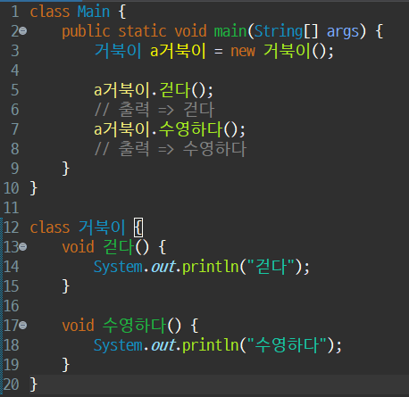
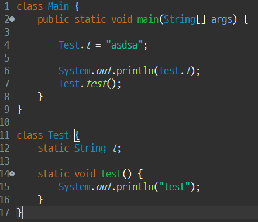

# 9.4 6일차 공부 (인스턴스)

[목록으로](README.md)

[노션 원문](https://app.notion.com/p/264c2c49a250802788ecfc28d871da5f)

- [객체 문제 풀이](%EB%AC%B8%EC%A0%9C%ED%92%80%EC%9D%B4/Day06/%EA%B0%9D%EC%B2%B4%20%EB%AC%B8%EC%A0%9C%20%ED%92%80%EC%9D%B4.md)
- [인스턴스 문제 풀이](%EB%AC%B8%EC%A0%9C%ED%92%80%EC%9D%B4/Day06/%EC%9D%B8%EC%8A%A4%ED%84%B4%EC%8A%A4%20%EB%AC%B8%EC%A0%9C%20%ED%92%80%EC%9D%B4.md)
- [문제 풀이 복습](%EB%AC%B8%EC%A0%9C%ED%92%80%EC%9D%B4/Day06/%EB%AC%B8%EC%A0%9C%20%ED%92%80%EC%9D%B4%20%EB%B3%B5%EC%8A%B5.md)

## 객체와 인스턴스

---

**객체**는 현실 세계의 사물을 프로그램으로 구현한 것으로, 클래스라는 **설계도**를 기반으로 만들어진 **실체**를 의미합니다. 예를 들어, '자동차'라는 설계도가 있다면, 그 설계도를 바탕으로 만들어진 '내 자동차'가 바로 객체입니다. 자바에서는 모든 클래스가 `Object` 클래스로부터 상속받습니다.
**인스턴스**는 클래스를 기반으로 만들어진 객체를 더 구체적으로 지칭하는 용어입니다. **`new`**** 키워드**를 사용하여 메모리에 할당된 객체를 바로 인스턴스라고 부르며, 이 인스턴스는 해당 클래스의 특정한 형태를 가지게 됩니다.
**예시:**
```java
Java

`public class Animal {
    // ...
}

Animal dog = new Animal(); 
// 'dog'는 'Animal' 클래스의 인스턴스입니다.`
```
위 코드에서 `dog` 변수는 `Animal` 클래스의 설계도를 바탕으로 만들어진 **객체**이며, 동시에 `new` 키워드를 통해 생성되었기 때문에 `Animal` 클래스의 **인스턴스**라고 부를 수 있습니다.

---

## 인스턴스 변수와 인스턴스 메서드

---

**인스턴스 변수**는 클래스 내부에 선언된 변수로, 클래스의 설계도를 바탕으로 만들어진 \*\*각 인스턴스(객체)\*\*가 개별적으로 가지는 변수입니다. 즉, 인스턴스를 생성해야만 사용할 수 있습니다.
**예시:**
```java
Java

`public class Car {
    String color; // 인스턴스 변수

    public Car(String color) {
        this.color = color;
    }
}

Car myCar = new Car("red");
Car yourCar = new Car("blue");

// myCar의 color와 yourCar의 color는 서로 다른 값을 가집니다.`
```
**인스턴스 메서드** 역시 클래스 내부에 선언된 메서드로, 인스턴스가 수행하는 동작이나 기능을 정의합니다. 이 메서드도 인스턴스를 생성해야만 호출할 수 있습니다.
**예시:**
```java
Java

`public class Dog {
    String name;

    public void bark() { // 인스턴스 메서드
        System.out.println(name + "가 짖습니다!");
    }
}

Dog puppy = new Dog();
puppy.name = "강아지";
puppy.bark(); // "강아지가 짖습니다!" 출력`
```
출력  간단하게 사진 


---

## `static` (정적) 키워드

---

`static`은 '정적'이라는 의미를 가지며, 메모리 내에서 **고정된 위치**에 존재함을 나타냅니다. `static` 변수와 메서드는 프로그램이 시작될 때 메모리의 **메서드 영역**에 할당되어 프로그램이 종료될 때까지 유지됩니다.
### `static` 변수와 메서드의 특징
- **인스턴스 생성 불필요:** `static` 멤버는 객체를 만들지 않고도 **클래스 이름으로 직접 접근**할 수 있습니다.
- **공유:** `static` 변수는 해당 클래스로 생성된 **모든 인스턴스가 값을 공유**합니다. 하나의 인스턴스가 `static` 변수의 값을 변경하면, 다른 모든 인스턴스에서도 변경된 값을 확인할 수 있습니다.
- **제한적인 접근:** `static` 메서드 내에서는 `static` 변수만 사용할 수 있습니다. 인스턴스 변수나 인스턴스 메서드에는 직접 접근할 수 없습니다.
**예시:**<br>게시판에서 모든 게시글에 대해 **게시글 번호**를 순차적으로 부여해야 한다고 가정해 봅시다. 이 경우, 모든 게시글(인스턴스)이 공유하는 `static` 변수를 사용하면 효율적입니다.
```java
Java

`public class Post {
    private static int nextId = 1; // 모든 Post 객체가 공유하는 static 변수
    private int id;
    private String title;

    public Post(String title) {
        this.id = nextId++; // 새 Post 객체가 생성될 때마다 nextId 값을 1씩 증가
        this.title = title;
    }

    public void printInfo() {
        System.out.println("게시글 번호: " + id + ", 제목: " + title);
    }
}

// static 변수는 인스턴스 생성 없이 클래스 이름으로 접근 가능합니다.
// Post.nextId; 

Post post1 = new Post("첫 번째 게시글");
Post post2 = new Post("두 번째 게시글");

post1.printInfo(); // "게시글 번호: 1, 제목: 첫 번째 게시글" 출력
post2.printInfo(); // "게시글 번호: 2, 제목: 두 번째 게시글" 출력`
```
위 코드에서 `nextId`는 `static` 변수이므로 `post1`과 `post2` 객체가 값을 공유합니다. `post1`이 생성되면서 `nextId`가 1로 설정되고, `post2`가 생성되면서 `nextId`가 2로 증가하는 것을 볼 수 있습니다.
### `static`의 장단점
- **장점:** 인스턴스 생성 과정 없이 바로 사용 가능하여 실행 속도가 빠릅니다. 자주 사용되는 유틸리티성 메서드(예: `Math` 클래스의 `random()` 메서드)에 유용합니다.
- **단점:** 프로그램 시작부터 종료까지 메모리를 점유하므로, 메모리 관리가 비효율적일 수 있습니다. 객체지향 프로그래밍의 본질인 '객체 간의 상호작용'을 흐릴 수 있습니다.
출력 간단하게 사진


---

## RAM 내부 메모리 구조

---

컴퓨터의 메모리인 RAM은 여러 영역으로 나뉩니다.
- **Method (Static) 영역:** 프로그램이 시작될 때 클래스 정보, `static` 변수, `static` 메서드 등이 할당됩니다.
- **Stack 영역:** 메서드의 호출 정보와 지역 변수 등이 저장되는 공간으로, 후입선출(LIFO) 방식으로 데이터가 관리됩니다.
- **Heap 영역:** **`new`**** 키워드**로 생성된 \*\*인스턴스(객체)\*\*가 저장되는 공간입니다.
