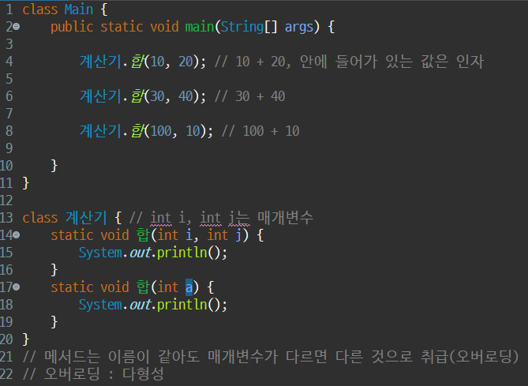
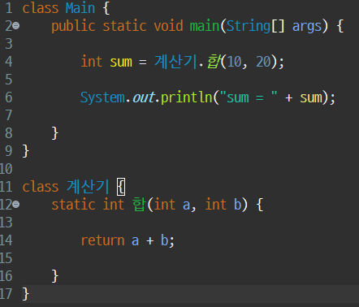
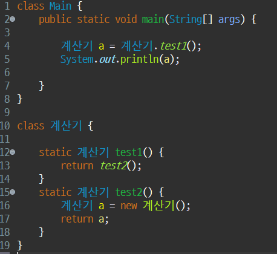
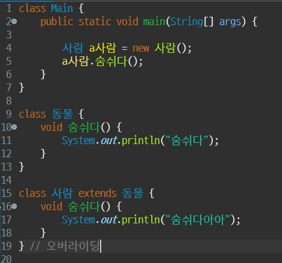
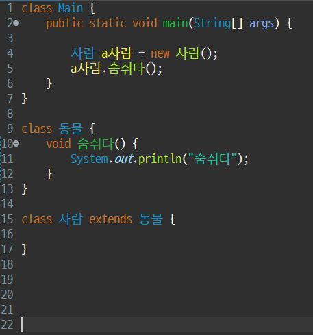
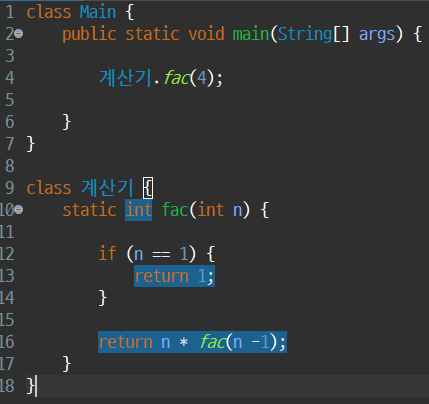

# 9.5 7일차 공부(인자, 매개변수, return, 상속)

[목록으로](README.md)

[노션 원문](https://app.notion.com/p/265c2c49a250809ca4e9c18ca0f55ac0)

- [인자, 매개변수, return 문제 풀이](%EB%AC%B8%EC%A0%9C%ED%92%80%EC%9D%B4/Day07/%EC%9D%B8%EC%9E%90%2C%20%EB%A7%A4%EA%B0%9C%EB%B3%80%EC%88%98%2C%20return%20%EB%AC%B8%EC%A0%9C%20%ED%92%80%EC%9D%B4.md)

- [첨부파일: 9.5_상속_문제풀이.txt](attachments/9.5_%EC%83%81%EC%86%8D_%EB%AC%B8%EC%A0%9C%ED%92%80%EC%9D%B4.txt)

- [첨부파일: 9.5_상속_형변환_문제풀이.txt](attachments/9.5_%EC%83%81%EC%86%8D_%ED%98%95%EB%B3%80%ED%99%98_%EB%AC%B8%EC%A0%9C%ED%92%80%EC%9D%B4.txt)

### **1. 인자 (Argument)와 매개변수 (Parameter)**
**인자**는 메서드를 호출할 때 전달하는 **값**입니다. **매개변수**는 메서드를 선언할 때 선언부에 있는 변수로, 전달받은 인자 값을 저장하는 **그릇** 역할을 합니다. 인자와 매개변수는 둘이 한 쌍을 이룹니다.
- **인자**: `계산기.합(10, 20)`에서 **10**과 **20**
- **매개변수**: `static void 합(int i, int j)`에서 **int i**와 **int j**

```javascript
Java

`class Main {
	public static void main(String[] args) {
		
	계산기.합(10, 20); // 10, 20은 인자
		
	계산기.합(30, 40); // 30, 40은 인자
		
	계산기.합(100, 10); // 100, 10은 인자
		
	}
}

class 계산기 { // int i, int j는 매개변수
	static void 합(int i, int j) {
		System.out.println();
	}
	static void 합(int a) {
		System.out.println();
	}
}`
```
- **규칙**: 매개변수는 인자 값을 **순서대로** 받습니다.
- `new int[3]`과 `null`을 인자로 전달하면, 매개변수는 각각 `int[]`와 `Object` 타입으로 받을 수 있습니다.
- `Object` 타입에는 모든 값(기본 자료형, 참조형)을 넣을 수 있지만, `Object` 변수에 `true`를 넣어도 `boolean` 변수에 바로 넣을 수는 없습니다. 실무에서는 거의 사용하지 않습니다.

---

### **2. 메서드 오버로딩 (Overloading)**
**오버로딩**은 메서드의 **이름은 같지만** 매개변수의 **개수**나 **타입**이 다른 경우를 의미합니다. 자바의 **다형성** 특징 중 하나로, 하나의 메서드 이름으로 다양한 기능을 수행할 수 있게 해줍니다.



---

### **3. ****`return`**** 키워드**
**`return`** 키워드는 메서드에서 값을 반환하는 데 사용됩니다. `return`이 실행되면 메서드는 **즉시 종료**됩니다.
- **타입 일치**: 메서드의 반환 타입과 `return`으로 반환하는 값의 타입은 **같아야** 합니다.
- **단일 값 반환**: 한 번에 반환할 수 있는 값의 개수는 **1개**입니다. (예: `return a, b`는 불가능)
- **`void`****에서의 사용**: `void` 타입의 메서드에서는 값을 반환할 수 없지만, `return;`을 사용하여 메서드를 **강제로 종료**시키는 용도로 쓸 수 있습니다.
- **사용 횟수**: `return` 키워드는 **조건문** 내에서 여러 번 사용할 수 있지만, 실제로 실행되는 `return`문은 **단 한 번**입니다.
기본 리턴 


리턴 심화 


---

### **4. 객체 지향 프로그래밍 (OOP) 특징**
자료에 언급된 객체 지향 프로그래밍의 4가지 주요 특징은 다음과 같습니다.
- **추상화 (Abstraction)**
- **다형성 (Polymorphism)**
- **상속 (Inheritance)**
- **캡슐화 (Encapsulation)**

---

### **5. 상속 (Inheritance)**
**상속**은 부모 클래스가 자식 클래스에게 변수와 메서드를 물려주는 행위입니다.
- **용어**:
	- **부모 클래스** (Parent Class) 또는 **슈퍼 클래스** (Super Class)
	- **자식 클래스** (Child Class) 또는 **서브 클래스** (Sub Class)
- **예약어**: 상속은 **`extends`** 키워드를 사용하여 구현합니다.
- **관계**: 상속 관계를 설정할 때는 "**A는 B다 (A is a B)**" 관계가 성립하는지 확인해야 합니다.
- **오버라이딩 (Overriding)**: 부모 클래스로부터 물려받은 메서드를 자식 클래스에서 자신의 필요에 맞게 재정의하는 것을 **오버라이딩**이라고 합니다.

- **이점**:
	- **코드 재활용**: 상속의 가장 대표적인 이점입니다.
	- **클래스 간 관계 파악 용이**
	- **확장성**
- **주의**: 자바에서는 **다중 상속은 지원하지 않습니다.**

상속


---

### **6. 형변환 (Type Casting)**
**형변환**은 변수의 타입을 다른 타입으로 바꾸는 것을 의미합니다.
- **상속을 통한 형변환 (자동)**: 부모 타입의 변수에 자식 객체를 할당할 수 있습니다.
	- `동물 a사람 = new 사람();`
- **수동 형변환**: 명시적으로 타입을 지정하여 형변환을 해야 하는 경우입니다.
	- `사람 b사람 = (사람) a사람;`
- **특수한 경우**: 기본 자료형을 문자열로 변환할 때는 `String.valueOf()`와 같은 메서드를 사용합니다.
	- `String str = String.valueOf(a);`

```javascript
Java

`class Main{
	public static void main(String[] args) {
	
		동물 a사람 = new 사람();
		// 상속을 통해 사용할 수 있는 자동 형변환
		
		사람 b사람 = (사람) a사람; 
		// 수동 형변환
		double a = 1.0;
		int b = (int) a;
		
		//특수한 경우
		int c = 10;
		String str = String.valueOf(c);
		System.out.println(str);
	}
}

class 동물 {
	
}

class 사람 extends 동물 {
	
}`
```

재귀 함수 

