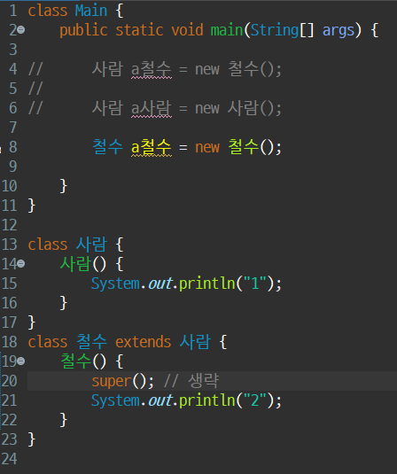
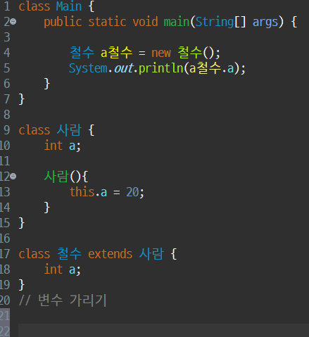

# 9.8 8일차 공부 (상속, 생성자, 초기화, 인터페이스 등)

[목록으로](README.md)

[노션 원문](https://app.notion.com/p/268c2c49a25080188085d2ed7088a834)

너무 어렵다… 복습은 완료..!

- [첨부파일: 9.4.txt](attachments/9.4.txt)

- [첨부파일: 9.8_상속_문제풀이.txt](attachments/9.8_%EC%83%81%EC%86%8D_%EB%AC%B8%EC%A0%9C%ED%92%80%EC%9D%B4.txt)

- [첨부파일: 9.8_종합문제_풀이.txt](attachments/9.8_%EC%A2%85%ED%95%A9%EB%AC%B8%EC%A0%9C_%ED%92%80%EC%9D%B4.txt)

### **1. 생성자**
- \*생성자(Constructor)\*\*는 객체를 생성할 때 호출되는 특별한 메서드입니다. 객체의 초기 상태를 설정하는 역할을 합니다.
- **특징:**
	- 메서드의 일종이지만, **반환 타입이 없습니다.**
	- 이름은 **클래스명과 동일**해야 합니다.
	- `new` 키워드를 사용하여 **인스턴스를 생성할 때 자동으로 호출**됩니다.
	- **기본 생성자**는 클래스에 생성자가 하나도 없을 때만 컴파일러에 의해 자동으로 추가됩니다.
	- 매개변수를 가질 수 있으며, \*\*오버로딩(Overloading)\*\*이 가능합니다.
- **예시:**
Java
`class Test {     // 기본 생성자     Test() {         System.out.println("기본 생성자 호출");     }      // 오버로딩된 생성자     Test(int a) {         System.out.println("매개변수가 있는 생성자 호출");     } }  class Main {     public static void main(String[] args) {         Test test1 = new Test();     // "기본 생성자 호출" 출력         Test test2 = new Test(10);   // "매개변수가 있는 생성자 호출" 출력     } }`

---

### **2. 변수 초기화 방식**
변수 초기화는 여러 방법으로 할 수 있으며, 각 방식은 실행되는 시점과 용도가 다릅니다.
### **명시적 초기화 (Explicit Initialization)**
**명시적 초기화**는 변수 선언과 동시에 값을 직접 할당하는 방식입니다. 가장 간단하고 직관적인 초기화 방법입니다.
- **특징:**
	- 인스턴스 변수를 선언할 때 값을 바로 할당합니다.
	- 모든 객체가 생성될 때마다 **동일한 초기값**을 갖게 됩니다.
- **예시:**
Java
`class Car {     // 명시적 초기화     String brand = "Hyundai";     int maxSpeed = 100;      Car() {         // 이 생성자를 통해 생성되는 모든 Car 객체의 brand는 "Hyundai", maxSpeed는 100으로 초기화됨     } }`
### **생성자를 통한 초기화**
생성자를 사용하여 변수 값을 초기화하는 방식입니다.
- **특징:**
	- `new` 연산자로 객체를 생성할 때 호출되어 초기화가 이루어집니다.
	- 명시적 초기화와 달리, 생성자에 매개변수를 사용하여 **객체마다 다른 값으로 초기화**할 수 있습니다.
	- 명시적 초기화보다 유연하여 더 널리 사용됩니다.
- **예시:**
Java
`class Car {     String brand;     int maxSpeed;      // 생성자를 통한 초기화     Car(String brand, int maxSpeed) {         this.brand = brand;         this.maxSpeed = maxSpeed;     } }  class Main {     public static void main(String[] args) {         // 객체마다 다른 값으로 초기화 가능         Car myCar = new Car("Kia", 150);         Car yourCar = new Car("BMW", 200);     } }`
### **초기화 블록**
생성자에 비해 사용 빈도가 낮지만, 변수 초기화를 위해 사용됩니다.
- **인스턴스 초기화 블록:** `{ }`
	- 객체가 생성될 때마다 생성자보다 먼저 실행됩니다. 여러 생성자에서 공통으로 수행할 초기화 작업이 있을 때 사용할 수 있습니다.
- **스태틱 초기화 블록:** `static { }`
	- 클래스가 메모리에 로드될 때 단 한 번만 실행됩니다. 정적(static) 변수를 초기화할 때 사용합니다.
- **실제 사용:** 생성자를 통한 초기화가 가장 일반적이며, 정적 변수 초기화가 필요한 경우에만 스태틱 블록이 사용됩니다.

---

### **3. 상속에서의 생성자**
상속 관계에서 자식 클래스의 생성자가 호출될 때, **부모 클래스의 생성자가 먼저 실행**됩니다. 이는 `super()` 키워드를 통해 이루어집니다.
- **`super()`**** 호출:**
	- 자식 클래스 생성자의 첫 줄에는 **부모 클래스의 생성자를 호출하는 ****`super()`****가 생략되어 있습니다.** (단, 부모 클래스에 매개변수가 없는 기본 생성자가 있는 경우에 한함)
	- 만약 부모 클래스에 매개변수가 있는 생성자만 있다면, 자식 클래스에서 명시적으로 `super(매개변수)`를 호출해야 합니다.
- **예시:**
Java
`class 사람 {     사람() {         System.out.println("1"); // 부모 클래스 생성자     } }  class 철수 extends 사람 {     철수() {         System.out.println("2"); // 자식 클래스 생성자     }      철수(int a) {         // 이 생성자의 첫 줄에는 super()가 자동으로 삽입됨         System.out.println("3");     } }  class Main {     public static void main(String[] args) {         철수 a철수 = new 철수(10); // "1" -> "3" 순서로 출력     } }`
super 생략 예시 사진

- **변수 가리기(Shadowing):**Java
	- 부모 클래스와 자식 클래스에 같은 이름의 인스턴스 변수가 있을 경우, 자식 클래스에서 해당 변수를 호출하면 자식 클래스의 변수가 사용됩니다. 부모의 변수를 참조하려면 `super.변수명`을 사용해야 합니다.
	- **예시:**
	`class 사람 {     int a;     사람() { this.a = 20; } }  class 철수 extends 사람 {     int a; // 부모의 'a'를 가림     철수() { this.a = 30; }      void test() {         System.out.println(a);      // "30" 출력 (자식 클래스의 변수)         System.out.println(super.a);  // "20" 출력 (부모 클래스의 변수)     } }  class Main {     public static void main(String[] args) {         철수 a철수 = new 철수();         a철수.test();     } }`
	사진
	

---

### **4. 추상 클래스 (Abstract Class)**
추상 클래스는 미완성된 설계도와 같으며, `abstract` 키워드를 사용하여 선언합니다.
- **특징:**
	- \*추상 메서드(Abstract Method)\*\*를 하나 이상 포함할 수 있습니다. 추상 메서드는 구현부(몸체)가 없는 메서드입니다.
	- 추상 메서드가 없더라도 추상 클래스로 선언할 수 있습니다.
	- 일반적인 변수와 메서드도 포함할 수 있습니다.
	- **`new`****를 사용하여 직접 객체를 생성할 수 없습니다.**
	- **목적:** 클래스들 간의 구조를 설계하고, 상속받는 자식 클래스가 특정 메서드를 **반드시 구현하도록 강제**하는 데 사용됩니다.
- **규칙:**
	- 추상 메서드를 상속받은 자식 클래스는 해당 메서드를 반드시 **오버라이딩(Overriding)** 해야 합니다. 만약 오버라이딩하지 않으면, 자식 클래스 또한 추상 클래스가 되어야 합니다.
- **예시:**
Java
`// 추상 클래스 abstract class Animal {     String name;      // 추상 메서드 (구현부가 없음)     abstract void cry();      // 일반 메서드     void eat() {         System.out.println(name + "이(가) 먹이를 먹습니다.");     } }  class Dog extends Animal {     Dog(String name) { this.name = name; }          // 추상 메서드 오버라이딩 (필수)     @Override     void cry() {         System.out.println(name + "이(가) 멍멍 짖습니다.");     } }`

---

### **5. 인터페이스 (Interface)**
인터페이스는 **순도 100%의 추상 클래스**라고 볼 수 있습니다. 클래스들이 구현해야 할 동작의 규격을 정의하는 역할을 합니다.
- **특징:**
	- `implements` 키워드를 사용하여 클래스에 적용합니다.
	- **다중 상속이 가능**합니다. (클래스는 단일 상속만 가능)
	- 모든 필드(변수)는 **`public static final`** 이며, 이는 생략 가능합니다. (상수만 가질 수 있습니다)
	- 모든 메서드는 **`public abstract`** 이며, 이 또한 생략 가능합니다. (추상 메서드만 가질 수 있습니다)
	- **목적:** 클래스들 간의 구조를 설계하고, 서로 다른 클래스들이 동일한 기능을 수행하도록 강제하는 데 사용됩니다.
- **예시:**
Java
`// 인터페이스 interface Cryable {     // public static final String TYPE = "동물"; (생략 가능)     String TYPE = "동물";      // public abstract void cry(); (생략 가능)     void cry(); }  class Cat implements Cryable {     @Override     public void cry() {         System.out.println("야옹");     } }`
