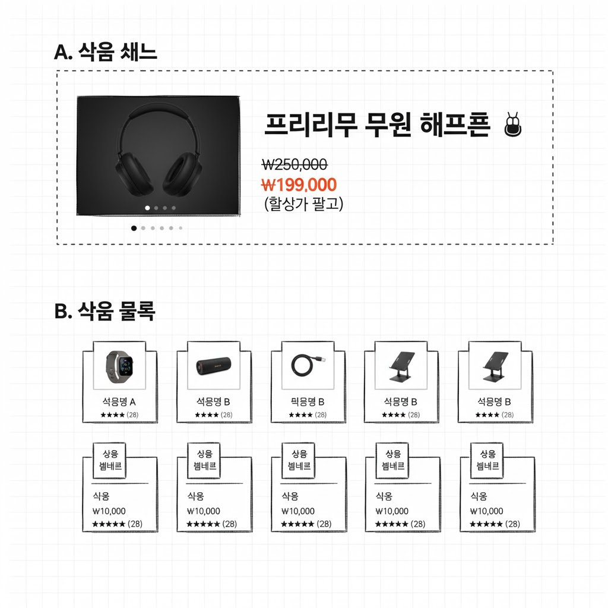

# 10.22 34일차 공부(화면 설계서, 와이퍼 프레임, 화면 설계)

[목록으로](README.md)

[노션 원문](https://app.notion.com/p/293c2c49a2508077a4e3e1627dc163ff)

## 화면 설계 및 구현 가이드
화면 설계(Screen Design)는 사용자에게 보여지는 화면의 구조와 기능을 정의하는 과정입니다. 와이어프레임은 이 과정에서 제작되는 핵심 산출물입니다.
### 1. 화면 설계 (와이어프레임 제작)
- \*와이어프레임(Wireframe)\*\*은 프로젝트 산출물인 \*\*화면 설계서(정의서)\*\*에 포함되는 요소로, 화면의 설계도와 같습니다.
- **목적:** 화면의 구조와 기능 배치를 시각화한 초안입니다.
- **구성:** 이미지, 색상, 정교한 디자인 요소를 배제하고, 박스, 선, 텍스트만으로 구성하여 정보의 우선순위와 흐름에 집중합니다.
- **유형:**
	- **로우(Low-fidelity):** 가장 단순한 형태. 손그림이나 기본적인 도형으로 구성.
	- **미드(Mid-fidelity):** 중간 정도의 디테일. 실제 텍스트, 아이콘 등을 포함하지만, 색상이나 이미지는 배제.
	- **하이(High-fidelity):** 실제 디자인 요소가 추가되어 목업(Mockup)에 가까움.
- **도구:** PPT, 그림판, 또는 Figma(피그마), Sketch, Adobe XD 등의 전문 디자인 도구를 사용하여 제작할 수 있습니다. 피그마 사용법을 익히면 협업 및 디자인 작업에 용이합니다.
### ✨ 요구사항을 반영한 와이어프레임 예시 (미드-피델리티)
요구사항을 반영하여 상품 상세/목록 페이지를 결합한 형태로 화면 구조를 구상해봅니다.

| 영역 | 요구사항 반영 요소 |
| --- | --- |
| **A. 상품 상세** | 상품 이미지 (슬라이드 전환 영역)<br>상품명 (눈에 띄게 큰 글씨)<br>가격 (정가: 취소선, 할인가: 강조) |
| **B. 상품 목록** | 상품 카드 (총 15개 표시)<br>표시 형식: 한 줄에 5개씩 × 3줄<br>리뷰 표시: 별 개수 ⋆⋆⋆⋆⋆, 리뷰 개수 (N개) |

**와이어프레임 시각화 예시:**



---

### 2. 화면 구현 (HTML, CSS, JS)
요구사항을 만족시키기 위해 실제 HTML, CSS, JavaScript를 사용하여 웹 페이지를 구현합니다.
### 1) 상품 상세 영역 구현 예시 (A 영역)

| 요구사항 | HTML/CSS/JS 구현 설명 |
| --- | --- |
| **상품 이미지** (슬라이드 형식) | **HTML:** `` 태그를 포함하는 `<div>` 슬라이더 컨테이너.<br>**CSS:** 이미지 크기 및 레이아웃 정의.<br>**JS:** 버튼 클릭 또는 자동 전환 로직 구현 (실제 동작은 JS로 처리). |
| **상품명** | **HTML:** `<h1>` 또는 `<p class="product-name">` 사용.<br>**CSS:** `font-size`, `font-weight`를 크게 설정하여 **눈에 띄게 표시**. |
| **가격** (정가/할인가 구분) | **HTML:** `<span>` 태그를 이용하여 정가와 할인가를 분리.<br>**CSS:** 정가에는 `text-decoration: line-through` (취소선) 적용. 할인가에는 **강조 색상**과 큰 글씨 적용. |

**코드 예시 (HTML/CSS):**
HTML
```html
<div class="product-detail">
    <div class="image-slider">
        
        </div>
    
    <h1 class="product-name">프리미엄 무선 헤드폰 🎧</h1>
    
    <div class="price-info">
        <span class="regular-price">₩250,000</span>
        <span class="discount-price">₩199,000</span>
    </div>
</div>

<style>
.product-name {
    font-size: 2em; /* 눈에 띄게 큰 글씨 */
    font-weight: bold;
    color: #333;
}
.regular-price {
    color: #999;
    text-decoration: line-through; /* 정가 취소선 */
    margin-right: 10px;
}
.discount-price {
    font-size: 1.5em;
    font-weight: 900;
    color: #ff4500; /* 할인 강조 색상 */
}
</style>
```

### 2) 상품 목록 영역 구현 예시 (B 영역)

| 요구사항 | HTML/CSS 구현 설명 |
| --- | --- |
| **한 줄에 5개씩 표시** (총 15개) | **CSS Flexbox** 또는 **Grid** 사용이 가장 적합합니다. `display: grid`와 `grid-template-columns: repeat(5, 1fr)`를 사용하여 5개 열을 균등하게 만듭니다. |
| **리뷰 표시** (별/개수) | **HTML:** 별 아이콘 (`★` 또는 이모티콘)과 텍스트 사용.<br>**CSS:** 별점 색상 및 크기 지정. |

**코드 예시 (HTML/CSS):**
HTML
```html
<div class="product-list">
    <div class="product-card">
        
        <div class="card-info">
            <p class="card-name">상품명 A</p>
            <div class="card-price">₩10,000</div>
            
            <div class="review-info">
                <span class="stars">★★★★☆</span> <span class="count">(128)</span>
            </div>
        </div>
    </div>
    </div>

<style>
.product-list {
    /* 5열 레이아웃 구현 */
    display: grid;
    grid-template-columns: repeat(5, 1fr); /* 5개 열을 균일하게 분할 */
    gap: 20px; /* 상품 카드 사이 간격 */
    padding: 20px 0;
}

.product-card {
    border: 1px solid #eee;
    padding: 10px;
    text-align: center;
}

.review-info {
    margin-top: 5px;
    font-size: 0.9em;
}

.stars {
    color: gold; /* 별점 색상 */
    margin-right: 5px;
}
</style>
```

화면 구현 예시 
HTML
```html
<script src="https://cdnjs.cloudflare.com/ajax/libs/jquery/3.7.1/jquery.min.js"></script>

<div class="product-list">
  <div class="product-row">
    <div class="product">
      <div class="img-box">
        <div class="img-area">
          
          
          
        </div>
        <div class="btn-area">
          <button class="left">◀</button>
          <button class="right">▶</button>
        </div>
      </div>
      <div class="product-name">상품명</div>
      <div class="product-price">29,900</div>
      <div class="product-disPrice">10,900</div>
      <div class="product-review">★★★★☆&nbsp;&nbsp;&nbsp;<span>&#40;204&#41;</span></div>
    </div>
    <div class="product">
      <div class="img-box">
        <div class="img-area">
          
          
          
        </div>
        <div class="btn-area">
          <button class="left">◀</button>
          <button class="right">▶</button>
        </div>
      </div>
      <div class="product-name">상품명</div>
      <div class="product-price">29,900</div>
      <div class="product-disPrice">10,900</div>
      <div class="product-review">★★★★☆&nbsp;&nbsp;&nbsp;<span>&#40;204&#41;</span></div>
    </div>
    <div class="product">
      <div class="img-box">
        <div class="img-area">
          
          
          
        </div>
        <div class="btn-area">
          <button class="left">◀</button>
          <button class="right">▶</button>
        </div>
      </div>
      <div class="product-name">상품명</div>
      <div class="product-price">29,900</div>
      <div class="product-disPrice">10,900</div>
      <div class="product-review">★★★★☆&nbsp;&nbsp;&nbsp;<span>&#40;204&#41;</span></div>
    </div>
    <div class="product">
      <div class="img-box">
        <div class="img-area">
          
          
          
        </div>
        <div class="btn-area">
          <button class="left">◀</button>
          <button class="right">▶</button>
        </div>
      </div>
      <div class="product-name">상품명</div>
      <div class="product-price">29,900</div>
      <div class="product-disPrice">10,900</div>
      <div class="product-review">★★★★☆&nbsp;&nbsp;&nbsp;<span>&#40;204&#41;</span></div>
    </div>
    <div class="product">
      <div class="img-box">
        <div class="img-area">
          
          
          
        </div>
        <div class="btn-area">
          <button class="left">◀</button>
          <button class="right">▶</button>
        </div>
      </div>
      <div class="product-name">상품명</div>
      <div class="product-price">29,900</div>
      <div class="product-disPrice">10,900</div>
      <div class="product-review">★★★★☆&nbsp;&nbsp;&nbsp;<span>&#40;204&#41;</span></div>
    </div>
  </div>
  <div class="product-row">
    <div class="product">
      <div class="img-box">
        <div class="img-area">
          
          
          
        </div>
        <div class="btn-area">
          <button class="left">◀</button>
          <button class="right">▶</button>
        </div>
      </div>
      <div class="product-name">상품명</div>
      <div class="product-price">29,900</div>
      <div class="product-disPrice">10,900</div>
      <div class="product-review">★★★★☆&nbsp;&nbsp;&nbsp;<span>&#40;204&#41;</span></div>
    </div>
    <div class="product">
      <div class="img-box">
        <div class="img-area">
          
          
          
        </div>
        <div class="btn-area">
          <button class="left">◀</button>
          <button class="right">▶</button>
        </div>
      </div>
      <div class="product-name">상품명</div>
      <div class="product-price">29,900</div>
      <div class="product-disPrice">10,900</div>
      <div class="product-review">★★★★☆&nbsp;&nbsp;&nbsp;<span>&#40;204&#41;</span></div>
    </div>
    <div class="product">
      <div class="img-box">
        <div class="img-area">
          
          
          
        </div>
        <div class="btn-area">
          <button class="left">◀</button>
          <button class="right">▶</button>
        </div>
      </div>
      <div class="product-name">상품명</div>
      <div class="product-price">29,900</div>
      <div class="product-disPrice">10,900</div>
      <div class="product-review">★★★★☆&nbsp;&nbsp;&nbsp;<span>&#40;204&#41;</span></div>
    </div>
    <div class="product">
      <div class="img-box">
        <div class="img-area">
          
          
          
        </div>
        <div class="btn-area">
          <button class="left">◀</button>
          <button class="right">▶</button>
        </div>
      </div>
      <div class="product-name">상품명</div>
      <div class="product-price">29,900</div>
      <div class="product-disPrice">10,900</div>
      <div class="product-review">★★★★☆&nbsp;&nbsp;&nbsp;<span>&#40;204&#41;</span></div>
    </div>
    <div class="product">
      <div class="img-box">
        <div class="img-area">
          
          
          
        </div>
        <div class="btn-area">
          <button class="left">◀</button>
          <button class="right">▶</button>
        </div>
      </div>
      <div class="product-name">상품명</div>
      <div class="product-price">29,900</div>
      <div class="product-disPrice">10,900</div>
      <div class="product-review">★★★★☆&nbsp;&nbsp;&nbsp;<span>&#40;204&#41;</span></div>
    </div>
  </div>
</div>
```

CSS
```css
body {
  margin: 0;
}

.product-list > .product-row {
  display: flex;
  justify-content: space-between;
  margin: 0 30px 20px 30px;
}

.product-list > .product-row > .product {
  text-align: center;
  margin: 5px;
}

.product-list > .product-row > .product > .img-box {
  position: relative;
}

.product-list > .product-row > .product > .img-box > .img-area > img {
  display: block;
}

.product-list > .product-row > .product > .img-box > .btn-area {
  position: absolute;
  top: 50%;
  transform: translatey(-50%);
  display: flex;
  justify-content: space-between;
  left: 0;
  right: 0;
  padding: 0 10px;
}

.product-list > .product-row > .product > .img-box > .btn-area > button {
  font-size: 1.1rem;
}

.product-list > .product-row > .product > .product-name {
  font-size: 1.2rem;
  font-weight: bold;
}

.product-list > .product-row > .product > .product-price {
  color: #adadad;
  text-decoration: line-through;
}

.product-list > .product-row > .product > .product-disPrice {
  color: red;
  font-size: 1.2rem;
  font-weight: bold;
}

.product-list > .product-row > .product > .product-review {
  color: gold;
}

.product-list > .product-row > .product > .product-review > span {
  color: rgba(0, 0, 0, .5);
}
```

JS
```javascript
console.clear();

$('.img-box').each(function() {
  const imgArea = $(this).find('.img-area');
  const imgs = imgArea.find('img');
  
  imgs.hide().first().show();
  imgArea.data('index', 0);
})

$('.btn-area > button').click(function(){
  const btn = $(this);
  const imgBox = btn.closest('.img-box');
  const imgArea = imgBox.find('.img-area');
  const imgs = imgArea.find('img');
  
  
  let index = imgArea.data('index');
  
  if (btn.hasClass('left')) {
    index = (index - 1 + imgs.length) % imgs.length;
  } else {
    index = (index + 1) % imgs.length;
  }
  
  imgs.hide().eq(index).show();
  imgArea.data('index', index);
})
```
